# Fundamentals of Computers

> **Unit 1 — Computer Fundamentals**  
> This lesson introduces computers, their basic working cycle, major components, characteristics, types, applications, and limitations.

---


> **Offline illustrated edition:** Every lesson image is stored inside the accompanying `images/` folder. The Markdown file therefore works after download and can be uploaded directly to GitHub without depending on remote image URLs.

## Learning Outcomes

After completing this lesson, you should be able to:

1. Define a computer in simple terms.
2. distinguish between data and information.
3. Explain the input–processing–output–storage cycle.
4. Identify the main components of a computer system.
5. Differentiate between hardware and software.
6. Classify computers according to size, purpose, and usage.
7. Describe common applications of computers.
8. Explain the strengths and limitations of computers.
9. Analyse a real-world activity as a computer-processing system.

---

## 1. What Is a Computer?

A **computer** is an electronic device that:

- accepts data as input,
- follows a set of instructions,
- processes the data,
- stores data and results,
- produces meaningful output, and
- communicates with other devices when required.

A computer does not automatically understand a problem like a human being. It performs operations according to the instructions provided through software.

### Simple Definition

> A computer is an electronic data-processing machine that converts raw data into useful information.

### Everyday Examples of Computers

Computers are not limited to desktop PCs and laptops. Computer systems are also present in:

- smartphones,
- smart televisions,
- cars,
- automatic washing machines,
- ATMs,
- digital watches,
- traffic-control systems,
- medical equipment,
- industrial robots,
- aircraft, and
- smart-home devices.

---

## 2. Data and Information

<p align="center">
  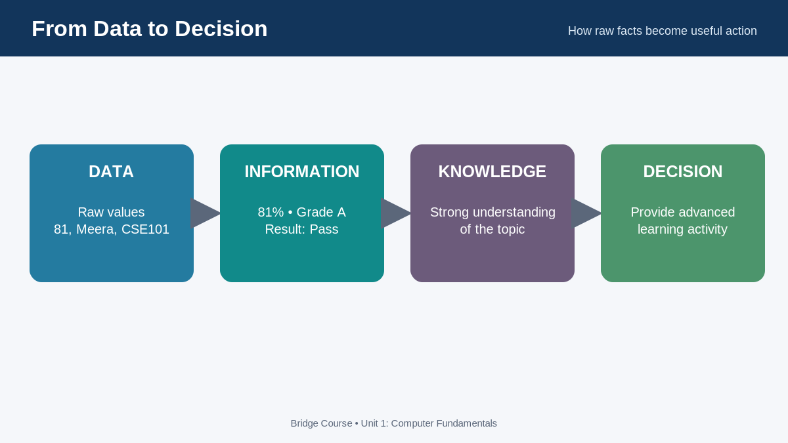
</p>
<p align="center"><em>Infographic: the journey from raw data to a decision.</em></p>


The words **data** and **information** are related, but they do not mean the same thing.

| Term | Meaning | Example |
|---|---|---|
| Data | Raw facts, symbols, values, or observations | `72`, `Aarav`, `CSE101` |
| Information | Data that has been processed and given context | `Aarav scored 72 marks in CSE101` |
| Knowledge | Information interpreted for understanding or action | `Aarav has performed well` |
| Decision | Action taken using knowledge | `Aarav can move to the advanced exercise` |

### Example: Student Marks

Suppose the following values are entered into a computer:

```text
Student Name: Meera
Marks: 81
Maximum Marks: 100
```

These values are **data**.

The computer may calculate:

```text
Percentage = 81%
Result = Pass
Grade = A
```

These calculated results are **information**.

A teacher may interpret the information and conclude that the student has understood the topic well. This interpretation becomes **knowledge**.

---

## 3. Basic Functions of a Computer

<p align="center">
  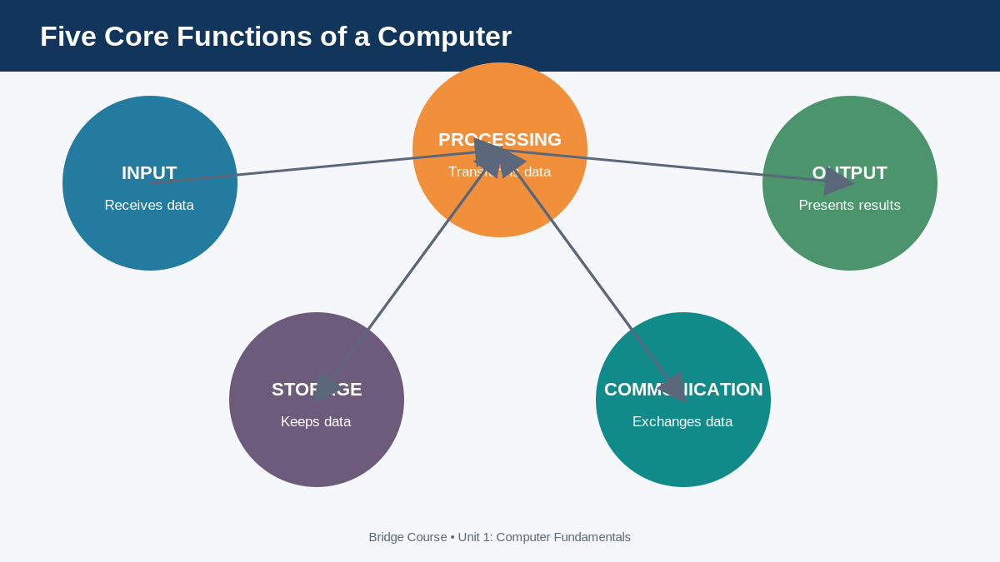
</p>
<p align="center"><em>Infographic: five core functions of a computer.</em></p>


Most computer systems perform five basic functions:

1. **Input**
2. **Processing**
3. **Output**
4. **Storage**
5. **Communication**

### 3.1 Input

Input is the data or instruction entered into a computer.

Common input devices include:

- keyboard,
- mouse,
- touchscreen,
- scanner,
- microphone,
- camera,
- barcode reader,
- biometric sensor, and
- game controller.

### 3.2 Processing

Processing is the operation performed on the input data.

Examples include:

- adding numbers,
- comparing values,
- arranging names alphabetically,
- calculating a percentage,
- searching a database,
- resizing an image, and
- predicting a result using a machine-learning model.

Processing is mainly performed by the **Central Processing Unit**, commonly called the **CPU**.

### 3.3 Output

Output is the result produced by the computer after processing.

Common output devices include:

- monitor,
- printer,
- speaker,
- projector,
- headphones, and
- haptic or vibration device.

### 3.4 Storage

Storage is used to save data, programs, and results for future use.

Examples include:

- hard disk drive,
- solid-state drive,
- USB flash drive,
- memory card,
- optical disc,
- cloud storage, and
- database server.

### 3.5 Communication

Communication allows computers to exchange data with other computers and devices.

Examples include:

- sending an email,
- opening a website,
- making a video call,
- uploading a file,
- connecting to a Wi-Fi router, and
- transferring data between a smartphone and a laptop.

---

## 4. Input–Processing–Output–Storage Cycle

<p align="center">
  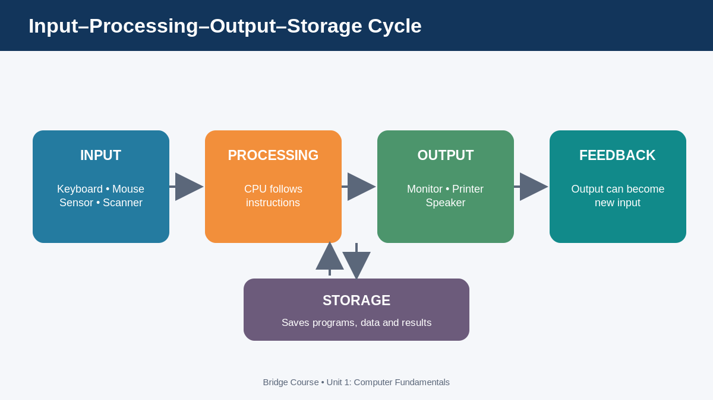
</p>
<p align="center"><em>Infographic: detailed input–processing–output–storage cycle.</em></p>


The basic operation of a computer can be represented as a cycle.

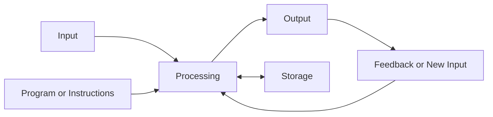
```mermaid
flowchart LR
    A[Input] --> B[Processing]
    B --> C[Output]
    B <--> D[Storage]
    E[Program or Instructions] --> B
    C --> F[Feedback or New Input]
    F --> B
```

<p align="center">
  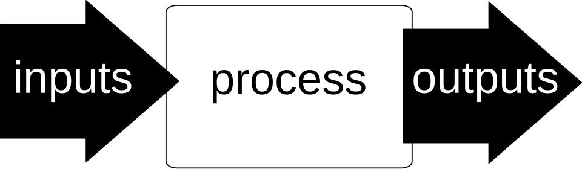
</p>

<p align="center">
  <em>Figure 1: Input–processing–output model.</em>
</p>

### Example: Calculator

| Stage | Activity |
|---|---|
| Input | User enters `25 + 17` |
| Processing | Calculator performs addition |
| Output | Screen displays `42` |
| Storage | The calculation may be stored in history |

### Example: Online Shopping

| Stage | Activity |
|---|---|
| Input | Customer selects a product and enters an address |
| Processing | Website calculates price, tax, discount, and delivery time |
| Storage | Order and customer details are saved in a database |
| Output | Order confirmation is displayed |
| Communication | The website contacts payment and delivery services |

---

## 5. Components of a Computer System

<p align="center">
  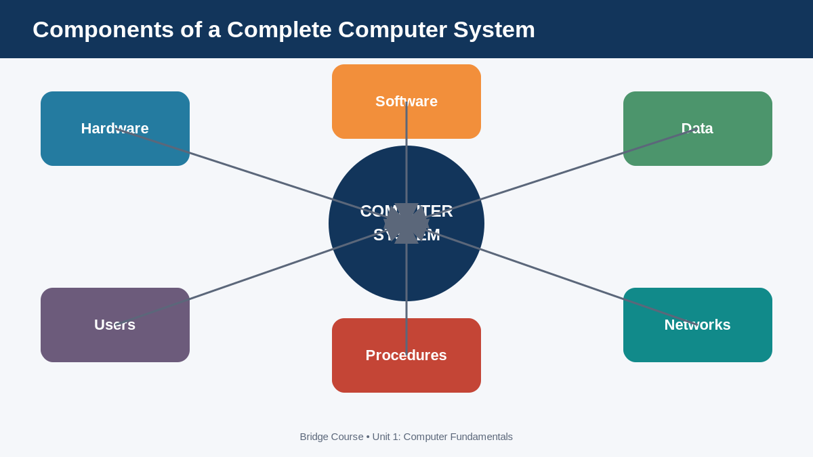
</p>
<p align="center"><em>Infographic: components of a complete computer system.</em></p>


A complete computer system consists of more than hardware.

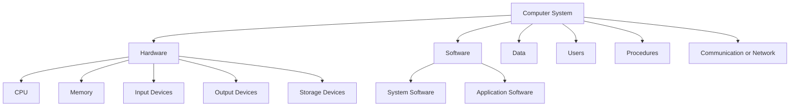
```mermaid
flowchart TB
    S[Computer System]
    S --> H[Hardware]
    S --> SW[Software]
    S --> D[Data]
    S --> U[Users]
    S --> P[Procedures]
    S --> N[Communication or Network]

    H --> CPU[CPU]
    H --> M[Memory]
    H --> I[Input Devices]
    H --> O[Output Devices]
    H --> ST[Storage Devices]

    SW --> SYS[System Software]
    SW --> APP[Application Software]
```

### 5.1 Hardware

<p align="center">
  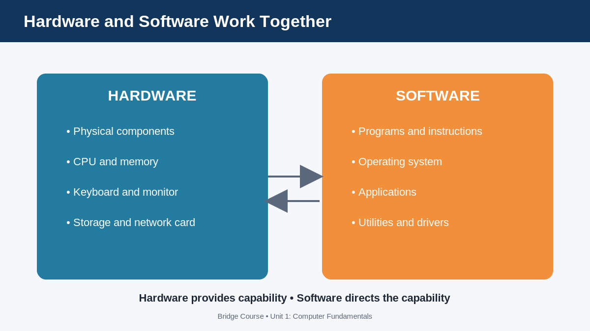
</p>
<p align="center"><em>Infographic: hardware and software work together.</em></p>


**Hardware** refers to the physical parts of a computer that can be seen and touched.

Examples:

- monitor,
- keyboard,
- motherboard,
- processor,
- memory,
- storage drive,
- printer, and
- network card.

<p align="center">
  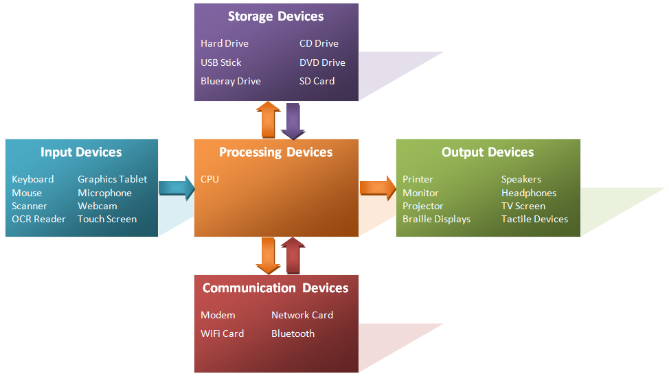
</p>

<p align="center">
  <em>Figure 2: Examples of computing hardware devices.</em>
</p>

### 5.2 Software

**Software** is a collection of programs, instructions, settings, and related data that tells hardware what to do.

Software is generally divided into two categories.

#### System Software

System software manages the computer and provides a platform for other programs.

Examples:

- Windows,
- Linux,
- macOS,
- Android,
- device drivers,
- language translators, and
- utility programs.

#### Application Software

Application software helps users perform specific tasks.

Examples:

- Microsoft Word,
- Google Chrome,
- Excel,
- Power BI,
- media players,
- games,
- payroll systems, and
- hospital-management systems.

### 5.3 Data

Data is the raw material processed by a computer.

Examples:

- names,
- marks,
- photographs,
- videos,
- sensor values,
- transaction records, and
- geographic coordinates.

### 5.4 Users

Users are the people or systems that interact with the computer.

Examples:

- students,
- teachers,
- programmers,
- bank employees,
- doctors,
- customers, and
- system administrators.

### 5.5 Procedures

Procedures are the rules or steps followed while using a computer system.

Examples:

- steps for logging in,
- instructions for taking a backup,
- rules for creating passwords,
- procedure for entering student marks, and
- process for approving an online payment.

### 5.6 Communication and Networks

<p align="center">
  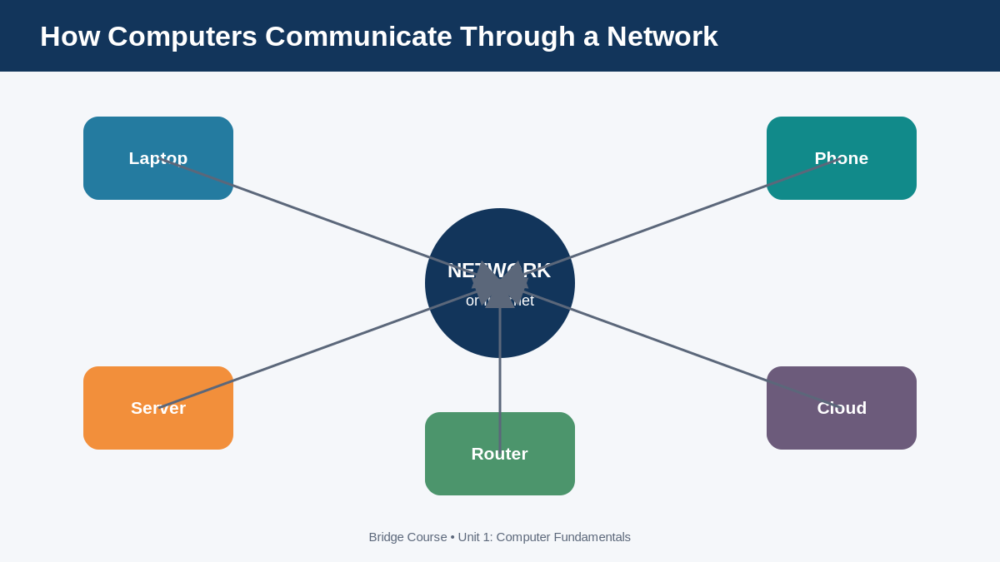
</p>
<p align="center"><em>Infographic: communication through a network.</em></p>


Modern computers frequently communicate through networks.

A network may connect:

- devices inside a room,
- computers in a university,
- branches of a bank,
- servers across different countries, or
- billions of devices through the internet.

---

## 6. Major Hardware Units

### 6.1 Input Unit

<p align="center">
  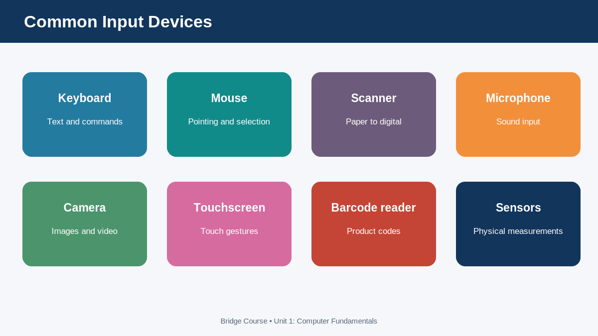
</p>
<p align="center"><em>Infographic: common input devices and their uses.</em></p>


The input unit receives data and converts it into a form that the computer can process.

| Input Device | Typical Use |
|---|---|
| Keyboard | Entering text and commands |
| Mouse | Selecting and moving objects |
| Scanner | Converting paper documents into digital form |
| Microphone | Capturing sound |
| Webcam | Capturing images and video |
| Touchscreen | Receiving touch-based instructions |
| Barcode reader | Reading product codes |
| Sensor | Measuring temperature, motion, pressure, or light |

### 6.2 Central Processing Unit

<p align="center">
  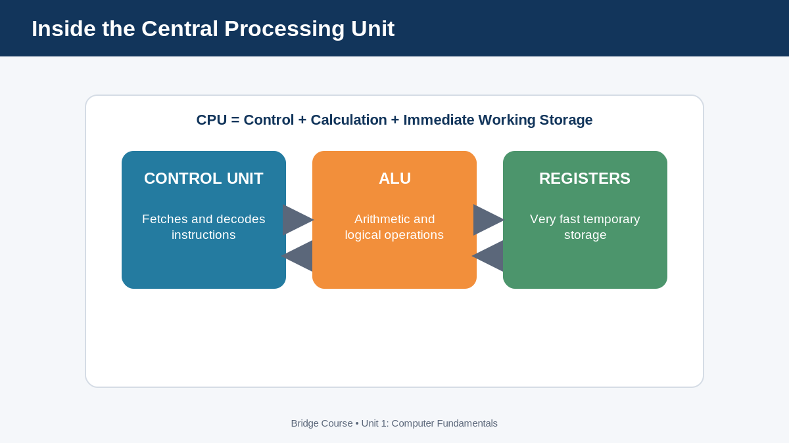
</p>
<p align="center"><em>Infographic: control unit, ALU and registers inside the CPU.</em></p>


The **CPU** is often described as the processing centre of a computer.

Its major parts include:

#### Arithmetic and Logic Unit

The **Arithmetic and Logic Unit**, or **ALU**, performs:

- arithmetic operations such as addition and subtraction,
- comparisons such as greater than or equal to,
- logical operations such as AND, OR, and NOT.

#### Control Unit

The **Control Unit**, or **CU**, directs and coordinates operations inside the computer.

It:

- fetches instructions,
- interprets instructions,
- controls data movement, and
- directs other components.

#### Registers

Registers are very small and very fast storage locations inside the CPU. They temporarily hold instructions, addresses, and data currently being processed.

### 6.3 Memory Unit

<p align="center">
  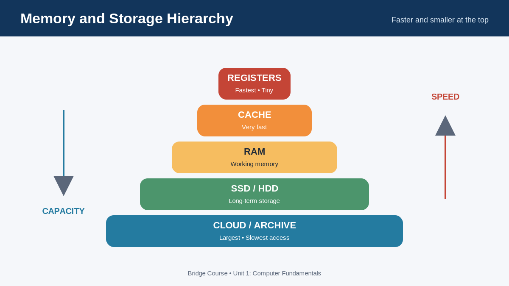
</p>
<p align="center"><em>Infographic: memory and storage hierarchy.</em></p>


Computer memory can be broadly divided into **primary memory** and **secondary storage**.

#### Primary Memory

Primary memory is directly accessible by the CPU.

| Type | Meaning |
|---|---|
| RAM | Temporary working memory used by active programs |
| ROM | Stores instructions that are normally not frequently changed |
| Cache | Very fast memory used to reduce CPU waiting time |

RAM is generally **volatile**, which means its contents are lost when power is switched off.

#### Secondary Storage

<p align="center">
  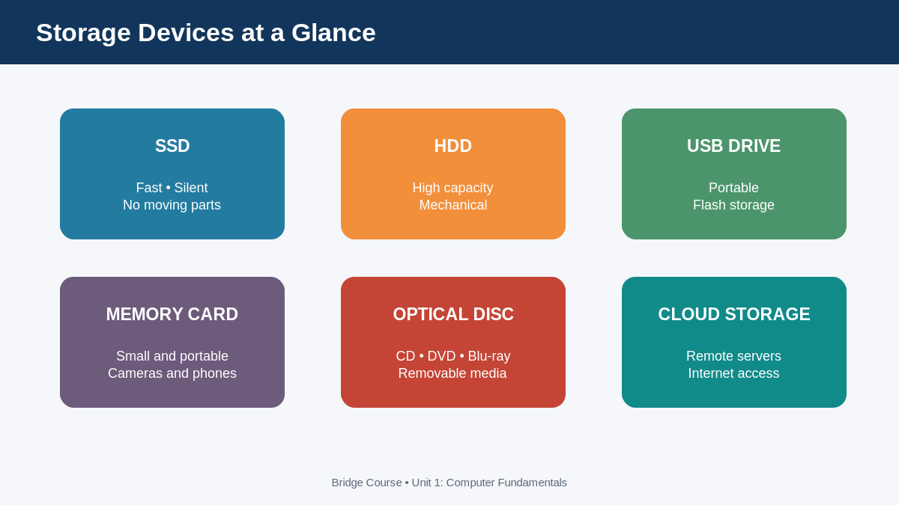
</p>
<p align="center"><em>Infographic: common long-term storage devices.</em></p>


Secondary storage retains data for long-term use.

Examples:

- HDD,
- SSD,
- USB drive,
- memory card,
- CD or DVD, and
- network or cloud storage.

### 6.4 Output Unit

<p align="center">
  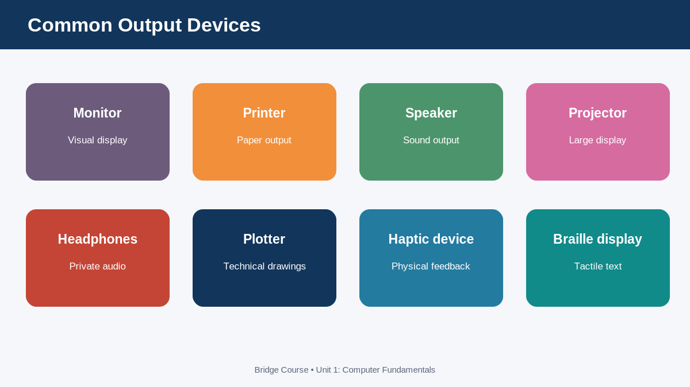
</p>
<p align="center"><em>Infographic: common output devices and their uses.</em></p>


The output unit presents processed information to the user.

| Output Device | Output Form |
|---|---|
| Monitor | Text, image, and video |
| Printer | Printed document |
| Speaker | Sound |
| Projector | Large visual display |
| Plotter | Large technical drawing |
| Haptic device | Vibration or physical feedback |

---

## 7. Desktop Computer System

A desktop computer normally includes a system unit and several peripheral devices.

<p align="center">
  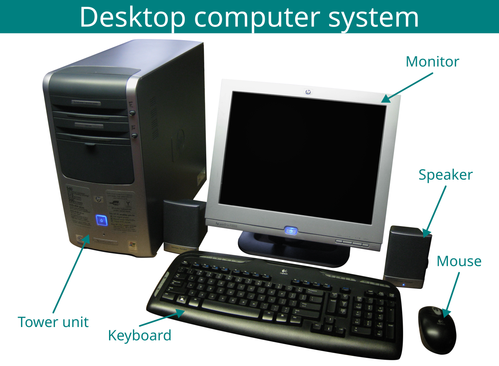
</p>

<p align="center">
  <em>Figure 3: A typical desktop computer system and its major external parts.</em>
</p>

### Internal Components

Typical internal components include:

- motherboard,
- CPU,
- RAM,
- storage drive,
- power supply,
- cooling fan,
- graphics processor, and
- network interface.

### Peripheral Devices

A **peripheral device** is a device connected to a computer to provide input, output, storage, or communication.

Examples:

- keyboard,
- mouse,
- printer,
- scanner,
- webcam,
- external drive, and
- speakers.

---


### Hardware Photograph Gallery

<table>
<tr>
<td align="center">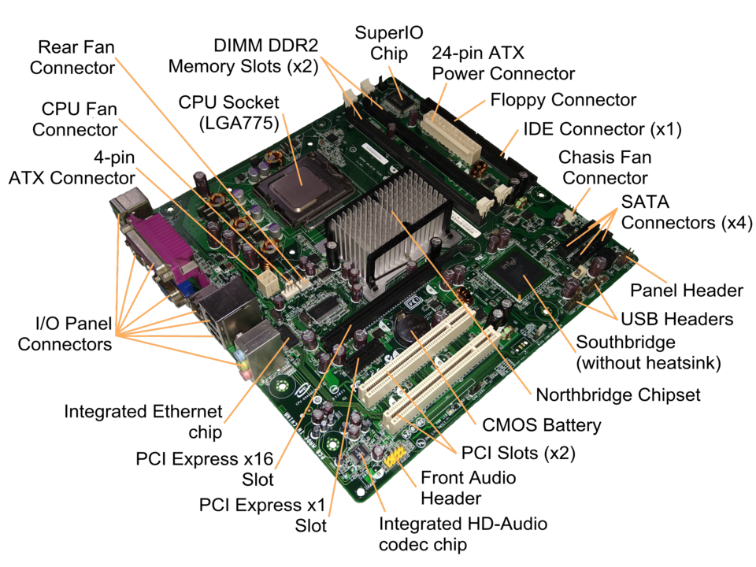<br><em>Labelled motherboard</em></td>
<td align="center">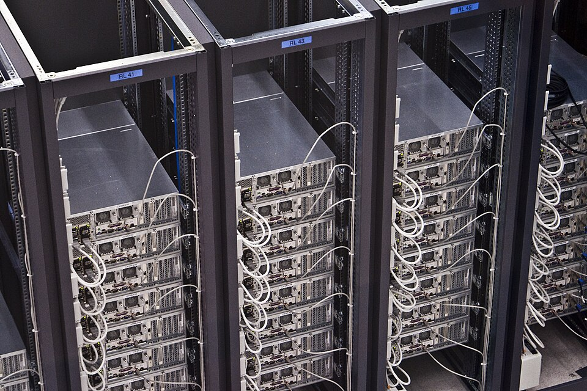<br><em>Server racks at CERN</em></td>
</tr>
<tr>
<td align="center">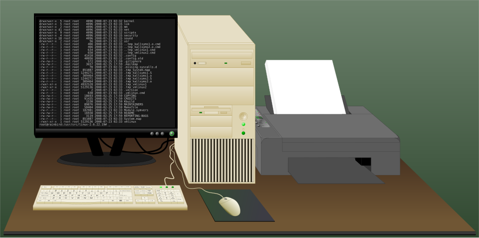<br><em>Basic desktop computer system</em></td>
<td align="center">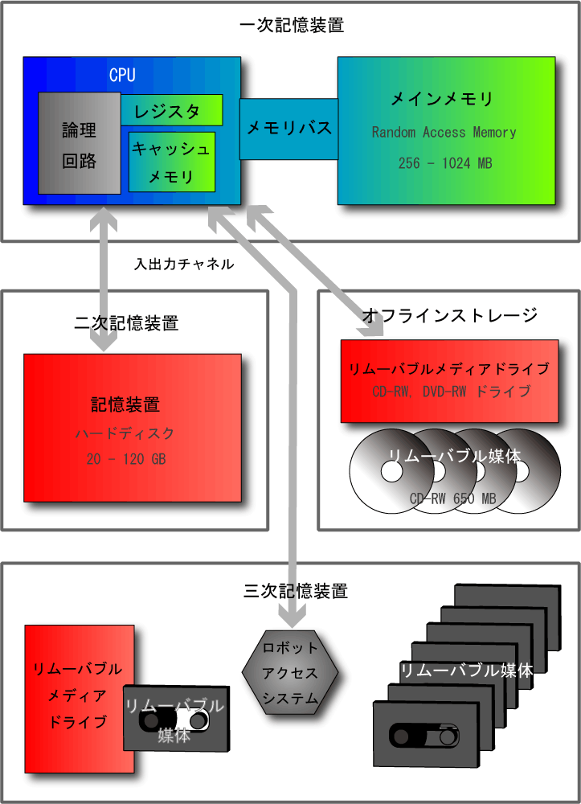<br><em>Storage-hierarchy diagram</em></td>
</tr>
</table>

## 8. Characteristics of Computers

<p align="center">
  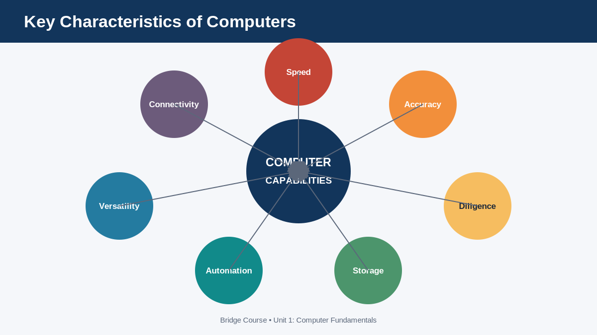
</p>
<p align="center"><em>Infographic: important characteristics of computers.</em></p>


### 8.1 Speed

Computers can perform a very large number of operations in a short time.

For example, a spreadsheet can calculate totals for thousands of records much faster than a person performing the same calculation manually.

### 8.2 Accuracy

A computer can produce highly accurate results when:

- the input data is correct,
- the program logic is correct, and
- the hardware is functioning properly.

A computer may still produce an incorrect result when incorrect data or incorrect instructions are supplied.

This is often expressed as:

> **Garbage In, Garbage Out — GIGO**

### 8.3 Diligence

Computers do not become tired or bored. They can repeat the same operation continuously.

Examples:

- processing salary records,
- monitoring sensors,
- checking network traffic, and
- generating daily reports.

### 8.4 Storage Capacity

Computers can store large amounts of:

- text,
- photographs,
- audio,
- video,
- programs, and
- databases.

### 8.5 Automation

Once correctly programmed, a computer can perform tasks with limited human intervention.

Examples:

- automatic bill generation,
- scheduled backups,
- traffic-light control, and
- industrial production systems.

### 8.6 Versatility

The same computer can be used for many different tasks by changing the software.

A laptop may be used for:

- writing documents,
- programming,
- video conferencing,
- data analysis,
- entertainment, and
- graphic design.

### 8.7 Reliability

Computers can perform repetitive operations consistently, provided that the system is properly designed and maintained.

### 8.8 Connectivity

Computers can communicate with other systems through:

- local networks,
- mobile networks,
- Wi-Fi,
- Bluetooth, and
- the internet.

---

## 9. Limitations of Computers

<p align="center">
  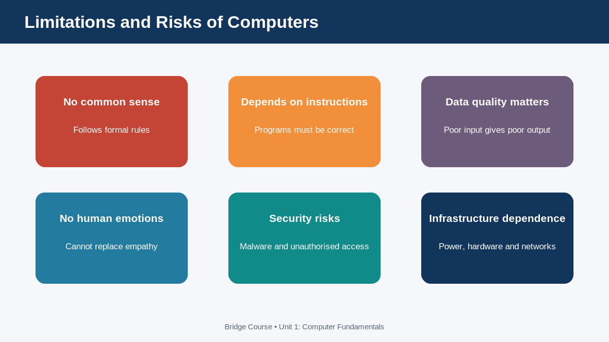
</p>
<p align="center"><em>Infographic: limitations and risks of computers.</em></p>


Computers are powerful, but they have limitations.

### 9.1 No Independent Common Sense

A computer follows formal instructions. It does not naturally possess human common sense.

### 9.2 Dependence on Instructions

A computer requires programs, rules, or trained models to perform tasks.

### 9.3 Dependence on Data Quality

Poor-quality data may lead to poor-quality results.

### 9.4 No Human Emotions

A computer does not experience feelings, motivation, empathy, or moral responsibility.

### 9.5 Security and Privacy Risks

Computer systems may be affected by:

- malware,
- unauthorised access,
- data leaks,
- weak passwords,
- online fraud, and
- hardware failure.

### 9.6 Need for Electricity and Infrastructure

Most computer systems depend on reliable:

- electrical power,
- hardware,
- communication networks, and
- maintenance.

---

## 10. Types of Computers

<p align="center">
  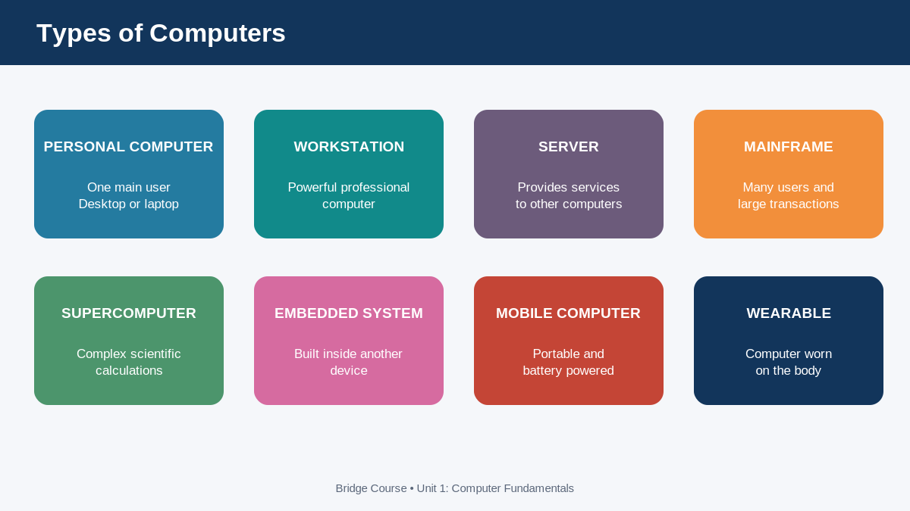
</p>
<p align="center"><em>Infographic: major types of computers.</em></p>


Computers can be classified in several ways.

### 10.1 Personal Computer

A personal computer is mainly designed for individual use.

Examples:

- desktop,
- laptop,
- tablet, and
- high-performance workstation.

Uses include:

- learning,
- office work,
- programming,
- internet access, and
- entertainment.

### 10.2 Server

A server provides data, applications, or services to other computers.

Examples of server functions:

- hosting a website,
- storing files,
- managing email,
- running a database, and
- authenticating users.

### 10.3 Mainframe Computer

A mainframe is designed to support large numbers of users and high volumes of transactions.

Mainframes are commonly associated with:

- banks,
- airlines,
- government systems,
- insurance companies, and
- large enterprises.

### 10.4 Supercomputer

<p align="center">
  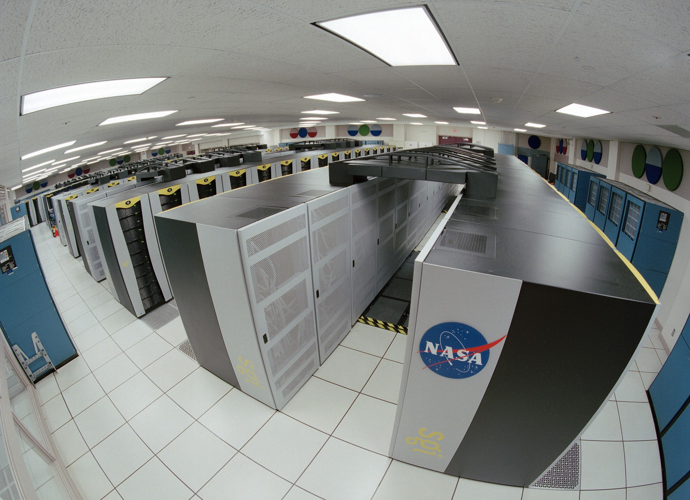
</p>
<p align="center"><em>Photograph: NASA Columbia supercomputer facility.</em></p>


A supercomputer is designed for extremely demanding scientific and engineering calculations.

Applications include:

- weather and climate modelling,
- aerospace simulation,
- physics research,
- molecular modelling, and
- large-scale artificial intelligence.

<p align="center">
  
</p>

<p align="center">
  <em>Figure 4: NASA's Columbia supercomputer.</em>
</p>

### 10.5 Embedded Computer

<p align="center">
  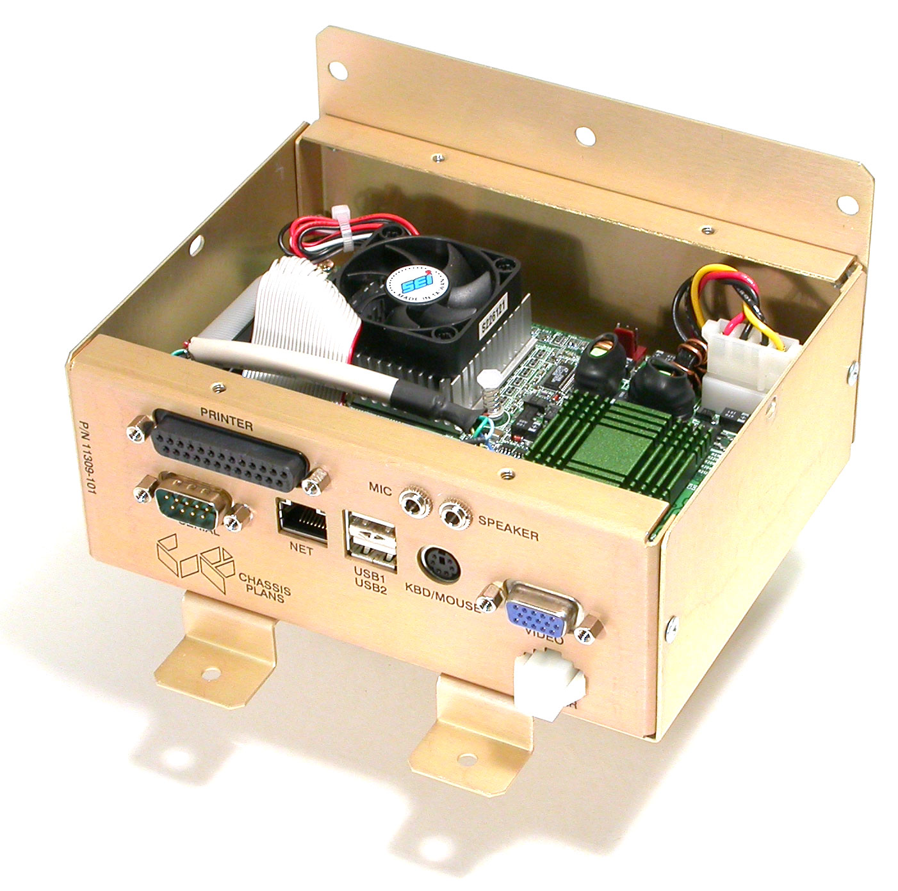
</p>
<p align="center"><em>Photograph: an embedded computer used inside a specialised system.</em></p>


An embedded computer is built into a larger device to perform a specific function.

Examples include computers inside:

- cars,
- washing machines,
- printers,
- routers,
- cameras,
- medical instruments, and
- industrial machinery.

<p align="center">
  
</p>

<p align="center">
  <em>Figure 5: An example of an embedded computer.</em>
</p>

### 10.6 Mobile Computer

Mobile computers are designed for portable use.

Examples:

- smartphones,
- tablets,
- smartwatches, and
- handheld data-collection terminals.

### 10.7 Workstation

A workstation is a powerful computer intended for demanding professional tasks such as:

- engineering design,
- animation,
- scientific computing,
- architecture, and
- data analysis.

---

## 11. General-Purpose and Special-Purpose Computers

<p align="center">
  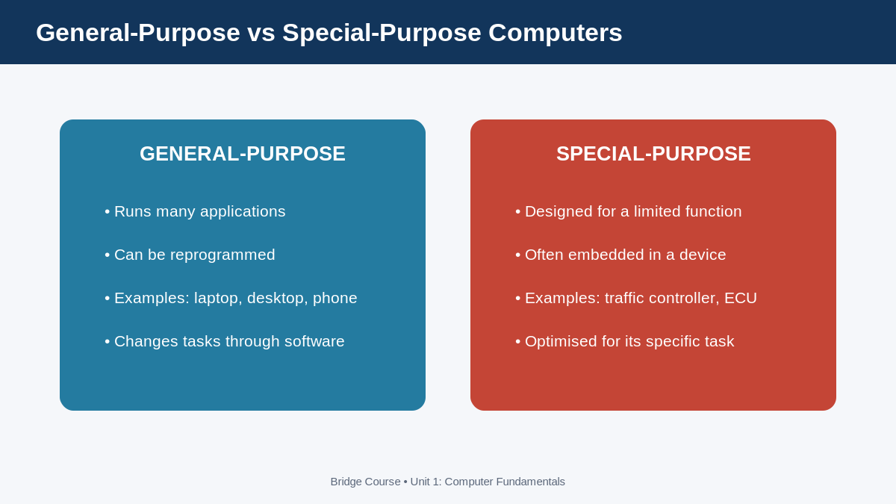
</p>
<p align="center"><em>Infographic: general-purpose and special-purpose computers.</em></p>


### General-Purpose Computer

A general-purpose computer can perform many different tasks.

Examples:

- laptop,
- desktop PC,
- smartphone.

### Special-Purpose Computer

A special-purpose computer is designed for a limited and specific function.

Examples:

- traffic-light controller,
- car engine-control unit,
- digital weighing machine,
- ATM control system, and
- washing-machine controller.

---

## 12. Analogue, Digital, and Hybrid Computers

<p align="center">
  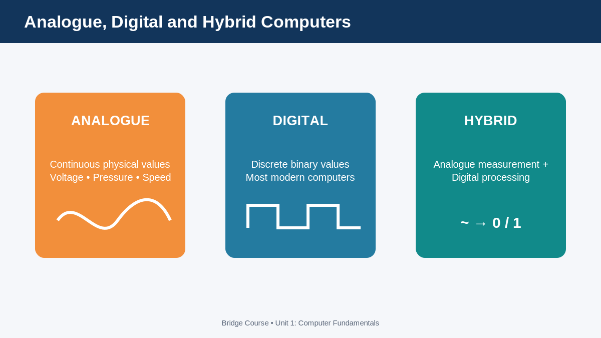
</p>
<p align="center"><em>Infographic: analogue, digital and hybrid computers.</em></p>


### Analogue Computer

An analogue computer works with continuously changing physical quantities.

Examples may involve:

- temperature,
- pressure,
- voltage, and
- speed.

### Digital Computer

A digital computer processes discrete values, generally represented using binary digits.

Most modern computers, smartphones, and servers are digital computers.

### Hybrid Computer

A hybrid system combines analogue measurement with digital processing.

Examples can be found in:

- medical monitoring,
- industrial process control, and
- scientific instruments.

---

## 13. Brief Development of Computers

<p align="center">
  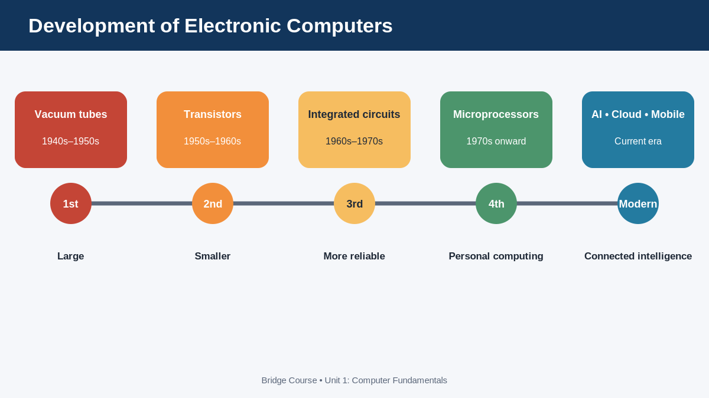
</p>
<p align="center"><em>Infographic: simplified development of electronic computers.</em></p>


The history of computing includes mechanical, electromechanical, and electronic systems.

### Early Devices

Important early calculation tools included:

- the abacus,
- mechanical calculators,
- punched-card systems, and
- electromechanical machines.


### Historical Image Gallery

<table>
<tr>
<td align="center">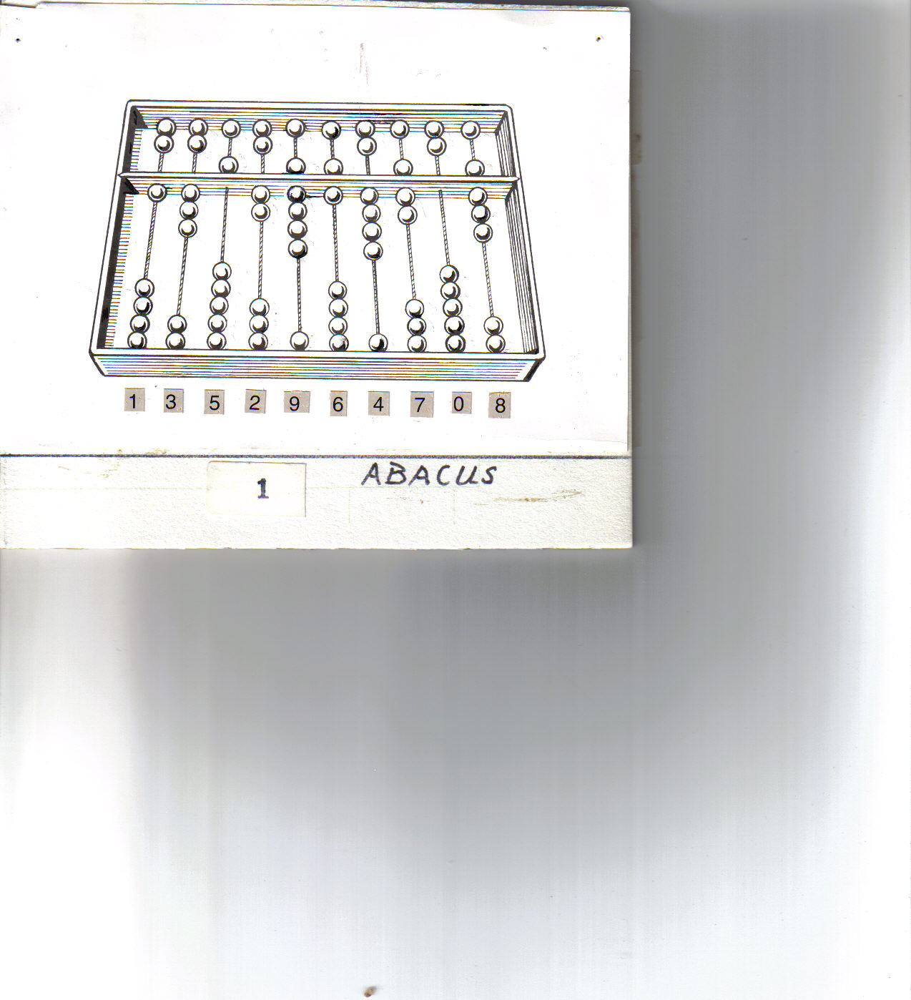<br><em>Abacus: an early calculation tool</em></td>
<td align="center">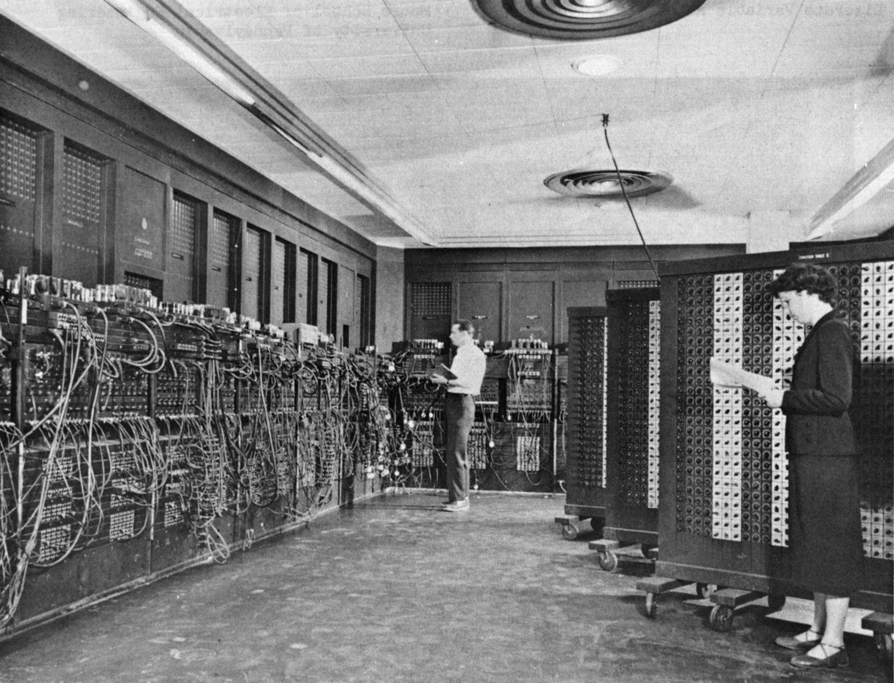<br><em>Programming the ENIAC</em></td>
</tr>
</table>

### Electronic Computer Generations

The generation model is a simplified way of describing changes in computer technology.

| Generation | Main Technology | General Development |
|---|---|---|
| First | Vacuum tubes | Large machines with high power consumption |
| Second | Transistors | Smaller and more reliable systems |
| Third | Integrated circuits | Multiple electronic components placed on chips |
| Fourth | Microprocessors | Personal computers and widespread digital systems |
| Fifth and modern era | AI, parallel processing, advanced chips | Intelligent applications, mobile systems, cloud computing, and high-performance computing |

> The boundaries between generations are approximate. Modern computer development is continuous and includes many overlapping technologies.

---

## 14. Software in More Detail

<p align="center">
  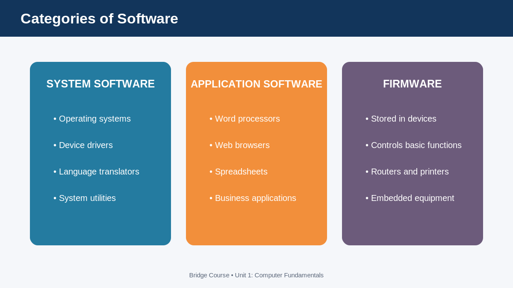
</p>
<p align="center"><em>Infographic: system software, application software and firmware.</em></p>


### 14.1 Operating System

An operating system manages hardware and software resources.

Its functions include:

- managing files,
- managing memory,
- running applications,
- controlling devices,
- providing security,
- managing users, and
- providing a user interface.

Examples include:

- Windows,
- Linux,
- macOS,
- Android, and
- iOS.

### 14.2 Utility Software

Utility software helps maintain, protect, or optimise a system.

Examples:

- antivirus software,
- backup tools,
- file-compression tools,
- disk-cleaning utilities, and
- system-monitoring tools.

### 14.3 Programming Software

Programming tools help developers create software.

Examples:

- code editor,
- compiler,
- interpreter,
- debugger, and
- integrated development environment.

### 14.4 Firmware

Firmware is software stored in a hardware device to control its basic functions.

Firmware may be present in:

- routers,
- printers,
- cameras,
- keyboards,
- storage devices, and
- embedded systems.

---

## 15. Applications of Computers

<p align="center">
  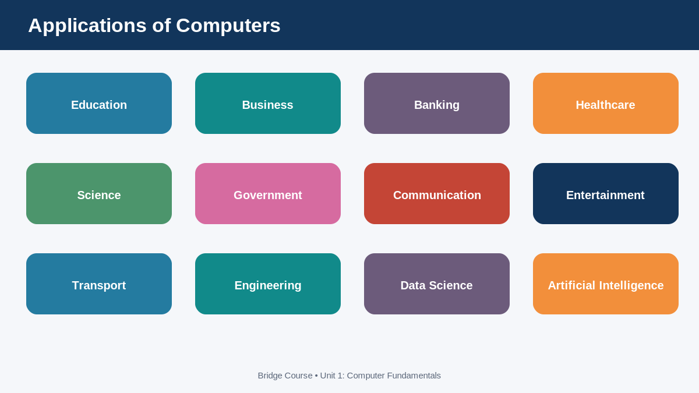
</p>
<p align="center"><em>Infographic: major application areas of computers.</em></p>


### 15.1 Education

Computers support:

- online classes,
- digital libraries,
- simulations,
- assessments,
- programming laboratories, and
- learning-management systems.

### 15.2 Business

Businesses use computers for:

- accounting,
- payroll,
- inventory,
- customer management,
- sales analysis,
- communication, and
- decision support.

### 15.3 Banking and Finance

Computers are used for:

- ATM services,
- online banking,
- transaction processing,
- fraud detection,
- account management, and
- financial modelling.

### 15.4 Healthcare

Applications include:

- electronic patient records,
- diagnostic imaging,
- laboratory systems,
- appointment management,
- remote consultation, and
- health monitoring.

### 15.5 Science and Engineering

Computers support:

- simulation,
- computer-aided design,
- numerical analysis,
- data processing,
- research, and
- control systems.

### 15.6 Government

Government systems use computers for:

- digital identity,
- taxation,
- public records,
- census processing,
- transport systems, and
- citizen services.

### 15.7 Communication

Examples include:

- email,
- instant messaging,
- social networking,
- video calls, and
- collaborative work platforms.

### 15.8 Entertainment

Computers are used for:

- games,
- streaming,
- music production,
- animation,
- photography, and
- video editing.

### 15.9 Transportation

Applications include:

- ticket booking,
- navigation,
- traffic management,
- vehicle-control systems,
- logistics, and
- fleet tracking.

### 15.10 Artificial Intelligence and Data Science

Computers are used to:

- analyse large datasets,
- recognise images,
- process natural language,
- recommend products,
- forecast demand, and
- automate decisions.

---

## 16. Worked Example: ATM Transaction

<p align="center">
  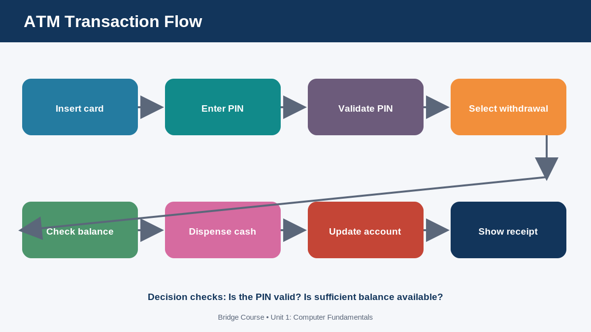
</p>
<p align="center"><em>Infographic: ATM transaction flow.</em></p>


An ATM is a useful example of a complete computer system.

| Component | ATM Example |
|---|---|
| Input | Card, PIN, language, account type, and amount |
| Processing | PIN validation, balance checking, and transaction rules |
| Storage | Transaction record stored in the bank database |
| Output | Cash, receipt, and screen message |
| Communication | Secure connection with the bank server |
| Hardware | Card reader, keypad, screen, cash dispenser, and printer |
| Software | ATM application, operating system, and security software |
| User | Bank customer |
| Procedure | Insert card, enter PIN, choose transaction, collect cash |

### ATM Processing Flow

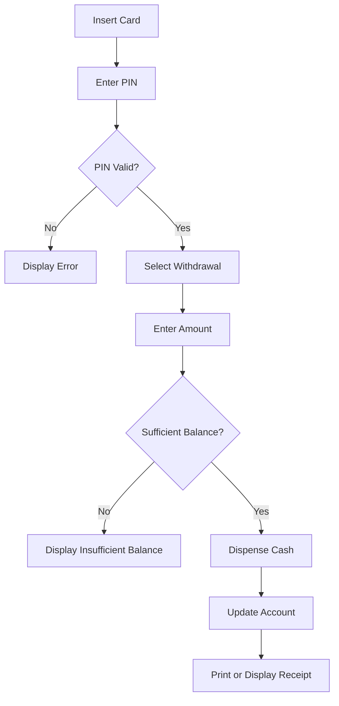
```mermaid
flowchart TD
    A[Insert Card] --> B[Enter PIN]
    B --> C{PIN Valid?}
    C -- No --> D[Display Error]
    C -- Yes --> E[Select Withdrawal]
    E --> F[Enter Amount]
    F --> G{Sufficient Balance?}
    G -- No --> H[Display Insufficient Balance]
    G -- Yes --> I[Dispense Cash]
    I --> J[Update Account]
    J --> K[Print or Display Receipt]
```

---

## 17. Worked Example: University Result System

<p align="center">
  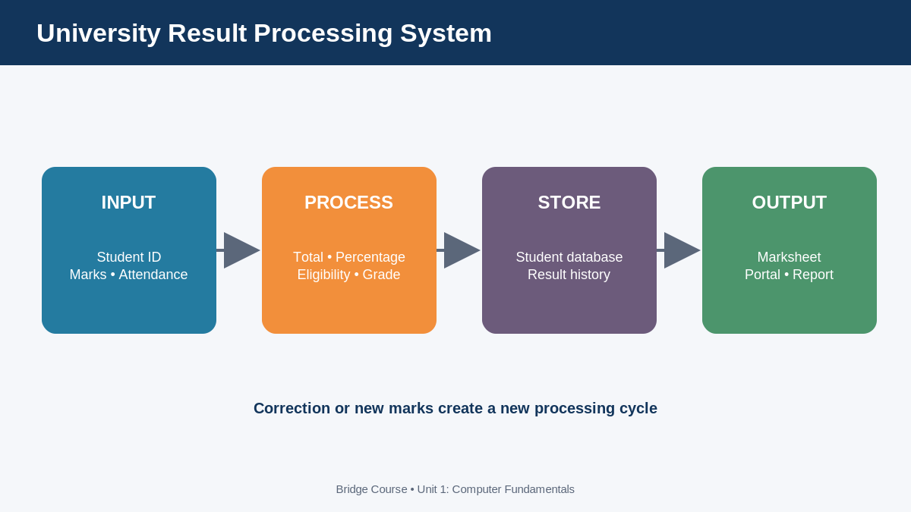
</p>
<p align="center"><em>Infographic: university result processing system.</em></p>


Suppose a university wants to calculate a student's final result.

### Input

- student ID,
- student name,
- subject marks,
- attendance,
- internal assessment, and
- examination marks.

### Processing

The program may:

- calculate total marks,
- calculate percentage,
- verify attendance eligibility,
- determine pass or fail status, and
- assign a grade.

### Storage

The system stores:

- student records,
- subject information,
- marks,
- grades, and
- result history.

### Output

The system may produce:

- marksheet,
- result portal,
- grade report, and
- performance summary.

### Feedback

When marks are corrected, the system processes the updated data and generates a revised result.

---

## 18. Common Beginner Misconceptions

<p align="center">
  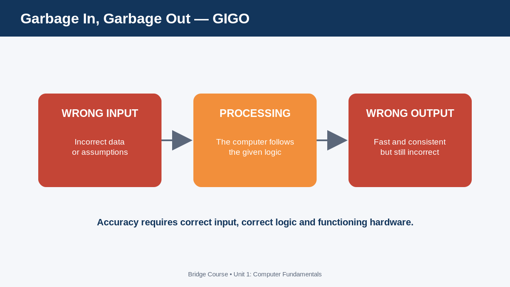
</p>
<p align="center"><em>Infographic: Garbage In, Garbage Out.</em></p>


| Misconception | Correct Explanation |
|---|---|
| A computer always gives the correct answer | It depends on correct data, logic, software, and hardware |
| CPU and computer cabinet are the same | The CPU is a processor; the cabinet contains several components |
| RAM and storage are identical | RAM is temporary working memory; storage keeps files long term |
| More storage always makes a computer faster | Capacity and performance are different properties |
| Internet and World Wide Web are the same | The web is one service that uses the internet |
| Software and program always mean exactly the same thing | Software may contain multiple programs, files, settings, and documentation |
| A computer understands information exactly like a human | It processes encoded data according to rules and models |
| Deleting a desktop shortcut deletes the program | A shortcut is usually only a link to a program or file |

---

## 19. Computer Safety and Responsible Use

<p align="center">
  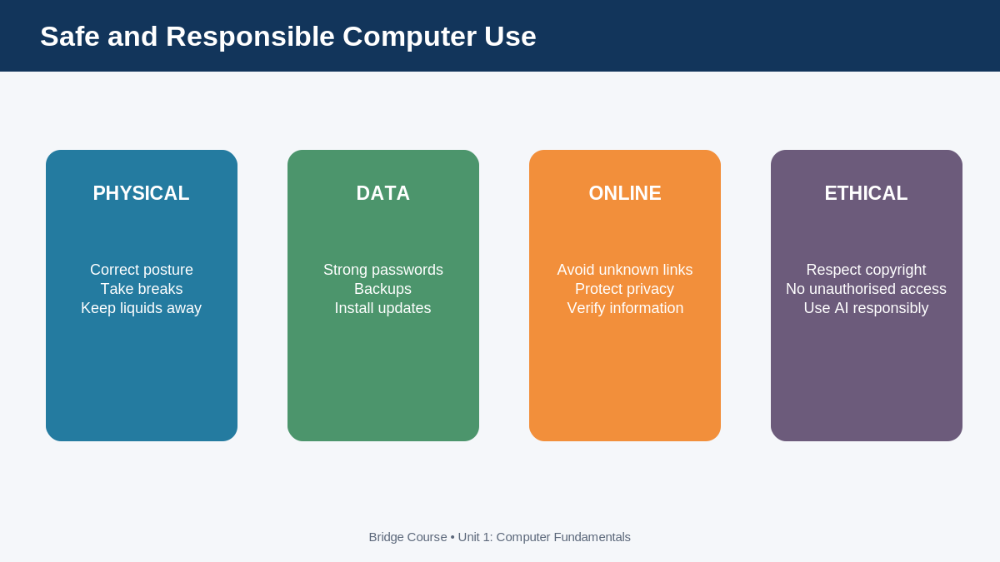
</p>
<p align="center"><em>Infographic: safe and responsible computer use.</em></p>


Students should follow basic safety practices.

### Physical Safety

- Sit with correct posture.
- Keep the screen at a comfortable height.
- Take regular breaks.
- Keep liquids away from electronic devices.
- Do not open electrical equipment without proper supervision.

### Data Safety

- Use strong passwords.
- Keep backups of important files.
- Install updates.
- Avoid unknown links and attachments.
- Do not share confidential information unnecessarily.
- Lock the computer when leaving it unattended.

### Responsible Use

- Respect copyright.
- Cite external material.
- Do not access another person's files without permission.
- Avoid cyberbullying.
- Verify information before sharing it.
- Use artificial intelligence tools responsibly.

---

## 20. Classroom Activity: Identify the Computer System

<p align="center">
  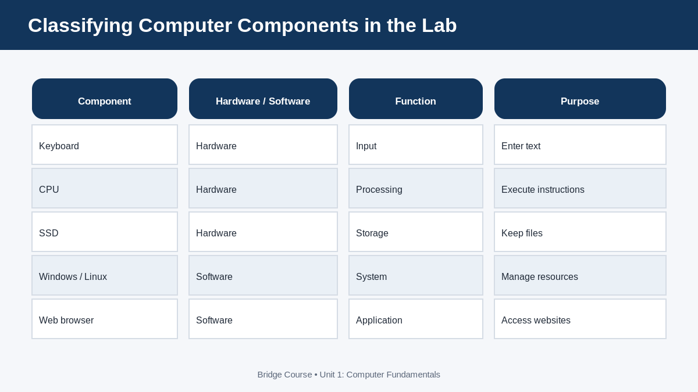
</p>
<p align="center"><em>Infographic: example component-classification table for the lab.</em></p>


For each example, identify the input, processing, output, storage, and communication components.

### Activity A: Railway Ticket Booking

Possible data items:

- passenger name,
- age,
- origin,
- destination,
- date,
- train number,
- class, and
- payment details.

### Activity B: Smart Washing Machine

Possible components:

- buttons or touchscreen,
- water-level sensor,
- temperature sensor,
- embedded controller,
- motor,
- display, and
- saved washing programs.

### Activity C: Online Examination

Possible components:

- student login,
- question database,
- browser,
- timer,
- answer submission,
- scoring software, and
- result report.

---

## 21. Practice Questions

### Very Short Answer Questions

1. What is a computer?
2. Define data.
3. Define information.
4. What is hardware?
5. What is software?
6. What is an input device?
7. What is an output device?
8. What is RAM?
9. What is secondary storage?
10. What is an embedded computer?

### Short Answer Questions

1. Explain the input–processing–output cycle with an example.
2. Differentiate between data and information.
3. Differentiate between hardware and software.
4. Explain any five characteristics of a computer.
5. Explain the major components of the CPU.
6. Compare primary memory and secondary storage.
7. Differentiate between a server and a personal computer.
8. Explain why a computer cannot guarantee correct output.
9. Describe five applications of computers.
10. Explain the role of users and procedures in a computer system.

### Long Answer Questions

1. Explain the components of a computer system with a diagram.
2. Describe the different types of computers and their uses.
3. Analyse an ATM as an input–processing–output–storage system.
4. Explain the major hardware units of a computer.
5. Discuss the advantages and limitations of computers.

---

## 22. Multiple-Choice Questions

### Question 1

Which component mainly performs calculations?

A. Monitor  
B. CPU  
C. Keyboard  
D. Printer  

### Question 2

Which of the following is an input device?

A. Speaker  
B. Projector  
C. Scanner  
D. Monitor  

### Question 3

Which memory normally loses its contents when power is switched off?

A. RAM  
B. SSD  
C. DVD  
D. ROM  

### Question 4

Which type of computer is designed for a specific function inside another device?

A. Mainframe  
B. Embedded computer  
C. Workstation  
D. Supercomputer  

### Question 5

Processed data with meaning is called:

A. Hardware  
B. Information  
C. Procedure  
D. Firmware  

### Question 6

Which device is mainly used for long-term storage?

A. CPU register  
B. Cache  
C. SSD  
D. ALU  

### Question 7

The statement “incorrect input may produce incorrect output” is related to:

A. GUI  
B. GIGO  
C. GPS  
D. USB  

### Question 8

Which software manages hardware and other applications?

A. Operating system  
B. Presentation file  
C. Photograph  
D. Database record  

### Question 9

Which computer is commonly used for complex scientific simulation?

A. Supercomputer  
B. Barcode reader  
C. Smartphone charger  
D. Keyboard  

### Question 10

Which of the following is not hardware?

A. Mouse  
B. Linux  
C. Motherboard  
D. Printer  

---

## 23. MCQ Answers

| Question | Answer |
|---|---|
| 1 | B |
| 2 | C |
| 3 | A |
| 4 | B |
| 5 | B |
| 6 | C |
| 7 | B |
| 8 | A |
| 9 | A |
| 10 | B |

---

## 24. Lab Exercise

### Objective

Observe a computer system and classify its components.

### Instructions

1. Examine a desktop or laptop computer.
2. Create a table with the following columns:

| Component | Hardware or Software | Input, Processing, Output, Storage, or Communication | Purpose |
|---|---|---|---|

3. Add at least 15 components.
4. Include the operating system and three applications.
5. Draw the input–processing–output cycle for one application.
6. Add a photograph or labelled diagram.
7. Write a conclusion of approximately 100 words.

---

## 25. Assignment

Choose one system from the following:

- ATM,
- railway reservation,
- hospital-management system,
- online shopping platform,
- smart classroom,
- traffic-control system, or
- food-delivery application.

Prepare a report containing:

1. purpose of the system,
2. input data,
3. processing activities,
4. outputs,
5. storage requirements,
6. hardware components,
7. software components,
8. users,
9. network or communication requirements,
10. possible security risks, and
11. a flowchart.

---

## 26. Key Takeaways

- A computer accepts data, processes it, stores it, and produces output.
- Data becomes information after processing and the addition of context.
- Hardware refers to physical components.
- Software provides instructions to hardware.
- A computer system also includes users, data, procedures, and communication.
- CPU, memory, input devices, output devices, and storage are major hardware units.
- Computers are fast, accurate, diligent, versatile, and capable of automation.
- Computers depend on correct data and instructions.
- Computers are used in education, business, healthcare, science, transport, communication, and entertainment.
- Embedded computers are present inside many everyday devices.

---

## 27. Image Credits and Reuse Information

This illustrated edition contains locally stored photographs and diagrams. Full source links, authors, licences, local filenames, and attribution notes are provided in [IMAGE_CREDITS.md](./IMAGE_CREDITS.md).

The original course infographics inside `images/infographics/` were created specifically for this lesson and may be reused with attribution to the Bridge Course repository.
