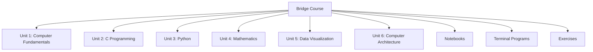

# Bridge Course

This repository contains bridge-course notes, diagrams, practice tasks, terminal C programs, Python notebooks, mathematics, data visualization, and computer architecture.

Most diagrams are written as Mermaid blocks, so they render in GitHub and VS Code Markdown preview.

## Course Map

## Units

### Unit 1: Computer Fundamentals

- [01 Fundamentals of Computers](Unit_1_Computer_Fundamentals/01_Fundamentals_of_Computers.md)
- [02 Computer Hardware](Unit_1_Computer_Fundamentals/02_Computer_Hardware.md)
- [03 Computer Architecture](Unit_1_Computer_Fundamentals/03_Computer_Architecture.md)
- [04 Application Software](Unit_1_Computer_Fundamentals/04_Application_Software.md)
- [05 Networking and Internet](Unit_1_Computer_Fundamentals/05_Networking_and_Internet.md)
- [Unit 1 Summary](Unit_1_Computer_Fundamentals/Summary.md)

### Unit 2: C Programming

- [01 Introduction to Programming](Unit_2_C_Programming/01_Introduction_to_Programming.md)
- [02 C Syntax](Unit_2_C_Programming/02_C_Syntax.md)
- [03 Data Types and Variables](Unit_2_C_Programming/03_Data_Types_and_Variables.md)
- [04 Data Structures](Unit_2_C_Programming/04_Data_Structures.md)
- [05 Operators](Unit_2_C_Programming/05_Operators.md)
- [06 Control Flow](Unit_2_C_Programming/06_Control_Flow.md)
- [07 Loops](Unit_2_C_Programming/07_Loops.md)
- [Unit 2 Summary](Unit_2_C_Programming/Summary.md)

### Unit 3: Python

- [01 Introduction to Python](Unit_3_Python/01_Introduction_to_Python.md)
- [02 Python IDEs](Unit_3_Python/02_Python_IDEs.md)
- [03 Syntax](Unit_3_Python/03_Syntax.md)
- [04 Data Types](Unit_3_Python/04_Data_Types.md)
- [05 Data Structures](Unit_3_Python/05_Data_Structures.md)
- [06 Operators](Unit_3_Python/06_Operators.md)
- [07 Control Flow](Unit_3_Python/07_Control_Flow.md)
- [08 Loops](Unit_3_Python/08_Loops.md)
- [Unit 3 Summary](Unit_3_Python/Summary.md)

### Unit 4: Mathematics

- [01 Discrete Mathematics](Unit_4_Mathematics/01_Discrete_Mathematics.md)
- [02 Sets](Unit_4_Mathematics/02_Sets.md)
- [03 Functions and Relations](Unit_4_Mathematics/03_Functions_and_Relations.md)
- [04 Graph Theory](Unit_4_Mathematics/04_Graph_Theory.md)
- [05 Probability](Unit_4_Mathematics/05_Probability.md)
- [06 Random Variables](Unit_4_Mathematics/06_Random_Variables.md)
- [07 Distributions](Unit_4_Mathematics/07_Distributions.md)
- [08 Statistics](Unit_4_Mathematics/08_Statistics.md)
- [09 Data Visualization Concepts](Unit_4_Mathematics/09_Data_Visualization_Concepts.md)
- [10 Continuous Probability](Unit_4_Mathematics/10_Continuous_Probability.md)
- [11 CS Applications](Unit_4_Mathematics/11_CS_Applications.md)
- [Unit 4 Summary](Unit_4_Mathematics/Summary.md)

### Unit 5: Data Visualization

- [01 Introduction](Unit_5_Data_Visualization/01_Introduction.md)
- [02 Excel](Unit_5_Data_Visualization/02_Excel.md)
- [03 Python](Unit_5_Data_Visualization/03_Python.md)
- [04 R](Unit_5_Data_Visualization/04_R.md)
- [Unit 5 Summary](Unit_5_Data_Visualization/Summary.md)

### Unit 6: Computer Architecture

- [01 Introduction](Unit_6_Computer_Architecture/01_Introduction.md)
- [02 CPU](Unit_6_Computer_Architecture/02_CPU.md)
- [03 Memory](Unit_6_Computer_Architecture/03_Memory.md)
- [04 I/O Subsystems](Unit_6_Computer_Architecture/04_IO_Subsystems.md)
- [05 Common Bus System](Unit_6_Computer_Architecture/05_Common_Bus_System.md)
- [Unit 6 Summary](Unit_6_Computer_Architecture/Summary.md)

## Notebooks

- [Notebook Index](Notebooks/README.md)
- [Python Basics](Notebooks/Python/01_Python_Basics.ipynb)
- [Python Control Flow and Data Structures](Notebooks/Python/02_Control_Flow_and_Data_Structures.ipynb)
- [Python Data Visualization](Notebooks/Python/03_Data_Visualization.ipynb)

## Terminal Programs

- [Terminal program index](Programs/README.md)
- [C programs from terminal](Programs/C/README.md)

## Supporting Material

- [Exercises](Exercises/README.md)
- [Glossary](Glossary.md)
- [References](References.md)
- [Images](Images/)
- [Figures](Figures/)

## Intensive Course Outcomes

After completing the bridge course, students should be able to:

- Explain how computer systems process data through hardware, software, storage, networking, and users.
- Write, test, and debug beginner-to-intermediate C programs using variables, arrays, structures, decisions, and loops.
- Use Python for scripting, data handling, decision logic, loops, collections, and basic analytics.
- Apply discrete mathematics, probability, statistics, and graph concepts to computer science problems.
- Build and interpret charts in Excel, Python, and R with attention to data quality and visual honesty.
- Describe CPU, memory, I/O, and bus subsystems well enough to reason about performance bottlenecks.
- Complete small integrated projects that combine programming, mathematics, and data interpretation.

## Intensive Delivery Model

The course is designed to be used as an active learning bridge, not only as reading material.

| Activity | Expected Student Work |
| --- | --- |
| Concept reading | Read lesson notes and summarize each section in 3 to 5 points |
| Diagram tracing | Recreate Mermaid diagrams by hand and explain each arrow |
| Code execution | Run every C and Python example, then modify at least one input |
| Dry runs | Trace algorithms manually before coding |
| Error analysis | Record compiler/interpreter errors and explain the fix |
| Practice ladder | Solve foundation, core, and challenge exercises |
| Mini project | Submit one integrated artifact per unit |
| Reflection | Write what was difficult, what changed, and what remains unclear |

## Suggested 6-Week Intensive Plan

| Week | Focus | Deliverable |
| --- | --- | --- |
| 1 | Computer fundamentals, hardware, software, networking | smart classroom system proposal |
| 2 | C problem solving, syntax, variables, operators | tested C programs with dry runs |
| 3 | C arrays, structures, control flow, loops | student result processing program |
| 4 | Python tools, syntax, data types, collections, control flow | command-line student analytics script |
| 5 | Mathematics for CS: sets, relations, graphs, probability, statistics | mathematical analysis of a student dataset |
| 6 | Visualization and architecture | dashboard report plus architecture case study |

## Assessment Design

| Component | Weight | Evidence |
| --- | --- | --- |
| Daily practice | 20% | solved exercises, code outputs, dry runs |
| Debugging journal | 15% | errors, causes, fixes, lessons learned |
| Unit mini projects | 35% | working programs, diagrams, reports, analysis |
| Concept viva | 15% | oral explanation of diagrams, code, and math |
| Final integration task | 15% | combined programming, visualization, and architecture reflection |

## Final Integration Task

Build a small student performance analysis package:

1. Store student data using C structures or Python dictionaries.
2. Compute totals, averages, grades, pass/fail counts, highest, and lowest marks.
3. Use sets or relations to analyze branch, subject, or result categories.
4. Visualize the results using Excel or Python.
5. Explain the hardware, memory, I/O, and networking steps involved if this system is deployed in a lab.
6. Submit code, charts, diagrams, and a short interpretation report.

## Suggested Study Flow

1. Read the lesson note.
2. Sketch or review the Mermaid diagram.
3. Run the related notebook cells.
4. Solve the practice tasks.
5. Revisit the unit summary before moving ahead.
6. Attempt the intensive practice section.
7. Record one misconception or error fixed during the session.
8. Complete the unit assessment or mini project.
