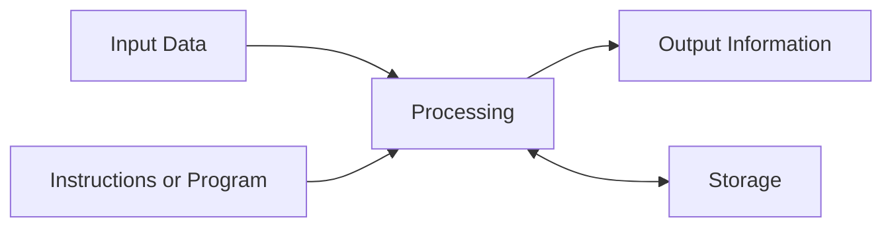
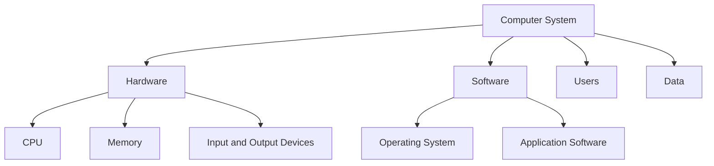

# Fundamentals of Computers

## Learning Goals

- Define a computer as an electronic data-processing system.
- Explain the input-process-output-storage cycle.
- Distinguish data, information, hardware, and software.
- Identify common characteristics and applications of computers.

## 1. What Is a Computer?

A computer is an electronic machine that accepts data, processes it according to instructions, stores results, and produces useful output.

| Term | Meaning | Example |
| --- | --- | --- |
| Data | Raw facts | `75`, `Amit`, `UPES` |
| Information | Processed data with meaning | `Amit scored 75 marks` |
| Hardware | Physical parts | Keyboard, CPU, monitor |
| Software | Programs and instructions | Browser, compiler, operating system |

## 2. Basic Working Model

Example: When you calculate marks in a spreadsheet, the marks are input, formulas process them, the result is output, and the file is stored for later use.

## 3. Characteristics of Computers

- Speed: executes millions or billions of operations per second.
- Accuracy: produces correct output when data and instructions are correct.
- Diligence: repeats tasks without fatigue.
- Storage: stores large amounts of data.
- Versatility: supports many tasks, from documents to simulations.
- Automation: performs tasks automatically after instructions are supplied.

## 4. Computer System Components

## 5. Types of Computers

| Type | Typical Use |
| --- | --- |
| Personal computer | Study, office work, programming |
| Laptop | Portable computing |
| Server | Websites, databases, cloud services |
| Mainframe | Large organizations and high-volume transactions |
| Supercomputer | Weather, research, scientific simulation |
| Embedded computer | Cars, washing machines, routers |

## 6. Applications

- Education: online learning, simulations, digital libraries.
- Business: billing, accounting, inventory, analytics.
- Healthcare: diagnosis, patient records, imaging.
- Science and engineering: modeling, design, data analysis.
- Communication: email, video calls, social platforms.
- Entertainment: games, streaming, animation.

## 7. Intensive Understanding: From Data to Decision

A useful way to understand a computer is to follow one real task from beginning to end. Suppose a university wants to calculate whether a student has passed a subject.

1. Input: marks, attendance, internal assessment, and student ID are entered through a keyboard, form, scanner, or database.
2. Processing: the program applies rules such as total marks calculation, minimum passing marks, attendance eligibility, and grade assignment.
3. Storage: raw marks and final grades are stored in files or a database so they can be retrieved later.
4. Output: the result is shown on screen, exported as a report, or sent to a student portal.
5. Feedback: if a correction is made, the same cycle runs again with updated data.

This shows why a computer is not "intelligent" by itself. It follows precise instructions at high speed. The quality of the output depends on the quality of the input data, the correctness of the processing rules, and the reliability of the software and hardware.

## 8. Data, Information, and Knowledge

Beginners often use data and information as if they are the same thing. In computing, the difference matters:

| Level | Meaning | Example in a marks system |
| --- | --- | --- |
| Data | Raw symbols or facts | `37`, `CSE101`, `Aarav` |
| Information | Processed data with context | `Aarav scored 37 in CSE101` |
| Knowledge | Interpreted information used for action | `Aarav needs remedial support` |
| Decision | Action based on knowledge | Assign extra lab practice |

Most information systems are built to move from raw data toward decisions. Programming, databases, networking, analytics, and visualization all support this movement.

## 9. Common Beginner Misconceptions

| Misconception | Correction |
| --- | --- |
| A computer always gives correct answers | It gives correct answers only when input, logic, and hardware are correct |
| More storage makes a computer faster | Storage capacity and processing speed are different concepts |
| Software and program mean exactly the same thing | A program is a set of instructions; software may include many programs, data, settings, and documentation |
| Internet and web are the same | The web is one service that runs on the internet |
| A computer understands English like humans do | It processes encoded instructions and data using formal rules |

## 10. Worked Example: ATM Transaction

| Stage | What happens |
| --- | --- |
| Input | User inserts card, enters PIN, selects withdrawal amount |
| Processing | ATM validates PIN, checks balance, applies bank rules |
| Storage | Transaction record is written to bank systems |
| Output | Cash, receipt, and screen confirmation are produced |
| Communication | ATM contacts bank server over a secure network |

The ATM example combines hardware, software, networking, storage, and security. A simple user action depends on many computer-system components working together.

## 11. Intensive Practice

1. Draw the input-process-output-storage cycle for a railway ticket booking system. Include at least five data items.
2. Convert the following data into information: student names, roll numbers, three subject marks, attendance percentage.
3. Identify the hardware, software, data, user, and network components involved in an online exam.
4. Write a short paragraph explaining why incorrect input can produce incorrect output even when the computer is working perfectly.
5. Compare a desktop computer, smartphone, ATM, and smart watch as computer systems.

## Key Takeaways

- A computer converts data into information using instructions.
- Hardware is physical; software controls hardware.
- The input-process-output-storage model is the simplest way to understand computer work.

## Practice

1. Give three examples each of data and information.
2. Draw the input-process-output-storage cycle for an ATM transaction.
3. List five places where embedded computers are used.
