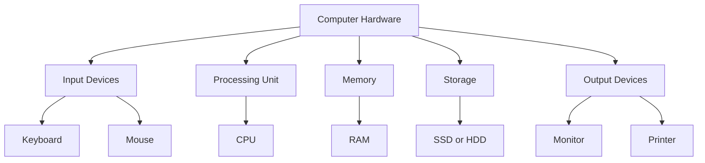
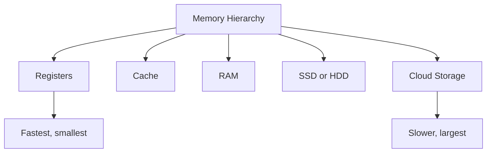

# Computer Hardware

## Learning Goals

- Identify major hardware components.
- Explain input, output, storage, memory, and processing devices.
- Compare primary and secondary storage.

## 1. Hardware Overview

Hardware means the physical parts of a computer system. You can touch hardware, replace it, repair it, or upgrade it.

## 2. Input Devices

Input devices send data and commands to the computer.

| Device | Use |
| --- | --- |
| Keyboard | Text and command input |
| Mouse | Pointing and selection |
| Scanner | Converts paper documents into digital form |
| Microphone | Audio input |
| Camera | Image and video input |

## 3. Processing Unit

The CPU is the main processing component. It executes instructions and coordinates other parts.

CPU parts:

- ALU: arithmetic and logical operations.
- Control Unit: directs instruction execution.
- Registers: very small, very fast storage inside the CPU.

## 4. Memory and Storage

| Feature | RAM | SSD or HDD |
| --- | --- | --- |
| Type | Primary memory | Secondary storage |
| Volatile | Yes | No |
| Speed | Faster | Slower than RAM |
| Use | Running programs | Saving files permanently |

## 5. Output Devices

Output devices present processed information to users.

- Monitor: visual output.
- Printer: hard copy output.
- Speakers: audio output.
- Projector: large display output.

## 6. Hardware Selection Example

For programming and data work, a good student laptop should have:

- Multi-core processor.
- At least 8 GB RAM, preferably 16 GB.
- SSD storage.
- Reliable keyboard and display.
- Good battery life.

## 7. Intensive Hardware View

Computer hardware should be understood as a performance chain. A program is not executed by the CPU alone. Data moves from storage to RAM, from RAM to cache, from cache to registers, and then through CPU execution units. If any part is slow or too small, the full system may feel slow.

| Component | Main Question | Performance Concern |
| --- | --- | --- |
| CPU | How fast can instructions be executed? | cores, clock speed, architecture, cache |
| RAM | How much active work can stay in memory? | capacity, speed, multitasking |
| SSD/HDD | How fast can files and programs load? | read/write speed, reliability |
| GPU | How fast can graphics or parallel numeric work run? | graphics rendering, AI workloads |
| Network adapter | How fast can data move over a network? | bandwidth, latency, stability |
| Cooling system | Can components sustain performance? | heat, throttling, noise |

## 8. RAM, Storage, and Performance

RAM and storage are often confused. RAM is the worktable. Storage is the cupboard. When you open a program, it is loaded from storage into RAM. When RAM is insufficient, the operating system may use part of storage as temporary memory, which is much slower than real RAM.

Example: A laptop with a fast processor but only 4 GB RAM may struggle when a browser, IDE, notebook, and video call are open together. Upgrading to 16 GB RAM may improve the experience more than changing the processor.

## 9. Hardware Troubleshooting Thinking

| Symptom | Possible Hardware Cause | First Check |
| --- | --- | --- |
| Computer starts slowly | Slow HDD, many startup apps | Disk type and startup list |
| System freezes during multitasking | Low RAM | Memory usage in Task Manager |
| Fan is loud and performance drops | Overheating | Airflow, dust, temperature |
| Display flickers | Cable, driver, GPU, monitor | External monitor or cable test |
| Wi-Fi disconnects | Adapter or router issue | Try another network/device |

Good troubleshooting starts with observation, not guessing. Record the symptom, when it occurs, what changed recently, and whether the problem is repeatable.

## 10. Intensive Practice

1. Design three computer configurations: budget programming laptop, data science workstation, and office desktop. Justify CPU, RAM, storage, and display choices.
2. Explain why an SSD can make an old computer feel faster even if the CPU is unchanged.
3. Classify hardware bottlenecks for these tasks: compiling code, editing video, opening many browser tabs, training a neural network, copying large files.
4. Create a comparison table for HDD, SATA SSD, NVMe SSD, and cloud storage.
5. Interview your own laptop or lab PC using system information tools and write a one-page hardware profile.

## Key Takeaways

- Hardware performs input, processing, storage, and output functions.
- RAM is temporary; SSD/HDD storage is permanent.
- CPU speed matters, but memory and storage also strongly affect performance.

## Practice

1. Classify five devices as input, output, processing, or storage.
2. Explain why RAM contents disappear when power is off.
3. Compare SSD and HDD in your own words.
