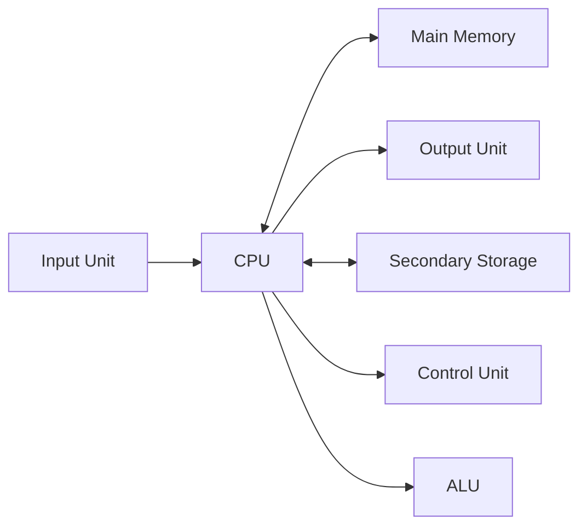
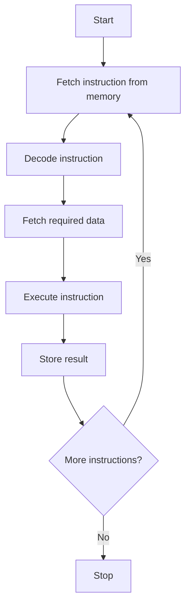

# Computer Architecture

## Learning Goals

- Describe the basic organization of a computer.
- Explain the Von Neumann model.
- Understand the fetch-decode-execute cycle.

## 1. Meaning of Computer Architecture

Computer architecture describes how the main parts of a computer are organized and how they communicate to execute programs.

Important architectural questions:

- Where are instructions stored?
- How does the CPU access memory?
- How is input/output handled?
- How does data move inside the system?

## 2. Von Neumann Architecture

Most modern computers are based on the Von Neumann model, where instructions and data are stored in the same memory.



## 3. Fetch-Decode-Execute Cycle



## 4. Key CPU Registers

| Register | Purpose |
| --- | --- |
| Program Counter | Stores address of next instruction |
| Instruction Register | Stores current instruction |
| Accumulator | Stores intermediate arithmetic results |
| Memory Address Register | Holds memory address being accessed |
| Memory Data Register | Holds data moving to or from memory |

## 5. System Bus

A bus is a communication path that transfers data and signals.

| Bus | Role |
| --- | --- |
| Address bus | Carries memory addresses |
| Data bus | Carries actual data |
| Control bus | Carries control signals |

## 6. Intensive View: Why Architecture Matters

Architecture explains the contract between software and hardware. A C statement such as `total = total + marks[i];` may look simple, but the computer performs several lower-level actions:

1. Fetch the instruction that tells the CPU what to do.
2. Decode the instruction to identify the operation.
3. Locate the value of `total`.
4. Locate `marks[i]` using a memory address.
5. Add the values in the ALU.
6. Store the result back in a register or memory.
7. Move to the next instruction using the program counter.

When programs are slow, the reason may be CPU work, memory access, disk I/O, network delay, or inefficient software design. Architecture gives the vocabulary to identify the real bottleneck.

## 7. Von Neumann Bottleneck

In the Von Neumann model, instructions and data share the same memory path. This can create a bottleneck because the CPU may be ready to execute faster than memory can deliver instructions and data.

Modern systems reduce this bottleneck using:

- CPU cache to keep frequently used data nearby.
- Pipelining to overlap instruction stages.
- Multiple cores to execute independent tasks.
- Separate instruction and data caches in many processors.
- Faster memory buses and storage interfaces.

## 8. Instruction-Level Walkthrough

For the expression:

```c
sum = a + b;
```

a simplified instruction sequence may be:

```text
LOAD R1, a
LOAD R2, b
ADD R3, R1, R2
STORE sum, R3
```

This shows that high-level programming languages hide many machine-level steps. Understanding those steps helps students later learn compilers, operating systems, embedded systems, and performance tuning.

## 9. Intensive Practice

1. Trace the fetch-decode-execute cycle for `x = y + 5`.
2. Explain how the program counter changes during sequential execution and during a branch.
3. Compare Von Neumann and Harvard architecture at a conceptual level.
4. Draw a CPU-memory-I/O diagram and label where address, data, and control signals move.
5. Write a short note on how cache helps reduce the Von Neumann bottleneck.

## Key Takeaways

- Architecture explains how hardware components work together.
- In Von Neumann architecture, data and instructions share memory.
- The CPU repeatedly fetches, decodes, and executes instructions.

## Practice

1. Draw the fetch-decode-execute cycle.
2. Why is the program counter important?
3. What is the difference between a data bus and an address bus?
