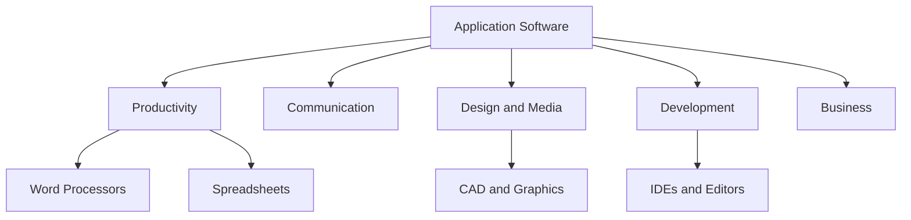
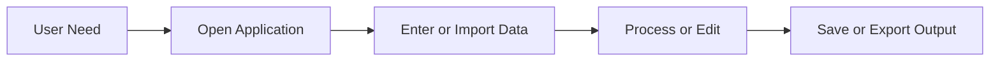

# Application Software

## Learning Goals

- Distinguish system software from application software.
- Identify major categories of application software.
- Explain how users interact with applications.

## 1. What Is Application Software?

Application software is designed to help users perform specific tasks such as writing documents, browsing the web, editing images, analyzing data, or coding.

System software manages the computer. Application software solves user problems.

| Software Type | Main Role | Examples |
| --- | --- | --- |
| System software | Manages hardware and system resources | Windows, Linux, device drivers |
| Application software | Helps users complete tasks | Word, Excel, Chrome, VS Code |

## 2. Categories

## 3. Common Examples

| Category | Examples | Use |
| --- | --- | --- |
| Word processing | MS Word, Google Docs | Reports and documents |
| Spreadsheet | Excel, Google Sheets | Tables, formulas, charts |
| Browser | Chrome, Edge, Firefox | Web access |
| IDE/editor | VS Code, PyCharm | Programming |
| Database | MySQL Workbench, Access | Data storage and queries |

## 4. Application Workflow

## 5. Choosing Software

Consider:

- Purpose: what task it solves.
- Ease of use: suitable for the user level.
- Compatibility: file formats and operating system.
- Cost and licensing: free, paid, or open source.
- Security: trusted source and regular updates.

## 6. Intensive View: Software as a Workflow Tool

Application software is best evaluated by the workflow it supports. A spreadsheet is not just "a table program"; it supports data entry, cleaning, formulas, summaries, charts, and reports. An IDE is not just "a typing tool"; it supports editing, syntax highlighting, debugging, terminal access, extensions, and version control.

| User Need | Application Features That Matter |
| --- | --- |
| Write a report | styles, spell check, references, export to PDF |
| Analyze marks | formulas, sorting, charts, pivot tables |
| Build a program | editor, compiler/interpreter integration, debugger |
| Design a poster | layers, fonts, image tools, export formats |
| Manage a database | tables, queries, relationships, backups |

The strongest users learn features as part of a task, not as isolated buttons.

## 7. File Formats and Compatibility

Application software often creates files in specific formats. Understanding formats prevents data loss and compatibility problems.

| Format | Common Use | Important Point |
| --- | --- | --- |
| `.docx` | Word documents | editable document format |
| `.pdf` | sharing final documents | preserves layout, harder to edit |
| `.xlsx` | spreadsheets | formulas, sheets, charts |
| `.csv` | tabular data | simple text, portable, no formatting |
| `.py` | Python code | plain text source file |
| `.ipynb` | notebooks | code, text, outputs in cells |

For data work, `.csv` is often more portable than a spreadsheet file. For final reports, PDF is usually safer than editable formats.

## 8. Security and Licensing

Students should avoid installing unknown software from random websites. Application software can include malware, unwanted browser extensions, or unsafe macros. Prefer official websites, university-provided licenses, open-source repositories, or trusted package managers.

Licensing also matters. Freeware, open source, trial software, educational licenses, and commercial licenses have different rules. Using software responsibly is part of professional computing practice.

## 9. Intensive Practice

1. Pick one application you use daily and map its workflow from input to final output.
2. Compare VS Code, Jupyter Notebook, and Google Colab for a beginner Python student.
3. Convert a small spreadsheet to CSV and explain what formatting or formulas are lost.
4. Make a software selection checklist for a college lab with 40 machines.
5. Write a security advisory for students installing programming tools on personal laptops.

## Key Takeaways

- Application software is task-focused.
- System software supports applications.
- Good software choice depends on need, cost, compatibility, and security.

## Practice

1. Classify ten applications on your laptop or phone.
2. Explain why VS Code is application software.
3. Compare a browser and a spreadsheet by purpose.
