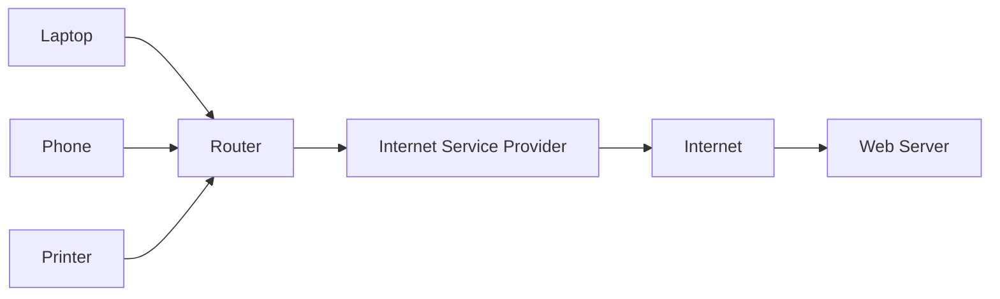
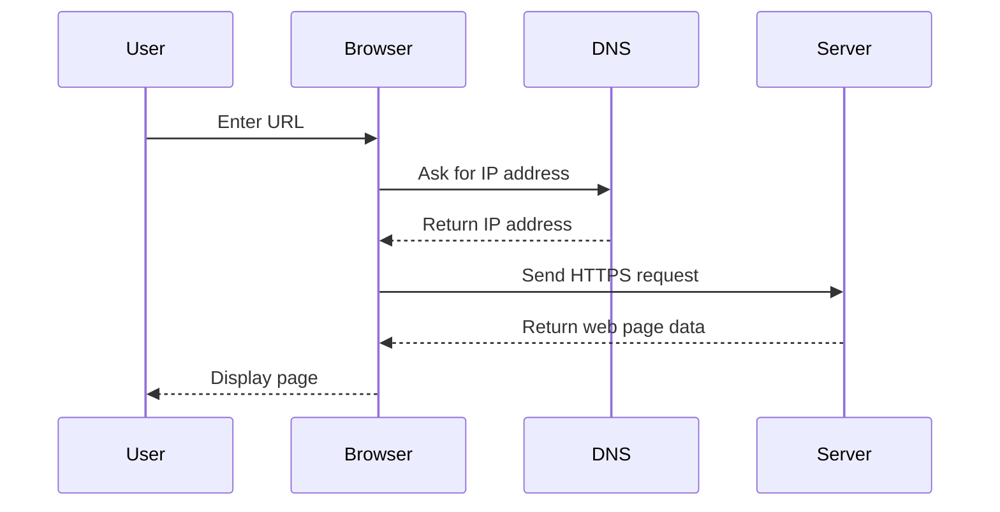

# Networking and Internet

## Learning Goals

- Define a computer network.
- Explain LAN, WAN, internet, IP address, DNS, and URL.
- Describe the basic path of a web request.

## 1. What Is a Network?

A computer network is a group of connected devices that can share data and resources.

## 2. Network Types

| Type | Full Form | Typical Area |
| --- | --- | --- |
| PAN | Personal Area Network | Around one person |
| LAN | Local Area Network | Room, lab, building |
| MAN | Metropolitan Area Network | City |
| WAN | Wide Area Network | Country or world |

## 3. Important Terms

| Term | Meaning |
| --- | --- |
| IP address | Numeric address of a device on a network |
| DNS | Converts domain names to IP addresses |
| URL | Web address of a resource |
| Router | Sends data packets between networks |
| Protocol | Rules for communication |
| HTTP/HTTPS | Protocols used for web pages |

## 4. How a Web Page Opens

## 5. Internet Safety Basics

- Prefer HTTPS websites.
- Use strong and unique passwords.
- Avoid unknown downloads.
- Keep software updated.
- Be careful with links in email and messages.

## 6. Intensive View: Packet-Based Communication

Network communication usually happens in packets. A large message, image, video, or web page is broken into smaller units, sent across the network, and reassembled at the destination.

Each packet may include:

- Source address: where it came from.
- Destination address: where it should go.
- Sequence information: how to reassemble packets in order.
- Payload: the actual piece of data.
- Error-checking information: helps detect corruption.

This packet approach makes networks resilient. If one route is congested or unavailable, packets may be routed differently depending on the network.

## 7. URL, DNS, IP, and HTTP Together

When you open `https://www.example.com/index.html`, several ideas work together:

| Part | Role |
| --- | --- |
| `https` | protocol for secure web communication |
| `www.example.com` | domain name readable by humans |
| DNS | finds the IP address for the domain |
| IP address | identifies the server on the network |
| `/index.html` | resource path on the server |
| Browser | sends request and renders response |

DNS is like a directory service. HTTPS is the communication rule. IP addressing is the delivery system.

## 8. Latency, Bandwidth, and Reliability

| Concept | Meaning | Example |
| --- | --- | --- |
| Latency | delay before data begins arriving | video call lag |
| Bandwidth | amount of data transferred per second | download speed |
| Reliability | consistency and correctness of delivery | dropped calls or failed uploads |

A network can have high bandwidth but poor latency. For example, a large file may download quickly, but an online game may still feel slow if latency is high.

## 9. Intensive Practice

1. Trace the full journey of opening a university website, from typing the URL to seeing the page.
2. Compare LAN, WAN, and the internet using an example for each.
3. Explain why DNS failure can stop websites from opening even when the internet connection works.
4. Run `ping` and `ipconfig` or `ifconfig` on a computer and interpret the output.
5. Create a safety checklist for using public Wi-Fi in an airport or cafe.

## Key Takeaways

- A network connects devices for communication and sharing.
- The internet is a global network of networks.
- DNS makes domain names easier to use than numeric IP addresses.

## Practice

1. Find the IP address of your computer using a terminal command.
2. Explain what DNS does using an example.
3. Draw the route from your laptop to a website.
