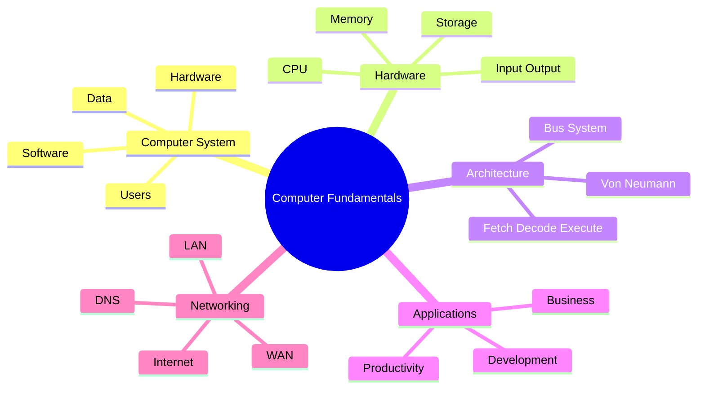

# Unit 1 Summary: Computer Fundamentals

## Lessons

- [01 Fundamentals of Computers](01_Fundamentals_of_Computers.md)
- [02 Computer Hardware](02_Computer_Hardware.md)
- [03 Computer Architecture](03_Computer_Architecture.md)
- [04 Application Software](04_Application_Software.md)
- [05 Networking and Internet](05_Networking_and_Internet.md)

## Concept Map

## Quick Review

| Topic | Core Idea |
| --- | --- |
| Computer | Processes data into information |
| Hardware | Physical components |
| Software | Instructions and programs |
| Architecture | Organization of computer components |
| Network | Connected devices that share data |

## Intensive Review Checklist

By the end of this unit, a student should be able to:

- Explain a computer system as a combination of hardware, software, data, users, and procedures.
- Trace input, processing, output, storage, and communication in a real scenario.
- Compare RAM, cache, registers, SSD, HDD, and cloud storage by role and volatility.
- Explain why CPU speed alone does not determine overall performance.
- Identify application software categories and evaluate software using workflow, cost, compatibility, licensing, and security.
- Trace how a browser uses URL, DNS, IP address, HTTPS, and a web server.
- Use basic diagnostic vocabulary: bottleneck, latency, bandwidth, storage, memory, and processing.

## Unit Assessment Tasks

1. Draw and explain the complete computer-system model for an online exam platform.
2. Prepare a hardware recommendation for three users: programmer, office worker, and video editor.
3. Create a flow diagram showing how a web page opens from URL entry to display.
4. Write a 500-word comparison of system software and application software with examples.
5. Explain one real troubleshooting scenario using observation, possible causes, and first checks.

## Mini Project

Design a "smart classroom computer system" proposal. Include:

- Hardware components and their roles.
- Application software required by teachers and students.
- Network requirements.
- Data handled by the system.
- Security and maintenance considerations.
- A diagram showing how components interact.

## Review Questions

1. Explain the input-process-output-storage cycle with an example.
2. What is the difference between RAM and SSD?
3. Describe the fetch-decode-execute cycle.
4. Give three examples of application software.
5. What happens when a browser opens a website?
