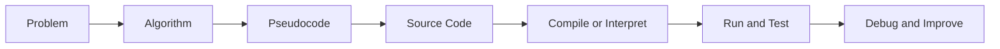
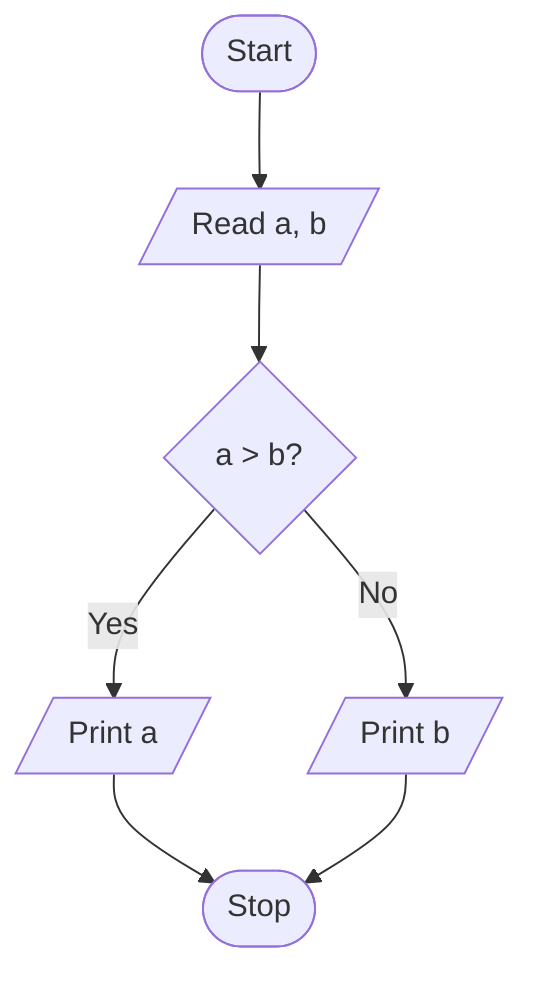

# Introduction to Programming

## Learning Goals

- Explain programming and problem solving.
- Write simple algorithms and pseudocode.
- Understand how C programs are compiled and executed.

## 1. What Is Programming?

Programming is the process of writing instructions that a computer can execute to solve a problem.

A program usually follows this path:



## 2. Algorithm

An algorithm is a finite, ordered set of steps to solve a problem.

Example: Find the largest of two numbers.

```text
1. Start
2. Read a and b
3. If a > b, print a
4. Otherwise, print b
5. Stop
```

## 3. Flowchart



## 4. First C Program

```c
#include <stdio.h>

int main(void) {
    printf("Hello, world!\n");
    return 0;
}
```

## 5. Program Development Cycle

| Step | Purpose |
| --- | --- |
| Analyze | Understand the problem |
| Design | Create algorithm or flowchart |
| Code | Write the program |
| Compile | Translate source code to machine code |
| Run | Execute the program |
| Test | Check outputs |
| Debug | Fix errors |

## 6. Intensive Problem-Solving Method

Before writing C code, train yourself to solve the problem without syntax. A strong programming answer usually has these layers:

1. Problem statement: what must be computed or decided.
2. Inputs: what data is required.
3. Outputs: what result must be shown or stored.
4. Constraints: valid ranges, special cases, and assumptions.
5. Algorithm: ordered steps independent of language.
6. Dry run: manual test using sample values.
7. Code: translation of the algorithm into C.
8. Testing: normal cases, boundary cases, and invalid cases.

Example problem: calculate simple interest.

| Layer | Example |
| --- | --- |
| Inputs | principal, rate, time |
| Output | simple interest |
| Formula | `SI = (P * R * T) / 100` |
| Boundary case | `time = 0` should give interest `0` |
| Invalid case | negative principal should be rejected in real systems |

## 7. Algorithm Quality Checklist

A good algorithm should be:

- Finite: it must stop after a limited number of steps.
- Unambiguous: each step must have only one meaning.
- Effective: each step must be possible to perform.
- Ordered: steps must be in a logical sequence.
- Tested: sample input should produce expected output.

If a beginner cannot dry-run an algorithm on paper, the code is usually not ready.

## 8. Worked Example: Largest of Three Numbers

Algorithm:

```text
1. Start
2. Read a, b, c
3. Set largest = a
4. If b > largest, set largest = b
5. If c > largest, set largest = c
6. Print largest
7. Stop
```

C program:

```c
#include <stdio.h>

int main(void) {
    int a, b, c, largest;

    printf("Enter three numbers: ");
    scanf("%d %d %d", &a, &b, &c);

    largest = a;

    if (b > largest) {
        largest = b;
    }

    if (c > largest) {
        largest = c;
    }

    printf("Largest = %d\n", largest);
    return 0;
}
```

This solution scales better than writing every possible comparison because it uses the idea of a current best value.

## 9. Intensive Practice

1. For each problem, write input, output, constraints, algorithm, dry run, and C code: area of circle, simple interest, maximum of three numbers, and Celsius to Fahrenheit.
2. Create test cases for an even/odd program, including zero and negative numbers.
3. Rewrite a vague instruction such as "calculate marks" into a precise algorithm.
4. Explain the difference between a syntax error, logic error, and runtime error using one C example for each.
5. Design a flowchart for an ATM withdrawal decision with balance and PIN checks.

## Key Takeaways

- Programming is structured problem solving.
- Algorithms are language-independent.
- C programs must be compiled before execution.

## Practice

1. Write an algorithm to calculate the area of a rectangle.
2. Draw a flowchart to check whether a number is even.
3. Write a C program that prints your name and branch.
