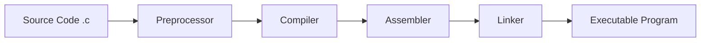

# C Syntax

## Learning Goals

- Recognize the structure of a C program.
- Use comments, statements, functions, and header files.
- Understand the compile-run workflow.

## 1. Basic Structure

```c
#include <stdio.h>

int main(void) {
    // statements go here
    return 0;
}
```

| Part | Meaning |
| --- | --- |
| `#include <stdio.h>` | Adds standard input/output functions |
| `main` | Program execution starts here |
| `{ }` | Groups statements into a block |
| `printf` | Prints output |
| `return 0` | Indicates successful completion |

## 2. Compilation Process



## 3. Comments

```c
// Single-line comment

/*
   Multi-line comment
*/
```

Comments are written for humans. The compiler ignores them.

## 4. Statements and Semicolons

Most C statements end with a semicolon.

```c
int age = 18;
printf("%d\n", age);
```

Missing semicolons are common beginner errors.

## 5. Input and Output

```c
#include <stdio.h>

int main(void) {
    int marks;
    printf("Enter marks: ");
    scanf("%d", &marks);
    printf("Marks = %d\n", marks);
    return 0;
}
```

## 6. Intensive Syntax Breakdown

C is strict because the compiler needs exact instructions. Small details such as semicolons, braces, data types, and format specifiers change the meaning of a program.

| Syntax Element | Example | Why It Matters |
| --- | --- | --- |
| Header file | `#include <stdio.h>` | gives access to `printf` and `scanf` declarations |
| Function header | `int main(void)` | defines the program entry point |
| Block | `{ ... }` | groups statements together |
| Statement | `age = 18;` | one executable instruction |
| Format specifier | `%d` | tells C how to print or read a value |
| Address operator | `&marks` | gives `scanf` the memory address to store input |

## 7. Compile-Time Thinking

The compiler checks whether your source code follows C rules. It does not know your intention. For example:

```c
int marks = 80
printf("%d\n", marks);
```

The missing semicolon after `80` causes a syntax error. The compiler may point to the next line because it discovers the problem when it sees `printf`.

Common compile problems:

- Missing semicolon.
- Missing closing brace.
- Wrong header file.
- Using a variable before declaring it.
- Format specifier mismatch.
- Writing `=` instead of `==` inside a condition.

## 8. Safer Input Example

Basic `scanf` examples are useful, but real programs should check whether input succeeded.

```c
#include <stdio.h>

int main(void) {
    int marks;

    printf("Enter marks: ");

    if (scanf("%d", &marks) != 1) {
        printf("Invalid input\n");
        return 1;
    }

    printf("Marks = %d\n", marks);
    return 0;
}
```

`scanf` returns the number of values successfully read. Checking this result helps detect invalid input.

## 9. Debugging Drill

For every C program you write, ask:

1. Did I include the required header files?
2. Is every variable declared before use?
3. Do all statements that need semicolons have them?
4. Do opening and closing braces match?
5. Do `printf` and `scanf` format specifiers match variable types?
6. Did I test with more than one input?

## 10. Intensive Practice

1. Write, compile, and run five short programs: print text, read integer, read float, add two numbers, and calculate percentage.
2. Intentionally create five syntax errors and record the compiler messages.
3. Explain why `scanf("%d", marks);` is wrong for an integer variable.
4. Fix a program with mismatched braces and missing semicolons.
5. Write a program that reads name initial, age, and percentage, then prints them in a formatted sentence.

## Key Takeaways

- C syntax is strict and case-sensitive.
- Every C program needs a `main` function.
- The compiler converts source code into an executable program.

## Practice

1. Write a C program that takes two integers and prints their sum.
2. Identify the syntax error in a program missing a semicolon.
3. Explain why `scanf` uses `&marks`.
