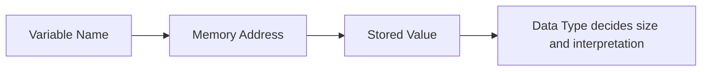

# Data Types and Variables

## Learning Goals

- Declare and initialize variables in C.
- Use common C data types.
- Choose suitable format specifiers for input and output.

## 1. Variables

A variable is a named memory location used to store a value.

```c
int age = 18;
float temperature = 36.6;
char grade = 'A';
```

## 2. Common Data Types

| Data Type | Stores | Example Format Specifier |
| --- | --- | --- |
| `int` | Whole numbers | `%d` |
| `float` | Decimal numbers | `%f` |
| `double` | Larger decimal values | `%lf` |
| `char` | Single character | `%c` |

## 3. Memory View



Example:

```c
int count = 10;
```

Here `count` is the name, `int` is the type, and `10` is the value.

## 4. Constants

```c
const float PI = 3.14159;
#define MAX_SIZE 100
```

Use constants for values that should not change.

## 5. Type Conversion

```c
int a = 5, b = 2;
float result = (float)a / b; // 2.5
```

The cast `(float)` converts `a` before division.

## 6. Intensive Memory and Type View

A variable has four important properties:

| Property | Meaning | Example |
| --- | --- | --- |
| Name | identifier used in code | `marks` |
| Type | kind of value and memory interpretation | `int` |
| Value | data currently stored | `85` |
| Address | memory location | accessed using `&marks` |

The data type determines how many bytes may be used and how the bits are interpreted. The exact size can vary by compiler and system, so professional C programmers often check sizes using `sizeof`.

```c
#include <stdio.h>

int main(void) {
    printf("int: %zu bytes\n", sizeof(int));
    printf("float: %zu bytes\n", sizeof(float));
    printf("double: %zu bytes\n", sizeof(double));
    printf("char: %zu bytes\n", sizeof(char));
    return 0;
}
```

## 7. Format Specifier Discipline

Wrong format specifiers are a major source of beginner bugs.

| Type | `printf` | `scanf` |
| --- | --- | --- |
| `int` | `%d` | `%d` |
| `float` | `%f` | `%f` |
| `double` | `%f` | `%lf` |
| `char` | `%c` | `%c` |

For `printf`, both `float` and `double` commonly use `%f` because of argument promotion. For `scanf`, `float` needs `%f`, while `double` needs `%lf`.

## 8. Integer Division Trap

```c
int total = 445;
int subjects = 5;
float average = total / subjects;
```

This gives `89.0`, which is fine here. But:

```c
int a = 5;
int b = 2;
float result = a / b; // 2.0, not 2.5
```

Because both operands are integers, C performs integer division before assigning to `float`. Use:

```c
float result = (float)a / b;
```

## 9. Naming and Scope

Use meaningful names such as `total_marks`, `radius`, and `student_count`. Avoid names that hide meaning, such as `a1`, `temp2`, and `xyz`, unless the context is mathematical and obvious.

Variables declared inside a block exist only inside that block. This is called scope.

```c
if (marks >= 40) {
    char grade = 'P';
    printf("%c\n", grade);
}

// grade cannot be used here
```

## 10. Intensive Practice

1. Write a program that prints the size of `int`, `float`, `double`, and `char` on your system.
2. Create a table of 10 variables for a student record with suitable C data types.
3. Demonstrate integer division and corrected floating-point division.
4. Write a program that reads radius and prints area and circumference using a constant for pi.
5. Explain why money should not always be stored as `float` in serious financial software.

## Key Takeaways

- A data type tells C how much memory to use and how to interpret a value.
- Format specifiers connect variables to `printf` and `scanf`.
- Type conversion helps avoid integer division mistakes.

## Practice

1. Declare variables for name initial, age, percentage, and grade.
2. Write a C program to convert Celsius to Fahrenheit.
3. Explain the difference between `float` and `double`.
