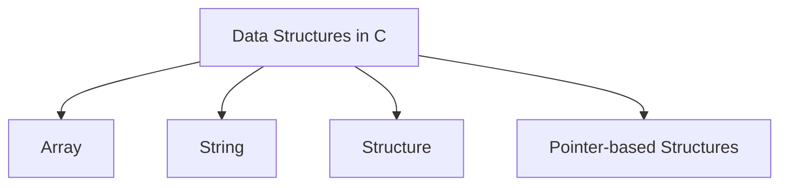
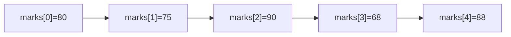

# Data Structures

## Learning Goals

- Use arrays to store multiple values.
- Work with strings as character arrays.
- Understand structures for grouping related data.

## 1. Why Data Structures?

A data structure organizes data so that it can be stored, accessed, and processed efficiently.



## 2. Arrays

An array stores multiple values of the same type.

```c
int marks[5] = {80, 75, 90, 68, 88};
printf("%d\n", marks[0]); // first element
```

Array indexing starts at `0`.



## 3. Strings

In C, a string is an array of characters ending with the null character `\0`.

```c
char name[] = "UPES";
printf("%s\n", name);
```

## 4. Structures

A structure groups related values of different types.

```c
struct Student {
    int roll;
    char grade;
    float marks;
};

struct Student s1 = {1, 'A', 91.5};
```

## 5. When to Use What?

| Need | Data Structure |
| --- | --- |
| Many values of same type | Array |
| Text | String |
| Related fields of different types | Structure |

## 6. Intensive Array Understanding

Arrays are stored in contiguous memory. This means elements are placed one after another. If an `int` takes 4 bytes and `marks[0]` starts at address 1000, then `marks[1]` may be at 1004, `marks[2]` at 1008, and so on.

This is why array indexing is fast: C can calculate the address of any element using the base address and index.

```text
address of marks[i] = base address + i * size of int
```

Important rule: C does not automatically stop you from accessing outside the array.

```c
int marks[5];
marks[10] = 99; // dangerous: outside the array
```

Out-of-bounds access can corrupt memory or crash the program.

## 7. Strings Require Extra Care

A C string needs space for the null character.

```c
char word[5] = "UPES"; // U P E S \0
```

If the array is too small, the string cannot be stored safely. For beginner input, prefer width limits:

```c
char name[20];
scanf("%19s", name);
```

The width limit leaves one character for `\0`.

## 8. Structure Example: Student Records

```c
#include <stdio.h>

struct Student {
    int roll;
    char name[30];
    float marks;
};

int main(void) {
    struct Student s = {101, "Asha", 88.5};

    printf("Roll: %d\n", s.roll);
    printf("Name: %s\n", s.name);
    printf("Marks: %.2f\n", s.marks);

    return 0;
}
```

Structures help represent real records cleanly. Arrays and structures can also be combined to store many records.

## 9. Intensive Practice

1. Store marks of 10 students in an array and find highest, lowest, average, and number of students above average.
2. Write a program that reads a word and counts its characters without using library functions.
3. Create a `struct Student` with roll, name, marks, and grade. Store three students in an array of structures.
4. Explain why `marks[5]` is invalid for an array declared as `int marks[5]`.
5. Draw the memory layout of a character array storing `"CODE"`.

## Key Takeaways

- Arrays store same-type values in continuous memory.
- Strings are character arrays.
- Structures are useful for records such as students, books, or employees.

## Practice

1. Store five marks in an array and print their average.
2. Write a program that reads and prints a name.
3. Create a `struct Book` with title, price, and pages.
