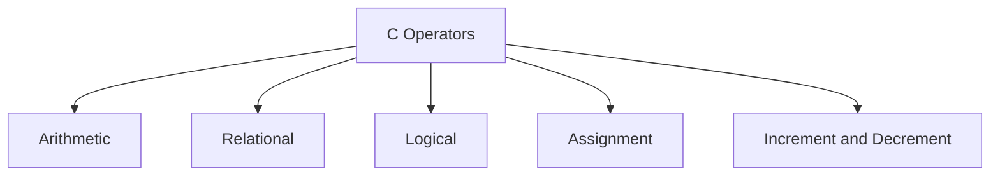

# Operators

## Learning Goals

- Use arithmetic, relational, logical, assignment, and increment operators.
- Understand operator precedence.
- Build correct expressions in C.

## 1. Operator Categories



## 2. Arithmetic Operators

| Operator | Meaning | Example |
| --- | --- | --- |
| `+` | Addition | `a + b` |
| `-` | Subtraction | `a - b` |
| `*` | Multiplication | `a * b` |
| `/` | Division | `a / b` |
| `%` | Remainder | `a % b` |

## 3. Relational and Logical Operators

```c
if (marks >= 40 && attendance >= 75) {
    printf("Eligible\n");
}
```

| Operator | Meaning |
| --- | --- |
| `==` | Equal to |
| `!=` | Not equal to |
| `>` | Greater than |
| `<` | Less than |
| `&&` | Logical AND |
| `||` | Logical OR |
| `!` | Logical NOT |

## 4. Assignment Operators

```c
total += marks; // same as total = total + marks
count++;
```

## 5. Precedence Example

```c
int result = 10 + 5 * 2; // 20, not 30
```

Multiplication happens before addition. Parentheses make expressions clearer:

```c
int result = (10 + 5) * 2; // 30
```

## 6. Intensive Operator Reasoning

Operators are not just symbols; they define how expressions are evaluated. In C, expression mistakes can create bugs even when the program compiles.

| Expression | Meaning | Common Mistake |
| --- | --- | --- |
| `a = b` | assign `b` to `a` | used accidentally inside condition |
| `a == b` | compare equality | confused with assignment |
| `a % b` | remainder after division | only valid for integers |
| `a && b` | true only if both are true | using `&` accidentally |
| `a || b` | true if at least one is true | confusing with English "either/or" |
| `!a` | logical negation | forgetting precedence |

## 7. Short-Circuit Evaluation

C uses short-circuit evaluation for `&&` and `||`.

```c
if (denominator != 0 && numerator / denominator > 2) {
    printf("Safe division\n");
}
```

The division is evaluated only if `denominator != 0` is true. This prevents division by zero.

For `||`, if the first condition is true, the second condition is not evaluated because the whole expression is already true.

## 8. Increment and Decrement Details

```c
int x = 5;
int a = x++; // a gets 5, x becomes 6

int y = 5;
int b = ++y; // y becomes 6, b gets 6
```

Use `x++` or `++x` as standalone statements when possible. Complex expressions with increments can be confusing and sometimes unsafe.

```c
i++;
```

is clearer than hiding the increment inside a larger expression.

## 9. Intensive Practice

1. Predict the output of 15 expressions involving arithmetic, relational, logical, and assignment operators.
2. Write a condition for scholarship eligibility: marks at least 85, attendance at least 80, and no disciplinary case.
3. Use short-circuit logic to safely divide two numbers only when the denominator is nonzero.
4. Explain why `if (x = 5)` is dangerous.
5. Rewrite three complex expressions using parentheses to make evaluation order obvious.

## Key Takeaways

- Operators create expressions.
- `=` assigns; `==` compares.
- Parentheses reduce mistakes in complex expressions.

## Practice

1. Predict the result of `8 + 12 / 4 * 2`.
2. Write a condition for passing if marks are at least 40.
3. Explain the difference between `x++` and `++x`.
