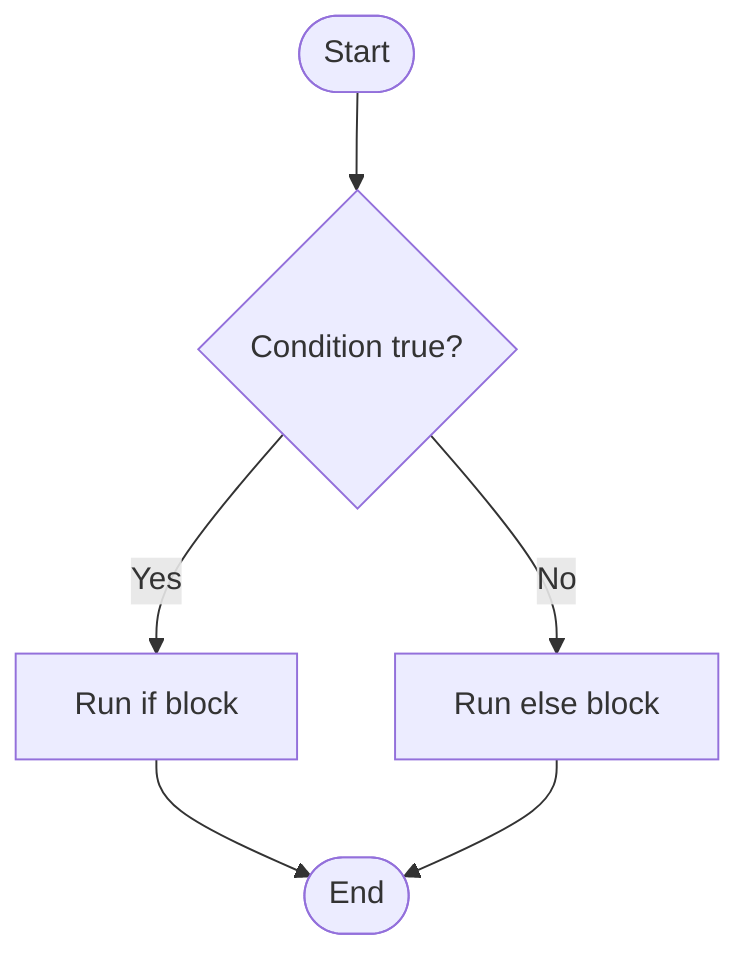

# Control Flow

## Learning Goals

- Use `if`, `else if`, `else`, and `switch`.
- Represent decisions using flowcharts.
- Write programs that choose between alternatives.

## 1. Decision Making

Control flow decides which statements run based on conditions.



## 2. `if` Statement

```c
if (marks >= 40) {
    printf("Pass\n");
}
```

## 3. `if else`

```c
if (number % 2 == 0) {
    printf("Even\n");
} else {
    printf("Odd\n");
}
```

## 4. `else if` Ladder

```c
if (marks >= 90) {
    printf("Grade A\n");
} else if (marks >= 75) {
    printf("Grade B\n");
} else if (marks >= 40) {
    printf("Grade C\n");
} else {
    printf("Fail\n");
}
```

## 5. `switch`

Use `switch` when checking one expression against many fixed values.

```c
switch (choice) {
    case 1:
        printf("Add\n");
        break;
    case 2:
        printf("Subtract\n");
        break;
    default:
        printf("Invalid choice\n");
}
```

## 6. Intensive Decision Design

Good control flow starts with clear decision rules. Before coding, write the rules in a table.

Example: grading system

| Condition | Grade |
| --- | --- |
| `marks >= 90` | A |
| `marks >= 75` and `< 90` | B |
| `marks >= 60` and `< 75` | C |
| `marks >= 40` and `< 60` | D |
| below 40 | Fail |

The order matters. If you check `marks >= 40` first, then a score of 95 also satisfies that condition and may receive the wrong grade.

## 7. Range Checking

Real programs should validate inputs before using them.

```c
#include <stdio.h>

int main(void) {
    int marks;

    printf("Enter marks: ");
    scanf("%d", &marks);

    if (marks < 0 || marks > 100) {
        printf("Invalid marks\n");
    } else if (marks >= 90) {
        printf("Grade A\n");
    } else if (marks >= 75) {
        printf("Grade B\n");
    } else if (marks >= 40) {
        printf("Pass\n");
    } else {
        printf("Fail\n");
    }

    return 0;
}
```

Validation separates bad input from valid decision logic.

## 8. `switch` Design Rules

Use `switch` when:

- One expression is compared with fixed values.
- Menu choices are numeric or character-based.
- Ranges are not required.

Avoid `switch` when:

- Conditions involve ranges such as `marks >= 90`.
- Multiple variables are involved.
- Complex logical expressions are needed.

Remember `break`. Without it, execution falls through into the next case.

## 9. Intensive Practice

1. Build a grade calculator with input validation and clear range rules.
2. Write a menu-driven calculator using `switch` for addition, subtraction, multiplication, division, and modulus.
3. Write a program that decides loan eligibility using income, credit score, and existing debt.
4. Create a truth table for a login rule: valid username, valid password, and account not locked.
5. Find the bug in an `else if` ladder where conditions are in the wrong order.

## Key Takeaways

- Conditions control which statements execute.
- Use `if else` for ranges and complex conditions.
- Use `switch` for menu-driven fixed choices.

## Practice

1. Write a program to find the largest of three numbers.
2. Write a grade calculator using `else if`.
3. Create a menu-driven calculator using `switch`.
