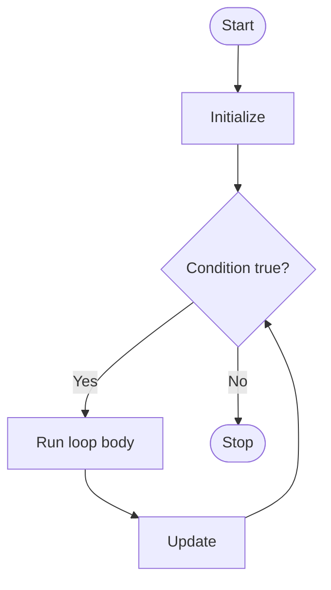

# Loops

## Learning Goals

- Use `for`, `while`, and `do while` loops.
- Identify loop initialization, condition, body, and update.
- Avoid infinite loops.

## 1. Why Loops?

Loops repeat a block of code while a condition is true.



## 2. `for` Loop

Best when the number of repetitions is known.

```c
for (int i = 1; i <= 5; i++) {
    printf("%d\n", i);
}
```

## 3. `while` Loop

Best when repetition depends on a condition.

```c
int n = 1;
while (n <= 5) {
    printf("%d\n", n);
    n++;
}
```

## 4. `do while` Loop

Runs at least once.

```c
int choice;
do {
    printf("Enter 0 to stop: ");
    scanf("%d", &choice);
} while (choice != 0);
```

## 5. Nested Loops

```c
for (int row = 1; row <= 3; row++) {
    for (int col = 1; col <= 3; col++) {
        printf("* ");
    }
    printf("\n");
}
```

## 6. Intensive Loop Anatomy

Every loop must answer four questions:

| Question | Example in `for (int i = 1; i <= 10; i++)` |
| --- | --- |
| Where does it start? | `int i = 1` |
| When does it continue? | `i <= 10` |
| What repeats? | loop body |
| How does it move forward? | `i++` |

If the update is missing or wrong, the loop may become infinite. If the condition is wrong, the loop may run too many or too few times.

## 7. Accumulators and Counters

Loops often use two patterns:

```c
int count = 0;
int total = 0;

for (int i = 1; i <= 5; i++) {
    int marks;
    scanf("%d", &marks);

    total += marks;  // accumulator
    count++;         // counter
}

printf("Average = %.2f\n", (float)total / count);
```

An accumulator combines values. A counter counts occurrences.

## 8. Sentinel-Controlled Loop

A sentinel value signals the end of input.

```c
int number;
int sum = 0;

printf("Enter numbers, -1 to stop:\n");
scanf("%d", &number);

while (number != -1) {
    sum += number;
    scanf("%d", &number);
}

printf("Sum = %d\n", sum);
```

This is useful when the number of inputs is not known in advance.

## 9. Nested Loop Thinking

Nested loops are common in patterns, tables, matrices, and grid problems. The outer loop usually controls rows; the inner loop usually controls columns.

```c
for (int row = 1; row <= 5; row++) {
    for (int col = 1; col <= row; col++) {
        printf("* ");
    }
    printf("\n");
}
```

Trace nested loops using a table of `row`, `col`, and output.

## 10. Intensive Practice

1. Write programs for factorial, sum of digits, reverse of a number, and prime number testing.
2. Print square, right triangle, inverted triangle, and multiplication table patterns.
3. Read marks until `-1` is entered and calculate count, sum, average, highest, and lowest.
4. Use nested loops to print a 10 by 10 multiplication grid.
5. Debug an infinite loop by identifying initialization, condition, body, and update.

## Key Takeaways

- A loop must move toward making its condition false.
- `for` is compact for counting loops.
- `do while` executes before checking the condition.

## Practice

1. Print numbers from 1 to 100.
2. Print the multiplication table of a number.
3. Calculate the factorial of a number.
4. Print a triangle pattern using nested loops.
