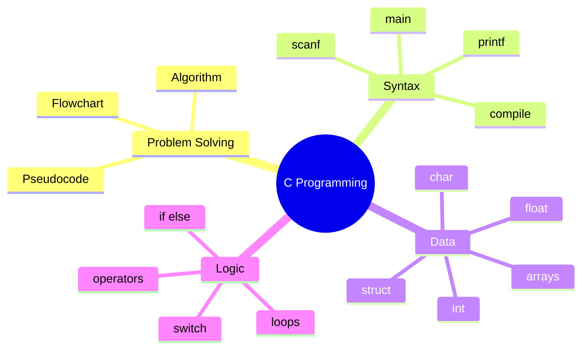

# Unit 2 Summary: C Programming

## Lessons

- [01 Introduction to Programming](01_Introduction_to_Programming.md)
- [02 C Syntax](02_C_Syntax.md)
- [03 Data Types and Variables](03_Data_Types_and_Variables.md)
- [04 Data Structures](04_Data_Structures.md)
- [05 Operators](05_Operators.md)
- [06 Control Flow](06_Control_Flow.md)
- [07 Loops](07_Loops.md)

## Concept Map

## Quick Reference

| Task | C Feature |
| --- | --- |
| Print output | `printf` |
| Read input | `scanf` |
| Store whole number | `int` |
| Store decimals | `float` or `double` |
| Repeat statements | Loops |
| Choose between options | Control flow |

## Intensive Review Checklist

By the end of this unit, a student should be able to:

- Convert a problem statement into inputs, outputs, constraints, algorithm, dry run, and C code.
- Explain the C compile-run-debug cycle.
- Use `printf` and `scanf` with correct format specifiers.
- Choose suitable data types and explain integer division, casting, constants, and scope.
- Use arrays, strings, and structures for simple records.
- Build expressions with arithmetic, relational, logical, assignment, and increment operators.
- Write correct `if`, `else if`, `switch`, `for`, `while`, and `do while` programs.
- Test programs using normal, boundary, and invalid input cases.

## Unit Assessment Tasks

1. Write a C program for a grade management system using arrays and structures.
2. Build a menu-driven calculator with input validation and safe division.
3. Write a program that reads marks until a sentinel value and prints count, sum, average, highest, and lowest.
4. Debug five intentionally broken programs and explain each error.
5. Prepare a flowchart and pseudocode before coding one nontrivial problem.

## Mini Project

Create a student result processing program in C.

Required features:

- Store at least five students.
- Use a structure for student details.
- Store marks in an array.
- Calculate total, average, grade, pass/fail, class highest, and class average.
- Use functions if students have already learned them, or clearly separated code blocks if not.
- Include at least five test cases and expected outputs.

## Review Questions

1. What is the difference between an algorithm and a program?
2. Why does C require compilation?
3. What is the difference between `=` and `==`?
4. When would you use an array?
5. Write a program to find the sum of the first `n` natural numbers.

## Terminal Practice

- [C programs from terminal](../Programs/C/README.md)
