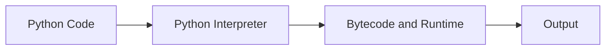

# Introduction to Python

## Learning Goals

- Explain what Python is and why it is popular.
- Run simple Python statements.
- Understand where Python is used in computer science and data work.

## 1. What Is Python?

Python is a high-level, interpreted programming language known for readable syntax and a large ecosystem of libraries.

Python is used for:

- Beginner programming.
- Automation and scripting.
- Data analysis and visualization.
- Web development.
- Artificial intelligence and machine learning.
- Scientific computing.

## 2. Python Execution Model



Unlike C, Python programs usually do not need a separate manual compilation step.

## 3. First Program

```python
print("Hello, Python!")
```

## 4. Variables

```python
name = "Asha"
age = 18
percentage = 86.5

print(name, age, percentage)
```

Python detects the type from the assigned value.

## 5. Strengths of Python

| Strength | Explanation |
| --- | --- |
| Readability | Code is close to English |
| Libraries | Many packages for common tasks |
| Portability | Runs on Windows, Linux, and macOS |
| Community | Large beginner-friendly community |
| Productivity | Fewer lines for many tasks |

## 6. Intensive View: What "Interpreted" Means

Python code is executed by the Python interpreter. In normal beginner use, you write a `.py` file or notebook cell, run it, and Python handles the execution process. Internally, Python compiles source code to bytecode and runs it on the Python virtual machine, but the student usually does not manage this step manually.

This creates a different workflow from C:

| C | Python |
| --- | --- |
| Write source code | Write source code |
| Compile manually | Interpreter handles execution |
| Run executable | Run script or cell |
| More strict type declarations | Dynamic typing |
| Often faster execution | Often faster development |

Python is excellent for learning, automation, data science, and rapid experimentation. C is excellent for understanding memory, systems, and performance. A strong computer science student benefits from both.

## 7. Python as a Problem-Solving Language

Python is commonly used as "executable pseudocode" because its syntax is compact and readable.

Problem: calculate average marks.

```python
marks = [82, 91, 76, 88, 95]
average = sum(marks) / len(marks)
print("Average:", average)
```

The same logic can later be expanded into a full program with input validation, file reading, visualization, or database storage.

## 8. Running Python in Different Modes

| Mode | Best Use |
| --- | --- |
| Interactive shell | quick experiments |
| `.py` script | reusable programs |
| Jupyter notebook | learning, data analysis, explanation |
| IDE project | larger applications |
| Command-line script | automation tasks |

Students should practice all modes. Notebooks are friendly for learning, but scripts are important for real software projects.

## 9. Intensive Practice

1. Run the same `print` program in a notebook, terminal, and script file. Compare the experience.
2. Write a Python script that stores your name, branch, semester, and three goals, then prints a formatted profile.
3. Convert a simple C-style algorithm for average marks into Python code.
4. List five areas where Python is used and identify one library associated with each.
5. Explain in your own words why Python is good for beginners but still used by professionals.

## Key Takeaways

- Python is interpreted and beginner-friendly.
- It is widely used in data science, automation, and AI.
- Python code emphasizes readability.

## Practice

1. Print your name, university, and course.
2. Store your age in a variable and print it.
3. Write three Python use cases you care about.
