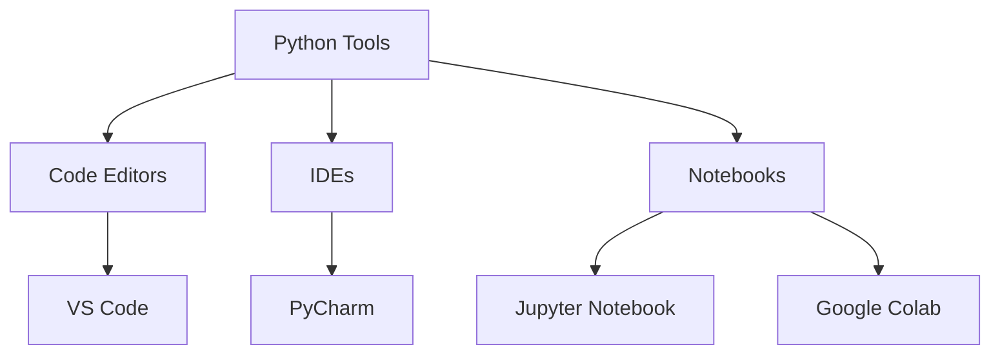
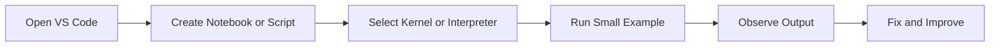

# Python IDEs

## Learning Goals

- Identify common Python development tools.
- Choose the right tool for scripts, notebooks, and projects.
- Understand the difference between editor, IDE, and notebook.

## 1. Development Tools

## 2. Tool Comparison

| Tool | Best For |
| --- | --- |
| VS Code | General coding, notebooks, projects |
| Jupyter Notebook | Interactive learning and data analysis |
| Google Colab | Cloud notebooks and quick experiments |
| PyCharm | Larger Python projects |
| IDLE | Simple beginner practice |

## 3. Scripts vs Notebooks

| Feature | Python Script `.py` | Notebook `.ipynb` |
| --- | --- | --- |
| Format | Plain text code | Cells with code, text, and output |
| Best for | Programs and projects | Learning, exploration, reports |
| Execution | Usually top to bottom | Cell by cell |
| Output | Terminal | Inline below cells |

## 4. Recommended Beginner Setup

For this course:

- Use VS Code for editing notes and code.
- Use Jupyter notebooks for Python experiments and terminal C programs for Unit 2 practice.
- Keep code examples small and test frequently.

## Workflow

## 5. Intensive Tooling Concepts

Learning Python is easier when you understand the parts of the development environment.

| Term | Meaning |
| --- | --- |
| Editor | tool for writing code |
| IDE | editor plus debugging, project tools, and integrations |
| Interpreter | program that runs Python code |
| Kernel | execution engine used by notebooks |
| Terminal | command-line interface for running commands |
| Virtual environment | isolated set of Python packages for a project |
| Package manager | tool such as `pip` for installing libraries |

Many beginner errors come from using one Python interpreter in the terminal and a different interpreter in the notebook or editor.

## 6. Recommended Course Workflow

For each Python topic:

1. Read the Markdown note.
2. Run the smallest example in a notebook.
3. Copy the final version into a `.py` script.
4. Test with at least three input cases.
5. Save errors and fixes in a learning log.

This builds both exploration skill and disciplined programming skill.

## 7. Debugger Basics

A debugger lets you pause a program and inspect values.

Core debugging actions:

- Breakpoint: pause execution at a selected line.
- Step over: run the current line and move to the next.
- Step into: enter a function call.
- Variables panel: inspect current values.
- Call stack: see how execution reached the current point.

Debugging is not only for fixing broken code. It is also a way to understand how code executes.

## 8. Intensive Practice

1. Configure VS Code or another editor to run a Python file.
2. Run a notebook and identify the selected kernel.
3. Create a virtual environment and install one package such as `matplotlib`.
4. Use a breakpoint to inspect variables in a loop.
5. Write a short comparison of notebook-first and script-first workflows.

## Practice

1. Create a Python notebook and run `print("Bridge Course")`.
2. Create a `.py` file and run the same code.
3. Compare the notebook output with terminal output.
