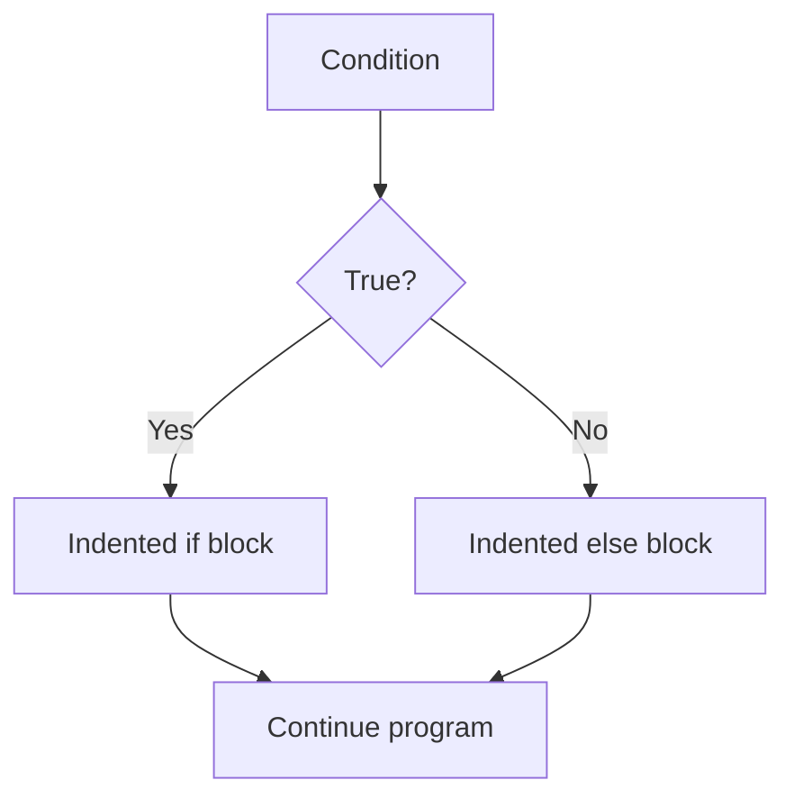

# Syntax

## Learning Goals

- Write valid Python statements.
- Use indentation correctly.
- Add comments and readable names.

## 1. Python Syntax Basics

Python uses indentation to define blocks.

```python
marks = 82

if marks >= 40:
    print("Pass")
else:
    print("Fail")
```

The indented lines belong to the `if` and `else` blocks.

## 2. Indentation Flow



## 3. Comments

```python
# This is a single-line comment

"""
This is a multi-line string.
It is often used as a docstring.
"""
```

## 4. Naming Rules

Good names:

```python
student_name = "Riya"
total_marks = 450
is_passed = True
```

Avoid names like `x1`, `abc`, or `data2` unless their meaning is obvious.

## 5. Input and Output

```python
name = input("Enter your name: ")
print("Hello,", name)
```

## Common Syntax Errors

| Error | Example |
| --- | --- |
| Missing colon | `if marks > 40` |
| Wrong indentation | Unaligned block statements |
| Wrong case | `Print()` instead of `print()` |
| Unclosed string | `"Hello` |

## 6. Intensive Syntax Rules

Python syntax is simple, but it is not loose. The interpreter still needs exact structure.

| Rule | Correct Example | Problem Example |
| --- | --- | --- |
| Blocks use indentation | `if x > 0:` then indented body | inconsistent spaces |
| Statements usually end by line | `name = "Asha"` | unnecessary semicolon habits from C |
| Strings need matching quotes | `"UPES"` | `"UPES'` |
| Names are case-sensitive | `marks` | using `Marks` later |
| Colons start blocks | `for i in range(5):` | missing colon |

Use four spaces per indentation level. Avoid mixing tabs and spaces.

## 7. Readability Standards

Readable Python uses clear names and simple structure.

```python
student_marks = [82, 91, 76]
total_marks = sum(student_marks)
average_marks = total_marks / len(student_marks)
```

This is better than:

```python
x = [82, 91, 76]
y = sum(x)
z = y / len(x)
```

Short names are acceptable for small mathematical loops, such as `i` or `n`, but meaningful names are better for program data.

## 8. Input Conversion Pattern

`input()` always returns a string. Convert when numeric computation is needed.

```python
age_text = input("Enter age: ")
age = int(age_text)

if age >= 18:
    print("Adult")
else:
    print("Minor")
```

For production programs, invalid input should be handled using exception handling, but this course first focuses on the basic conversion pattern.

## 9. Intensive Practice

1. Fix five Python snippets with indentation, colon, quote, and name errors.
2. Write a profile program using at least five variables with meaningful names.
3. Ask for two numbers as input, convert them, and print sum, difference, product, and quotient.
4. Rewrite poorly named code using descriptive names.
5. Explain why `print`, `Print`, and `PRINT` are different in Python.

## Practice

1. Write an `if else` block using correct indentation.
2. Ask the user for their city and print a greeting.
3. Fix a Python program with a missing colon.
