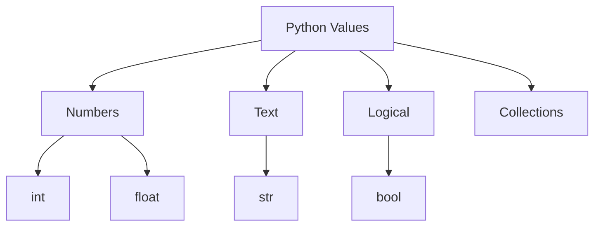

# Data Types

## Learning Goals

- Use Python's built-in data types.
- Check and convert types.
- Understand mutable and immutable values at a basic level.

## 1. Core Data Types

| Type | Example | Meaning |
| --- | --- | --- |
| `int` | `25` | Whole number |
| `float` | `9.8` | Decimal number |
| `str` | `"hello"` | Text |
| `bool` | `True` | Logical value |
| `NoneType` | `None` | No value |

```python
age = 18
height = 1.72
name = "Dev"
is_student = True
```

## 2. Type Checking

```python
print(type(age))
print(type(name))
```

## 3. Type Conversion

```python
marks_text = "85"
marks = int(marks_text)
percentage = float("91.5")
```

## 4. Type System Diagram



## 5. Mutable vs Immutable

| Category | Meaning | Examples |
| --- | --- | --- |
| Immutable | Cannot be changed in place | `int`, `float`, `str`, `tuple` |
| Mutable | Can be changed in place | `list`, `dict`, `set` |

## 6. Intensive Type Behavior

Python variables are names attached to objects. The object has a type; the name can later point to a different object.

```python
score = 90
print(type(score))  # int

score = "ninety"
print(type(score))  # str
```

This flexibility is convenient, but it can create bugs if the same variable name is used for different meanings. Keep variables consistent.

## 7. Boolean Truthiness

Python values can be evaluated as true or false in conditions.

| Value | Truthiness |
| --- | --- |
| `0` | false |
| `0.0` | false |
| `""` | false |
| `[]` | false |
| `{}` | false |
| `None` | false |
| nonzero numbers | true |
| non-empty strings | true |
| non-empty collections | true |

Example:

```python
name = input("Enter name: ")

if name:
    print("Hello", name)
else:
    print("Name was empty")
```

## 8. Type Conversion Risks

```python
marks = int("85")      # works
price = float("99.5")  # works
age = int("eighteen")  # ValueError
```

Conversion should be used when the string content is valid for the target type. Later, exception handling can be added for invalid input.

## 9. Intensive Practice

1. Create examples of `int`, `float`, `str`, `bool`, and `None`, then print their types.
2. Test truthiness for empty string, non-empty string, zero, nonzero number, empty list, and non-empty list.
3. Write a program that reads marks as text, converts them to `float`, and prints pass/fail.
4. Explain why `10 + "20"` is an error but `"10" + "20"` is not.
5. Demonstrate that strings are immutable by trying to change one character directly.

## Practice

1. Convert input age from string to integer.
2. Print the type of five different values.
3. Explain why `"10" + "20"` gives `"1020"`.
