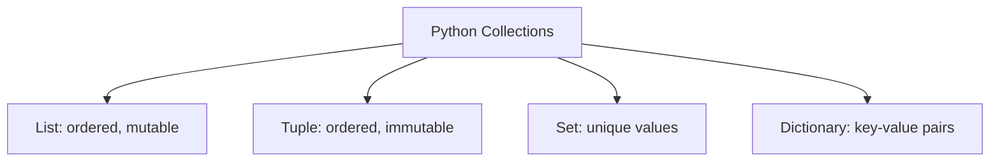

# Data Structures

## Learning Goals

- Use lists, tuples, sets, and dictionaries.
- Choose the right collection for a task.
- Iterate through collections.

## 1. Collection Types



## 2. Lists

```python
marks = [82, 90, 76, 88]
marks.append(95)
print(marks[0])
print(sum(marks) / len(marks))
```

## 3. Tuples

```python
point = (10, 20)
x, y = point
```

Use tuples when values should stay fixed.

## 4. Sets

```python
subjects = {"Math", "Python", "Math"}
print(subjects)  # duplicate removed
```

## 5. Dictionaries

```python
student = {
    "name": "Neha",
    "roll": 12,
    "marks": 87
}

print(student["name"])
```

## Choosing a Structure

| Need | Use |
| --- | --- |
| Ordered values that change | List |
| Fixed record of values | Tuple |
| Unique items | Set |
| Lookup by name/key | Dictionary |

## 6. Intensive Collection Comparison

Choosing the right collection makes programs clearer and faster.

| Collection | Ordered | Mutable | Allows Duplicates | Best For |
| --- | --- | --- | --- | --- |
| List | Yes | Yes | Yes | sequences that change |
| Tuple | Yes | No | Yes | fixed records |
| Set | No guaranteed order | Yes | No | uniqueness and membership |
| Dictionary | In insertion order | Yes | keys are unique | labeled data and lookup |

The same information can often be represented in multiple ways, but one representation will usually make the task easier.

## 7. Student Record Example

```python
student = {
    "name": "Neha",
    "roll": 12,
    "marks": [82, 90, 76],
    "is_hosteller": False
}

average = sum(student["marks"]) / len(student["marks"])
print(student["name"], "average:", average)
```

This example combines a dictionary and a list. Real data often uses nested structures.

## 8. Common Operations

```python
numbers = [5, 2, 9, 2]
numbers.append(7)
numbers.sort()

unique_numbers = set(numbers)

student = {"name": "Asha", "marks": 88}
student["grade"] = "A"
```

Know the difference between operations that change a collection in place and operations that create a new value.

## 9. Intensive Practice

1. Store five students as dictionaries inside a list. Print each student's name and average marks.
2. Use a set to find common subjects selected by two students.
3. Use a dictionary to count how many times each character appears in a word.
4. Convert a tuple of coordinates into separate `x` and `y` variables.
5. Explain why a dictionary is better than two separate lists for storing roll-number-to-name mapping.

## Practice

1. Store five subject marks in a list and calculate average.
2. Use a dictionary to store student name, branch, and semester.
3. Use a set to remove duplicate city names.
