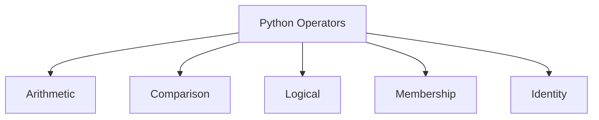

# Operators

## Learning Goals

- Use Python arithmetic, comparison, logical, assignment, membership, and identity operators.
- Build readable expressions.
- Understand truth values.

## 1. Operator Families



## 2. Arithmetic

```python
a = 10
b = 3

print(a + b)
print(a / b)   # normal division
print(a // b)  # floor division
print(a % b)   # remainder
print(a ** b)  # power
```

## 3. Comparison and Logical Operators

```python
marks = 78
attendance = 82

eligible = marks >= 40 and attendance >= 75
print(eligible)
```

## 4. Membership

```python
subjects = ["Python", "Math", "C"]
print("Python" in subjects)
print("Java" not in subjects)
```

## 5. Identity

```python
a = None
print(a is None)
```

Use `is` mainly for `None` checks and object identity.

## 6. Intensive Operator Details

Python operators often look familiar from C, but some behave differently.

| Operator | Meaning | Example |
| --- | --- | --- |
| `/` | true division | `5 / 2` gives `2.5` |
| `//` | floor division | `5 // 2` gives `2` |
| `%` | remainder | `5 % 2` gives `1` |
| `**` | exponentiation | `2 ** 3` gives `8` |
| `and` | logical AND | `marks >= 40 and attendance >= 75` |
| `in` | membership | `"a" in "data"` |
| `is` | identity | `value is None` |

Use `==` for value comparison and `is` for identity checks.

## 7. Chained Comparisons

Python allows readable chained comparisons:

```python
marks = 82

if 0 <= marks <= 100:
    print("Valid marks")
```

This is equivalent to:

```python
if marks >= 0 and marks <= 100:
    print("Valid marks")
```

## 8. Membership and Data Validation

Membership checks are useful for menus and validation.

```python
choice = input("Enter add/sub/mul/div: ")

if choice in {"add", "sub", "mul", "div"}:
    print("Valid choice")
else:
    print("Invalid choice")
```

Using a set for membership is clear and efficient.

## 9. Intensive Practice

1. Predict outputs for expressions using `/`, `//`, `%`, and `**`.
2. Write a condition that checks whether marks are between 0 and 100.
3. Use membership to validate a menu choice.
4. Explain the difference between `==` and `is` using lists or `None`.
5. Build a scholarship condition using marks, attendance, income, and disciplinary status.

## Key Takeaways

- `/` gives decimal division; `//` gives floor division.
- Use `and`, `or`, and `not` for logical expressions.
- Use `in` to check membership in strings and collections.

## Practice

1. Check whether a number is divisible by 5.
2. Check whether `"a"` appears in a word.
3. Write a condition for scholarship eligibility using marks and attendance.
