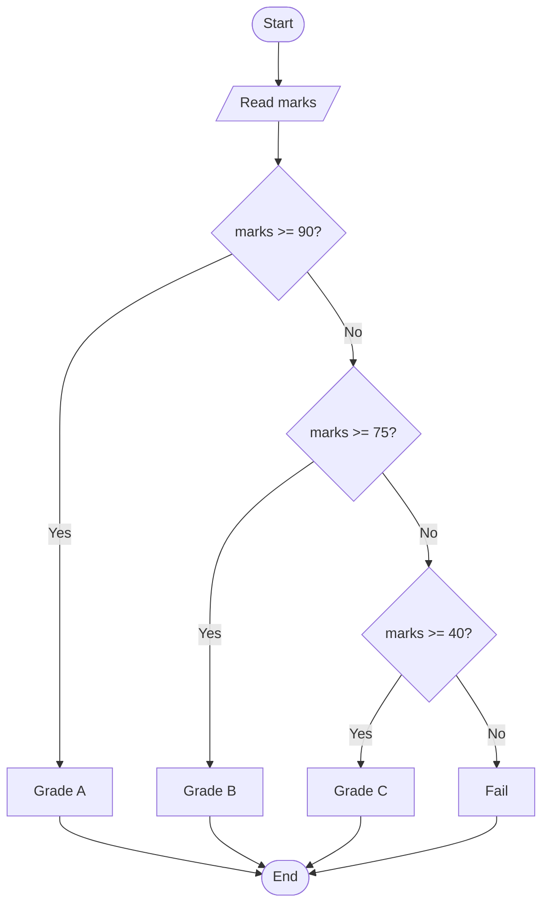

# Control Flow

## Learning Goals

- Use `if`, `elif`, and `else`.
- Build decision-making programs.
- Represent decisions with flowcharts.

## 1. Conditional Flow



## 2. `if elif else`

```python
marks = int(input("Enter marks: "))

if marks >= 90:
    grade = "A"
elif marks >= 75:
    grade = "B"
elif marks >= 40:
    grade = "C"
else:
    grade = "Fail"

print("Grade:", grade)
```

## 3. Nested Conditions

```python
age = 19
has_id = True

if age >= 18:
    if has_id:
        print("Allowed")
    else:
        print("ID required")
else:
    print("Not allowed")
```

## 4. Match Statement

Modern Python also supports `match` for clear multi-choice logic.

```python
choice = "add"

match choice:
    case "add":
        print("Addition")
    case "sub":
        print("Subtraction")
    case _:
        print("Invalid")
```

## 5. Intensive Decision Patterns

Decision code should be written so that the most specific or most restrictive checks happen at the right time.

Example: input validation first, decision second.

```python
marks = int(input("Enter marks: "))

if marks < 0 or marks > 100:
    print("Invalid marks")
elif marks >= 90:
    print("Grade A")
elif marks >= 75:
    print("Grade B")
elif marks >= 40:
    print("Pass")
else:
    print("Fail")
```

If invalid marks are not checked first, values like `150` may incorrectly receive Grade A.

## 6. Nested vs Combined Conditions

Nested conditions are useful when one decision depends on another. Combined conditions are better when the rule can be expressed clearly in one line.

Nested:

```python
if age >= 18:
    if has_id:
        print("Allowed")
```

Combined:

```python
if age >= 18 and has_id:
    print("Allowed")
```

Prefer the version that makes the business rule easiest to read.

## 7. Decision Table to Code

| Username valid | Password valid | Account locked | Result |
| --- | --- | --- | --- |
| yes | yes | no | login successful |
| yes | yes | yes | account locked |
| yes | no | no | wrong password |
| no | any | any | unknown user |

Decision tables help prevent missing cases.

## 8. Intensive Practice

1. Convert a decision table for library fine calculation into Python code.
2. Write a grade program with validation and clear boundary testing.
3. Build a login decision using username, password, and locked status.
4. Use `match` to implement a text menu for calculator operations.
5. Test every branch of a program and record which input triggers it.

## Practice

1. Write a program to find the largest of three numbers.
2. Write a login decision using username and password.
3. Create a calculator menu using `match`.
