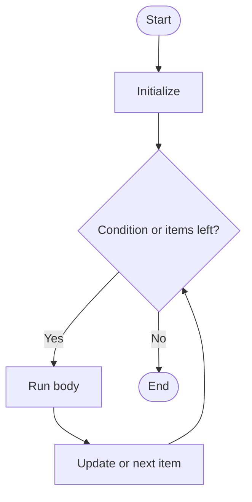

# Loops

## Learning Goals

- Use `for` and `while` loops.
- Iterate through ranges and collections.
- Use `break` and `continue`.

## 1. Loop Flow



## 2. `for` Loop

```python
for number in range(1, 6):
    print(number)
```

Loop through a list:

```python
subjects = ["C", "Python", "Math"]

for subject in subjects:
    print(subject)
```

## 3. `while` Loop

```python
count = 1

while count <= 5:
    print(count)
    count += 1
```

## 4. `break` and `continue`

```python
for n in range(1, 11):
    if n == 5:
        continue
    if n == 9:
        break
    print(n)
```

## 5. Loop Example: Average Marks

```python
marks = [80, 75, 90, 88]
total = 0

for mark in marks:
    total += mark

average = total / len(marks)
print(average)
```

## 6. Intensive Loop Patterns

Many loop problems use a small set of patterns.

| Pattern | Purpose | Example |
| --- | --- | --- |
| Counting | repeat a known number of times | `for i in range(10)` |
| Traversal | visit each item | `for mark in marks` |
| Accumulation | combine values | `total += mark` |
| Filtering | select matching values | `if mark >= 40` |
| Searching | stop when found | `break` |
| Transformation | create changed values | square each number |

Learning these patterns makes new problems less intimidating.

## 7. Building a New List

```python
marks = [35, 82, 91, 28, 76]
passing_marks = []

for mark in marks:
    if mark >= 40:
        passing_marks.append(mark)

print(passing_marks)
```

This filtering pattern is common in data processing.

## 8. While Loop for Input Validation

```python
marks = int(input("Enter marks between 0 and 100: "))

while marks < 0 or marks > 100:
    print("Invalid marks")
    marks = int(input("Enter marks between 0 and 100: "))

print("Accepted:", marks)
```

`while` loops are useful when repetition depends on user input or an external condition.

## 9. Intensive Practice

1. Count vowels, consonants, digits, and spaces in a sentence.
2. Find maximum, minimum, sum, and average in a list without using built-in aggregate functions.
3. Read numbers until the user enters `0`, then print count, sum, and average.
4. Build a menu loop that continues until the user chooses exit.
5. Convert three loop solutions into list comprehensions after writing the normal loop version.

## Practice

1. Print the multiplication table of a number.
2. Count vowels in a string.
3. Find the maximum number in a list without using `max`.
