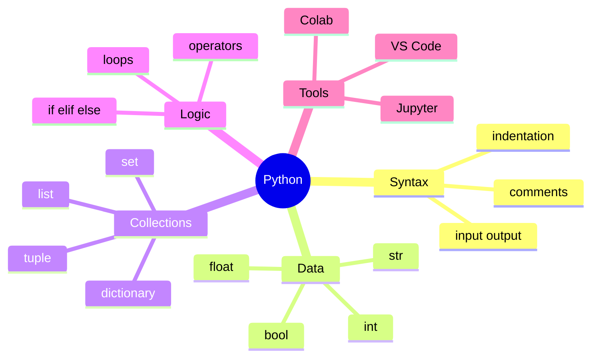

# Unit 3 Summary: Python

## Lessons

- [01 Introduction to Python](01_Introduction_to_Python.md)
- [02 Python IDEs](02_Python_IDEs.md)
- [03 Syntax](03_Syntax.md)
- [04 Data Types](04_Data_Types.md)
- [05 Data Structures](05_Data_Structures.md)
- [06 Operators](06_Operators.md)
- [07 Control Flow](07_Control_Flow.md)
- [08 Loops](08_Loops.md)

## Concept Map

## Notebook Links

- [Python basics notebook](../Notebooks/Python/01_Python_Basics.ipynb)
- [Python control flow and data structures notebook](../Notebooks/Python/02_Control_Flow_and_Data_Structures.ipynb)

## Intensive Review Checklist

By the end of this unit, a student should be able to:

- Run Python in a notebook, script, terminal, and editor.
- Explain the role of interpreter, kernel, virtual environment, and package manager.
- Use indentation, comments, naming, and input conversion correctly.
- Work with `int`, `float`, `str`, `bool`, `None`, and type conversion.
- Choose between list, tuple, set, and dictionary for a given task.
- Use arithmetic, comparison, logical, membership, and identity operators.
- Implement decision logic using `if`, `elif`, `else`, nested conditions, and `match`.
- Use `for`, `while`, `break`, `continue`, accumulators, filters, searches, and menu loops.
- Test each branch and loop condition using deliberate input cases.

## Unit Assessment Tasks

1. Build a marks analysis script that stores students in dictionaries and lists.
2. Write a menu-driven program that allows add student, view students, calculate averages, search by roll number, and exit.
3. Use a set to find common and unique subjects selected by students.
4. Debug programs with indentation, type conversion, and collection-access errors.
5. Convert one C program from Unit 2 into Python and compare the style.

## Mini Project

Create a command-line student analytics program in Python.

Required features:

- Store at least five student records as dictionaries.
- Use lists for groups of students and marks.
- Calculate average, highest, lowest, pass count, and fail count.
- Provide a simple menu loop.
- Validate marks between 0 and 100.
- Print a short text report at the end.

## Review Questions

1. Why is indentation important in Python?
2. What is the difference between a list and a tuple?
3. When should you use a dictionary?
4. What is the difference between `/` and `//`?
5. Write a loop to print all even numbers from 1 to 50.
