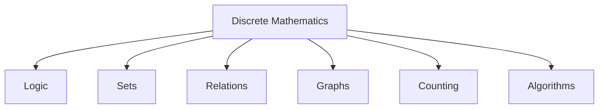

# Discrete Mathematics

## Learning Goals

- Define discrete mathematics.
- Recognize its importance in computer science.
- Identify examples of discrete structures.

## 1. What Is Discrete Mathematics?

Discrete mathematics studies objects that are separate and countable, such as integers, sets, graphs, logical statements, and algorithms.

Continuous mathematics studies smoothly changing quantities, such as real-valued distance, time, or temperature.

## 2. Where It Appears in CS



## 3. Examples

| CS Area | Discrete Math Idea |
| --- | --- |
| Databases | Sets and relations |
| Networks | Graphs |
| Programming | Logic and conditions |
| Algorithms | Counting and proof |
| Cybersecurity | Number theory |

## 4. Logical Statements

A proposition is a statement that is either true or false.

Examples:

- `5 > 3` is true.
- `10 is odd` is false.

Logical operators include AND, OR, and NOT.

## 5. Intensive Logic Foundations

Logic is the mathematical base of programming decisions. Every `if` statement depends on a condition that is true or false.

| Logic Operation | Programming Form | Meaning |
| --- | --- | --- |
| NOT p | `!p` in C, `not p` in Python | reverses truth value |
| p AND q | `p && q`, `p and q` | true only when both are true |
| p OR q | `p || q`, `p or q` | true when at least one is true |

Truth table for AND:

| p | q | p AND q |
| --- | --- | --- |
| true | true | true |
| true | false | false |
| false | true | false |
| false | false | false |

Truth tables help students test all possible decision cases.

## 6. Counting and Finite Structures

Discrete mathematics often deals with finite or countable structures:

- Number of passwords of a certain length.
- Number of paths in a graph.
- Number of possible outcomes in a probability problem.
- Number of iterations in an algorithm.
- Number of records returned by a database query.

Counting is important because computer memory and time are finite. Algorithms must be analyzed using finite steps.

## 7. Proof and Correctness

A program is not correct just because it runs once. Mathematical reasoning helps prove that an algorithm works for all valid inputs.

Example: To find the maximum in a list, maintain this invariant:

```text
After checking the first k elements, current_max is the largest among those k elements.
```

If the invariant is true at the start, remains true after each step, and covers the whole list at the end, the algorithm is correct.

## 8. Intensive Practice

1. Create truth tables for NOT, OR, and a scholarship rule using marks and attendance.
2. Identify propositions in five programming conditions.
3. Write an invariant for a loop that calculates the sum of a list.
4. Count how many two-letter passwords can be made using lowercase English letters if repetition is allowed.
5. Explain how discrete mathematics appears in a login system, a database table, and a road map.

## Key Takeaways

- Discrete math is foundational for computer science.
- Programming conditions are based on logic.
- Graphs model networks, maps, dependencies, and relationships.

## Practice

1. Give five examples of discrete objects.
2. Write three propositions and mark them true or false.
3. Explain why a social network can be modeled as a graph.
