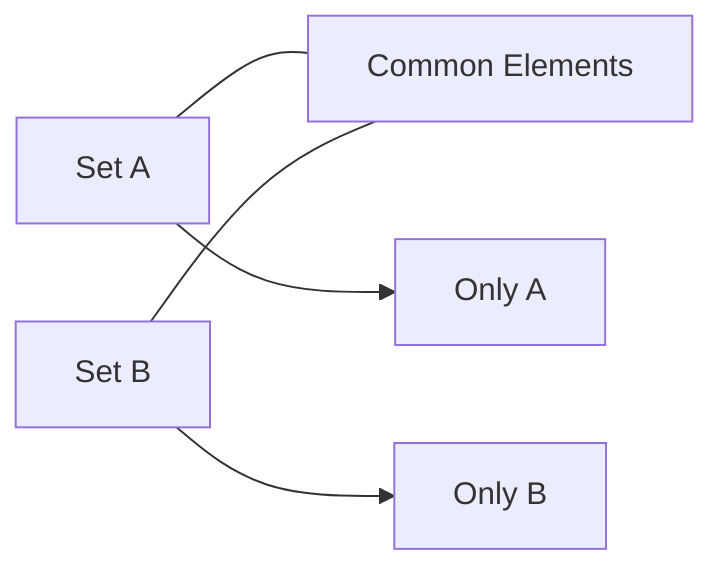

# Sets

## Learning Goals

- Define sets and set notation.
- Perform union, intersection, and difference.
- Connect sets to programming and databases.

## 1. Set Basics

A set is a collection of distinct objects called elements.

```text
A = {1, 2, 3, 4}
B = {3, 4, 5, 6}
```

## 2. Set Operations

| Operation | Symbol | Result for A and B |
| --- | --- | --- |
| Union | `A union B` | `{1, 2, 3, 4, 5, 6}` |
| Intersection | `A intersection B` | `{3, 4}` |
| Difference | `A - B` | `{1, 2}` |
| Subset | `A subset B` | True if every A element is in B |

## 3. Venn Diagram Concept



## 4. Python Connection

```python
A = {1, 2, 3, 4}
B = {3, 4, 5, 6}

print(A | B)  # union
print(A & B)  # intersection
print(A - B)  # difference
```

## 5. Applications

- Removing duplicates.
- Search and filtering.
- Database query results.
- Permission groups.
- Recommendation systems.

## 6. Intensive Set Operations

Let:

```text
A = {1, 2, 3, 4}
B = {3, 4, 5, 6}
```

| Operation | Meaning | Result |
| --- | --- | --- |
| Union | elements in A or B or both | `{1, 2, 3, 4, 5, 6}` |
| Intersection | elements in both A and B | `{3, 4}` |
| Difference `A - B` | elements in A but not B | `{1, 2}` |
| Difference `B - A` | elements in B but not A | `{5, 6}` |
| Symmetric difference | elements in exactly one set | `{1, 2, 5, 6}` |

The order matters for difference. `A - B` and `B - A` are usually different.

## 7. Subsets and Power Sets

If every element of A is also in B, then A is a subset of B.

```text
A = {1, 2}
B = {1, 2, 3}
A is a subset of B
```

The power set of a set is the set of all subsets. If a set has `n` elements, its power set has `2^n` subsets.

Example:

```text
S = {a, b}
Power set = {}, {a}, {b}, {a, b}
```

## 8. Database and Search Connection

Set thinking appears in database queries:

- Students in CSE: one set.
- Students enrolled in Python: another set.
- Students in CSE and Python: intersection.
- Students in CSE or Python: union.
- Students in CSE but not Python: difference.

Search filters also behave like set operations. When you filter products by price, brand, and rating, each filter narrows or combines sets.

## 9. Intensive Practice

1. For `A = {red, blue, green}` and `B = {green, yellow, red}`, compute union, intersection, both differences, and symmetric difference.
2. List the power set of `{0, 1, 2}`.
3. Use Python sets to find students who attended both lab sessions.
4. Draw a Venn-style explanation for students who passed theory, lab, both, and neither.
5. Explain why duplicate removal is naturally modeled using sets.

## Practice

1. Find the union and intersection of `{a, b, c}` and `{b, c, d}`.
2. Give a real-life example of a set.
3. Explain how sets help remove duplicates.
