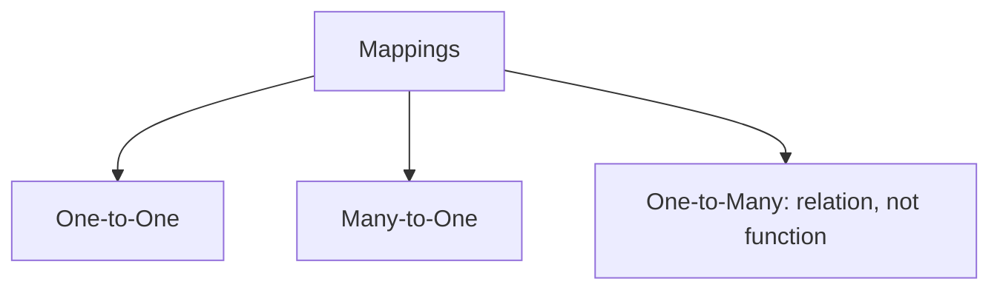

# Functions and Relations

## Learning Goals

- Define relations and functions.
- Distinguish one-to-one, many-to-one, and one-to-many mappings.
- Connect relations to databases and functions to programming.

## 1. Relation

A relation connects elements of one set to elements of another set.

Example:

```text
Student -> Course
Riya -> Python
Aman -> C
Riya -> Math
```

## 2. Function

A function maps each input to exactly one output.

```mermaid
flowchart LR
    A[Input x] --> F[f(x) = x * x]
    F --> B[Output x squared]
```

Example:

```text
f(2) = 4
f(3) = 9
```

## 3. Mapping Types



## 4. Programming Connection

```python
def square(x):
    return x * x

print(square(5))
```

The Python function `square` returns exactly one result for each input.

## 5. Database Connection

Relations are central to relational databases. Tables represent relationships between entities such as students, courses, departments, and marks.

## 6. Intensive Function Concepts

A function must assign exactly one output to each input in its domain.

| Mapping | Is it a function? | Reason |
| --- | --- | --- |
| student -> roll number | usually yes | each student should have one roll number |
| student -> enrolled courses | not as a single-output function | one student may have many courses |
| temperature in Celsius -> Fahrenheit | yes | each Celsius value has one Fahrenheit value |
| person -> phone number | may not be | one person can have multiple numbers |

Domain means allowed inputs. Codomain means possible target outputs. Range means outputs actually produced.

## 7. One-to-One, Many-to-One, and Onto

| Type | Meaning | Example |
| --- | --- | --- |
| One-to-one | different inputs produce different outputs | roll number to student |
| Many-to-one | multiple inputs may produce same output | students to department |
| Onto | every codomain value is used | depends on chosen codomain |

In programming, one-to-one mappings are useful for unique identifiers. Many-to-one mappings are common in classification problems.

## 8. Relation Properties

For a relation on a set, important properties include:

| Property | Meaning | Example Idea |
| --- | --- | --- |
| Reflexive | every element relates to itself | `a <= a` |
| Symmetric | if a relates to b, b relates to a | friendship |
| Transitive | if a relates to b and b to c, then a relates to c | prerequisite chain |

These properties help in databases, graphs, equivalence classes, ordering, and dependency analysis.

## 9. Intensive Practice

1. Identify domain, codomain, and range for `f(x) = 2x + 3` where domain is `{0, 1, 2, 3}`.
2. Decide whether each mapping is a function: employee to department, course to instructor, student to phone numbers, product ID to product.
3. Give one relation that is symmetric and one relation that is transitive.
4. Model a course prerequisite system as a relation.
5. Write Python functions for square, absolute value, Celsius to Fahrenheit, and pass/fail classification.

## Practice

1. Is `student -> roll_number` usually a function? Explain.
2. Is `student -> enrolled_course` always a function? Explain.
3. Write a function rule for converting Celsius to Fahrenheit.
