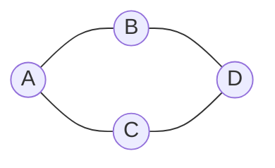
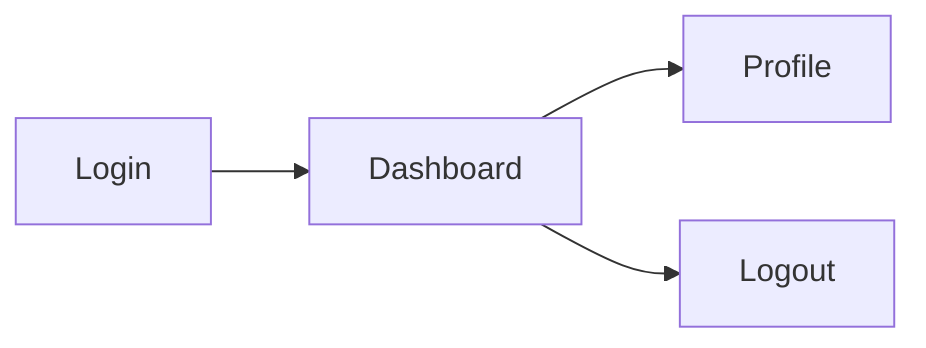
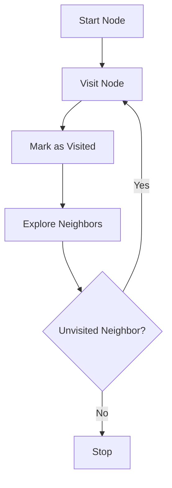

# Graph Theory

## Learning Goals

- Define vertices and edges.
- Recognize directed and undirected graphs.
- Connect graphs to computer science applications.

## 1. Graph Basics

A graph is a structure made of vertices and edges.



| Term | Meaning |
| --- | --- |
| Vertex | Node or point |
| Edge | Connection between vertices |
| Path | Sequence of connected vertices |
| Cycle | Path that returns to starting vertex |
| Degree | Number of edges connected to a vertex |

## 2. Directed Graph



Directed graphs have edges with direction.

## 3. Applications

| Application | Graph Model |
| --- | --- |
| Roads | Cities as vertices, roads as edges |
| Social networks | Users as vertices, friendships as edges |
| Web | Pages as vertices, links as edges |
| Course prerequisites | Courses as vertices, dependencies as edges |
| Computer networks | Devices as vertices, links as edges |

## 4. Graph Traversal



## 5. Intensive Graph Vocabulary

| Term | Meaning | Example |
| --- | --- | --- |
| Adjacent vertices | vertices connected by an edge | two directly connected cities |
| Weighted edge | edge with cost or distance | road length |
| Directed edge | one-way connection | web link |
| Connected graph | every vertex can be reached | all cities reachable by roads |
| Component | connected part of a graph | isolated network segment |
| Tree | connected graph with no cycles | folder hierarchy |
| Degree | number of incident edges | number of friends in a social graph |

Graphs are powerful because the same structure can model roads, networks, dependencies, websites, recommendations, and social relations.

## 6. Adjacency Matrix and Adjacency List

Graph data can be stored in different ways.

Adjacency list:

```text
A: B, C
B: A, D
C: A, D
D: B, C
```

Adjacency matrix:

```text
    A B C D
A   0 1 1 0
B   1 0 0 1
C   1 0 0 1
D   0 1 1 0
```

Adjacency lists are often efficient for sparse graphs. Matrices can be convenient when quick edge lookup is needed.

## 7. BFS and DFS Concept

Breadth-first search explores neighbors level by level. Depth-first search follows one path deeply before backtracking.

| Traversal | Uses |
| --- | --- |
| BFS | shortest path in unweighted graph, level-order exploration |
| DFS | cycle detection, connected components, dependency traversal |

Students should practice both by hand before coding them.

## 8. Intensive Practice

1. Draw a weighted graph of five cities and label distances.
2. Convert a small graph into an adjacency list and adjacency matrix.
3. Perform BFS and DFS manually from a selected start vertex.
4. Explain why a course prerequisite graph should not contain cycles.
5. Model a computer network as a graph and identify possible points of failure.

## Practice

1. Draw a graph of your friend network with five people.
2. Give one example of a directed graph.
3. What is the degree of a vertex?
