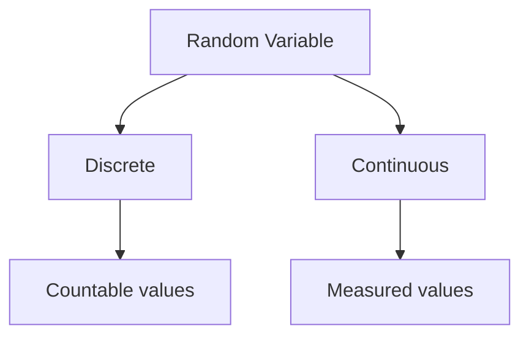

# Random Variables

## Learning Goals

- Define a random variable.
- Distinguish discrete and continuous random variables.
- Interpret expected value conceptually.

## 1. Random Variable

A random variable assigns a number to each outcome of a random experiment.

Example: Toss two coins. Let `X` be the number of heads.

| Outcome | X |
| --- | --- |
| HH | 2 |
| HT | 1 |
| TH | 1 |
| TT | 0 |

## 2. Types



| Type | Example |
| --- | --- |
| Discrete | Number of students absent |
| Continuous | Temperature, time, height |

## 3. Expected Value

Expected value is the long-run average value of a random variable.

For a fair die:

```text
E(X) = (1 + 2 + 3 + 4 + 5 + 6) / 6 = 3.5
```

## 4. Computing Connection

Random variables are used in:

- Simulations.
- Risk estimation.
- Machine learning.
- Queueing systems.
- Performance modeling.

## 5. Intensive Probability Distribution of a Random Variable

For a discrete random variable, list each possible value and its probability.

Example: Toss two fair coins. Let `X` be the number of heads.

| X | Outcomes | Probability |
| --- | --- | --- |
| 0 | TT | 1/4 |
| 1 | HT, TH | 2/4 |
| 2 | HH | 1/4 |

The probabilities must add to 1.

## 6. Expected Value with Probabilities

Expected value is calculated by multiplying each value by its probability and adding the results.

```text
E(X) = sum of x * P(X = x)
```

For the two-coin example:

```text
E(X) = 0*(1/4) + 1*(2/4) + 2*(1/4) = 1
```

This means the long-run average number of heads per two tosses is 1.

## 7. Variance Concept

Variance measures how spread out a random variable is around its expected value. A random variable with higher variance is less predictable.

In computing:

- Response time with low variance feels consistent.
- Network delay with high variance causes unstable video calls.
- Model predictions with high uncertainty need careful interpretation.

## 8. Intensive Practice

1. Create the probability distribution for the number of tails in three coin tosses.
2. Compute expected value for a fair die.
3. Define a random variable for the number of failed login attempts before success.
4. Classify these as discrete or continuous: queue length, download time, CPU temperature, number of bugs.
5. Explain why expected value may not be an actually observed value, using a die as example.

## Practice

1. Let X be the number of tails in two coin tosses. Make a table.
2. Classify marks, height, and number of emails as discrete or continuous.
3. Find the expected value of a fair coin where heads = 1 and tails = 0.
