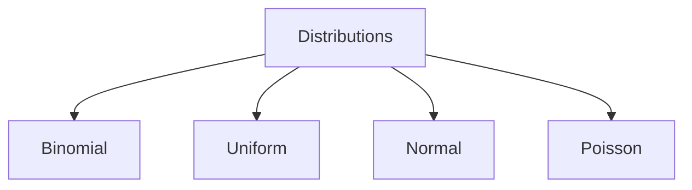

# Distributions

## Learning Goals

- Explain what a probability distribution is.
- Identify common distributions.
- Interpret distribution shape, center, and spread.

## 1. Probability Distribution

A probability distribution describes how probabilities are assigned to possible values of a random variable.

Example for a fair die:

| X | 1 | 2 | 3 | 4 | 5 | 6 |
| --- | --- | --- | --- | --- | --- | --- |
| P(X) | 1/6 | 1/6 | 1/6 | 1/6 | 1/6 | 1/6 |

## 2. Common Distributions

| Distribution | Used For |
| --- | --- |
| Uniform | Equal probability outcomes |
| Binomial | Success/failure trials |
| Normal | Bell-shaped natural variation |
| Poisson | Counts over time or space |

## 3. Shape Concepts

- Center: typical value.
- Spread: how values vary.
- Skew: whether one tail is longer.
- Outlier: unusually far value.

## 4. Data Science Connection

Distributions help us understand patterns, detect anomalies, make predictions, and model uncertainty.

## 5. Intensive Distribution Selection

| Situation | Suitable Distribution Idea | Reason |
| --- | --- | --- |
| Fair die outcome | discrete uniform | all outcomes equally likely |
| Number of successes in fixed trials | binomial | repeated success/failure events |
| Number of requests per minute | Poisson | count of events over time |
| Measurement error | normal | values cluster around mean |
| Waiting time until next event | exponential | time between random events |

Choosing a distribution is a modeling decision. It should be based on how the data is generated, not only on the shape of a chart.

## 6. Binomial Distribution Concept

A binomial setting has:

- Fixed number of trials.
- Each trial has two outcomes: success or failure.
- Probability of success stays the same.
- Trials are independent.

Example: Toss a coin 10 times and count heads.

## 7. Normal Distribution and Standard Deviation

The normal distribution is centered around the mean. Standard deviation controls spread.

Approximate interpretation:

- Many values fall near the mean.
- Fewer values appear far from the mean.
- Extreme values are rare.

In real data, not everything is normal. Always inspect the data before assuming a normal distribution.

## 8. Intensive Practice

1. Identify a likely distribution for each: coin heads in 20 tosses, web requests per second, student heights, fair spinner outcome.
2. Explain the four conditions for a binomial distribution.
3. Sketch two normal curves with the same mean but different standard deviations.
4. Collect 20 marks and discuss whether the distribution is symmetric or skewed.
5. Give an example where assuming normality would be misleading.

## Practice

1. Which distribution fits a fair die?
2. Which distribution may fit student heights?
3. Give an example of count data that might use a Poisson distribution.
