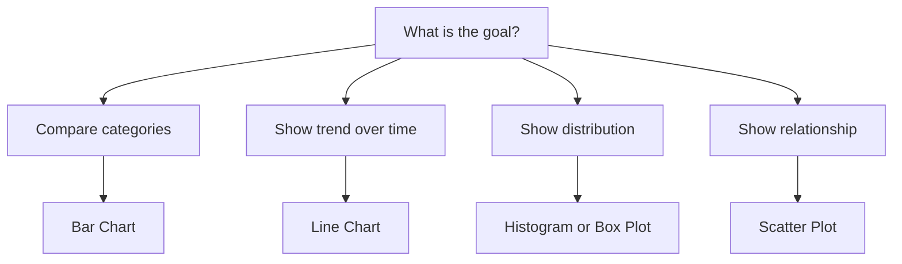

# Data Visualization Concepts

## Learning Goals

- Choose suitable charts for different data.
- Identify misleading visualizations.
- Understand basic design principles for charts.

## 1. Why Visualize Data?

Visualization turns data into pictures so patterns, trends, and comparisons are easier to understand.

## 2. Chart Selection

## 3. Common Charts

| Chart | Best For |
| --- | --- |
| Bar chart | Comparing categories |
| Line chart | Trends over time |
| Pie chart | Parts of a whole, few categories |
| Histogram | Distribution of numeric values |
| Scatter plot | Relationship between two numeric variables |

## 4. Good Visualization Practices

- Use clear titles and labels.
- Start bar charts at zero when comparing sizes.
- Avoid too many colors.
- Use the simplest chart that answers the question.
- Do not hide important scale information.

## 5. Intensive Chart Selection

Start with the question before choosing the chart.

| Analysis Question | Data Needed | Recommended Chart |
| --- | --- | --- |
| Which category is highest? | category and value | bar chart |
| How does value change over time? | date/time and value | line chart |
| How are values distributed? | numeric variable | histogram or box plot |
| Are two variables related? | two numeric variables | scatter plot |
| What is the rank order? | category and value | sorted bar chart |
| How does part relate to whole? | categories summing to total | stacked bar or pie with few categories |

Chart choice is a reasoning decision, not a decoration decision.

## 6. Misleading Chart Patterns

Common problems:

- Truncated y-axis exaggerating differences.
- 3D effects distorting visual size.
- Too many colors with no meaning.
- Pie charts with too many slices.
- Missing axis labels or units.
- Combining unrelated scales on one chart.
- Cherry-picked time range.

Good visualization is honest, readable, and aligned with the data question.

## 7. Visual Encoding

Charts use visual features to encode data:

| Encoding | Good For |
| --- | --- |
| Position | precise comparison |
| Length | bar values |
| Color | categories or intensity |
| Size | approximate magnitude |
| Shape | categories in scatter plots |

Position and length are usually easier to compare accurately than area or angle.

## 8. Intensive Practice

1. Choose charts for five different datasets and justify each choice.
2. Redesign a confusing chart by improving title, labels, scale, and chart type.
3. Explain why a bar chart should usually start at zero.
4. Create a small dashboard plan for student performance using at least three chart types.
5. Identify the visual encodings used in a scatter plot with colored categories.

## Practice

1. Choose a chart for monthly sales data.
2. Choose a chart for marks distribution.
3. Explain one way a graph can mislead readers.
