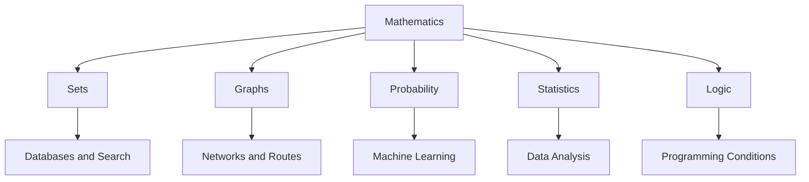

# CS Applications

## Learning Goals

- Connect mathematics topics to computer science.
- Identify where sets, graphs, probability, and statistics are used.
- Explain why mathematical thinking helps programming.

## 1. Math to CS Map

## 2. Examples

| Math Topic | CS Application |
| --- | --- |
| Logic | Conditions, circuits, proofs |
| Sets | Database operations, unique values |
| Relations | Tables and mappings |
| Functions | Programming functions, transformations |
| Graphs | Maps, networks, dependency management |
| Probability | AI, simulations, uncertainty |
| Statistics | Data science and decision making |

## 3. Algorithm Thinking

Mathematics helps with:

- Breaking problems into steps.
- Proving correctness.
- Estimating performance.
- Modeling real-world systems.
- Understanding data.

## 4. Mini Example: Recommendation

A recommendation system may use:

- Sets to compare user interests.
- Graphs to model users and items.
- Probability to estimate preferences.
- Statistics to evaluate results.

## 5. Intensive Application Map

| CS Problem | Mathematical Tools | Why They Matter |
| --- | --- | --- |
| Search engine ranking | graphs, probability, statistics | links and relevance scores |
| Social network suggestions | graphs, sets | mutual friends and communities |
| Spam detection | probability, statistics | uncertainty and classification |
| Database querying | sets, relations, logic | filtering and joining records |
| Route planning | graphs, optimization | shortest or fastest paths |
| Program correctness | logic, proof | reliable software behavior |
| Data dashboards | statistics, visualization | evidence-based decisions |

Mathematics gives structure to problems that would otherwise feel like disconnected coding tasks.

## 6. Case Study: Plagiarism Detection

A simple plagiarism detector may use:

1. Sets of words or phrases from two documents.
2. Intersection to find common phrases.
3. Similarity score such as common items divided by total unique items.
4. Threshold rule to flag suspicious submissions.
5. Statistics to evaluate false positives and false negatives.

This is not enough for a full industrial tool, but it shows how sets, logic, and statistics combine in a real computing problem.

## 7. Case Study: Network Routing

A computer network can be modeled as a weighted graph:

- Routers are vertices.
- Links are edges.
- Edge weights represent delay, cost, or bandwidth.
- Routing algorithms find efficient paths.

If one link fails, graph algorithms can search for an alternate route.

## 8. Intensive Practice

1. Choose one app and identify at least four mathematical ideas behind it.
2. Model a recommendation problem using sets and a similarity score.
3. Draw a graph for a delivery route problem and assign edge weights.
4. Explain how statistics helps evaluate whether a machine learning model is useful.
5. Write a one-page reflection: "Why mathematics makes me a better programmer."

## Practice

1. Pick one app and identify two math ideas behind it.
2. Explain how graph theory helps map apps.
3. Explain how statistics helps dashboards.
