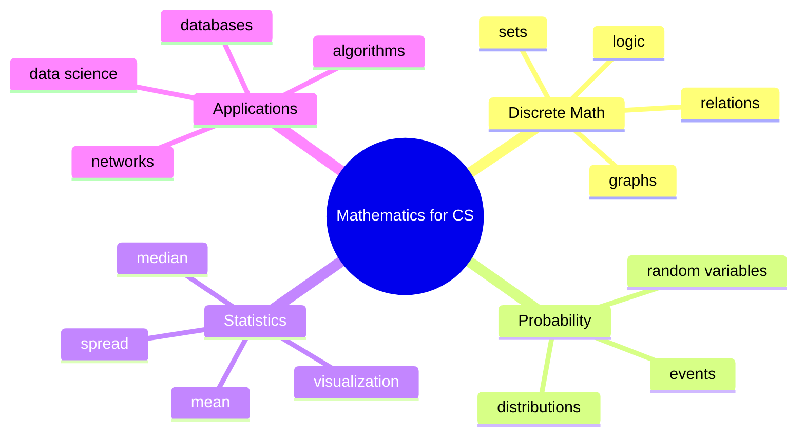

# Unit 4 Summary: Mathematics

## Lessons

- [01 Discrete Mathematics](01_Discrete_Mathematics.md)
- [02 Sets](02_Sets.md)
- [03 Functions and Relations](03_Functions_and_Relations.md)
- [04 Graph Theory](04_Graph_Theory.md)
- [05 Probability](05_Probability.md)
- [06 Random Variables](06_Random_Variables.md)
- [07 Distributions](07_Distributions.md)
- [08 Statistics](08_Statistics.md)
- [09 Data Visualization Concepts](09_Data_Visualization_Concepts.md)
- [10 Continuous Probability](10_Continuous_Probability.md)
- [11 CS Applications](11_CS_Applications.md)

## Concept Map

## Intensive Review Checklist

By the end of this unit, a student should be able to:

- Build truth tables for logical expressions and connect them to programming conditions.
- Perform set union, intersection, difference, symmetric difference, subset, and power set operations.
- Distinguish relations from functions and identify domain, codomain, and range.
- Represent graphs using diagrams, adjacency lists, and adjacency matrices.
- Explain BFS and DFS conceptually and perform them manually on a small graph.
- Apply probability rules, complements, conditional probability, and simulation.
- Define random variables, probability distributions, expected value, and variance conceptually.
- Choose common distributions for real computing situations.
- Compute and interpret descriptive statistics.
- Select appropriate visualizations and identify misleading charts.

## Unit Assessment Tasks

1. Model a university course registration system using sets, relations, and functions.
2. Create a graph for a campus navigation problem and find possible paths.
3. Solve a probability problem using both exact counting and Python simulation.
4. Summarize a marks dataset using mean, median, mode, range, and standard deviation.
5. Choose charts for a dataset and justify each choice using the analysis question.

## Mini Project

Analyze a small student dataset mathematically.

Required features:

- Define sets for branches, passed students, failed students, and high performers.
- Model student-course enrollment as a relation.
- Draw a graph of prerequisite or friendship relationships.
- Compute at least three probabilities.
- Calculate descriptive statistics for marks.
- Recommend charts for communicating results.

## Review Questions

1. Why is discrete mathematics important for programming?
2. What is the difference between a relation and a function?
3. Give three graph theory applications.
4. What is a random variable?
5. Which chart would you use for a trend over time?
