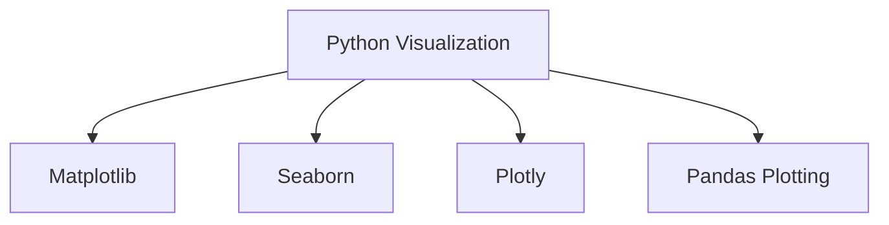
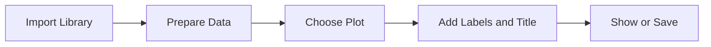

# Python

## Learning Goals

- Use Python libraries for basic visualization.
- Create line, bar, histogram, and scatter plots.
- Understand a simple plotting workflow.

## 1. Python Visualization Libraries



## 2. Basic Matplotlib Example

```python
import matplotlib.pyplot as plt

subjects = ["C", "Python", "Math"]
marks = [78, 88, 82]

plt.bar(subjects, marks)
plt.title("Subject Marks")
plt.xlabel("Subject")
plt.ylabel("Marks")
plt.show()
```

## 3. Common Plot Types

| Plot | Use |
| --- | --- |
| `plt.bar` | Compare categories |
| `plt.plot` | Trend over sequence or time |
| `plt.hist` | Distribution |
| `plt.scatter` | Relationship between two variables |

## 4. Plotting Workflow



## 5. Good Habits

- Label axes.
- Use meaningful titles.
- Keep plots simple.
- Use notebooks for exploration.
- Save final charts when needed.

## 6. Intensive Python Visualization Workflow

Python visualization usually follows this pattern:

```python
import pandas as pd
import matplotlib.pyplot as plt

data = pd.DataFrame({
    "subject": ["C", "Python", "Math", "Architecture"],
    "marks": [78, 88, 82, 74]
})

ax = data.plot(kind="bar", x="subject", y="marks", legend=False)
ax.set_title("Subject Marks")
ax.set_xlabel("Subject")
ax.set_ylabel("Marks")
plt.tight_layout()
plt.show()
```

`pandas` is often used to prepare data, while `matplotlib`, `seaborn`, or `plotly` are used to draw charts.

## 7. Seaborn for Statistical Charts

```python
import seaborn as sns
import matplotlib.pyplot as plt

tips = sns.load_dataset("tips")
sns.scatterplot(data=tips, x="total_bill", y="tip", hue="time")
plt.title("Tip Amount vs Total Bill")
plt.show()
```

Seaborn makes it easier to create statistical plots with grouping, color encoding, and clean defaults.

## 8. Common Plotting Mistakes

| Mistake | Fix |
| --- | --- |
| No title or labels | add title, x-label, y-label |
| Too many categories | sort, filter, or group smaller categories |
| Wrong chart type | match chart to analysis question |
| Overlapping labels | rotate labels or change layout |
| Misleading scale | inspect axis limits |
| Unclear colors | use color only when it adds information |

## 9. Intensive Practice

1. Load a CSV file with `pandas` and inspect rows, columns, and missing values.
2. Create bar, line, histogram, box plot, and scatter plot versions of suitable data.
3. Use color to show a category in a scatter plot.
4. Save a chart as a PNG file using `plt.savefig`.
5. Write a short interpretation for each chart, including one limitation.

## Notebook

- [Python data visualization notebook](../Notebooks/Python/03_Data_Visualization.ipynb)

## Practice

1. Create a line chart for marks over five tests.
2. Create a histogram of ten numeric values.
3. Create a scatter plot of study hours vs marks.
