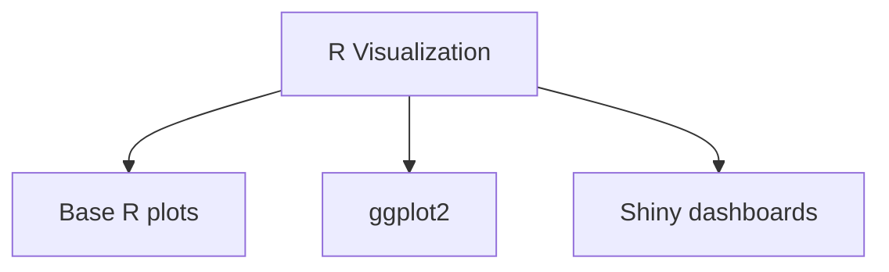

# R

## Learning Goals

- Recognize R as a language for statistics and visualization.
- Understand basic R plotting syntax.
- Compare R visualization with Python visualization.

## 1. What Is R?

R is a programming language designed for statistics, data analysis, and visualization. It is widely used in research, analytics, and statistical modeling.

## 2. R Visualization Tools



## 3. Base R Plot

```r
subjects <- c("C", "Python", "Math")
marks <- c(78, 88, 82)

barplot(marks, names.arg = subjects, main = "Subject Marks")
```

## 4. ggplot2 Idea

`ggplot2` builds charts using layers.

```r
library(ggplot2)

data <- data.frame(
  subject = c("C", "Python", "Math"),
  marks = c(78, 88, 82)
)

ggplot(data, aes(x = subject, y = marks)) +
  geom_col() +
  labs(title = "Subject Marks")
```

## 5. Python vs R

| Python | R |
| --- | --- |
| General-purpose language | Statistics-focused language |
| Strong in automation and AI | Strong in statistical analysis |
| Matplotlib, Seaborn, Plotly | ggplot2, base R, Shiny |

## 6. Intensive ggplot2 Grammar

`ggplot2` builds charts using a grammar of graphics:

| Layer | Meaning | Example |
| --- | --- | --- |
| Data | dataset being plotted | `data` |
| Aesthetics | mapping variables to x, y, color, etc. | `aes(x = subject, y = marks)` |
| Geometry | visual shape | `geom_col()`, `geom_point()` |
| Labels | title and axis text | `labs(...)` |
| Theme | visual styling | `theme_minimal()` |

Example:

```r
library(ggplot2)

data <- data.frame(
  subject = c("C", "Python", "Math", "Architecture"),
  marks = c(78, 88, 82, 74)
)

ggplot(data, aes(x = subject, y = marks)) +
  geom_col(fill = "steelblue") +
  labs(title = "Subject Marks", x = "Subject", y = "Marks") +
  theme_minimal()
```

## 7. When R Is Especially Useful

R is strong when the work is statistics-heavy:

- Statistical modeling.
- Academic research analysis.
- Publication-quality plots.
- Reproducible reports with R Markdown or Quarto.
- Interactive dashboards using Shiny.

Python may be preferred when the project also involves automation, web APIs, machine learning pipelines, or general software development.

## 8. Intensive Practice

1. Create a data frame in R with at least 10 rows and three columns.
2. Build a bar plot, scatter plot, and histogram using `ggplot2`.
3. Add title, axis labels, and a minimal theme.
4. Compare the same chart written in Python and R.
5. Write a paragraph explaining when you would choose R over Excel and Python.

## Practice

1. Write R code for a simple bar plot.
2. Compare `matplotlib` and `ggplot2` at a high level.
3. List two situations where R is useful.
