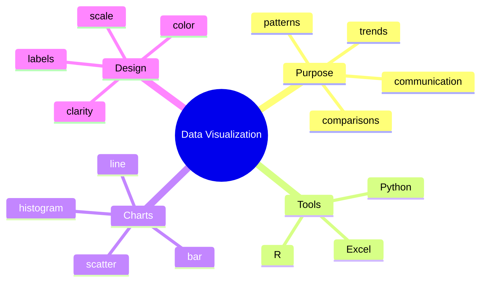

# Unit 5 Summary: Data Visualization

## Lessons

- [01 Introduction](01_Introduction.md)
- [02 Excel](02_Excel.md)
- [03 Python](03_Python.md)
- [04 R](04_R.md)

## Concept Map

## Notebook

- [Python data visualization notebook](../Notebooks/Python/03_Data_Visualization.ipynb)

## Intensive Review Checklist

By the end of this unit, a student should be able to:

- Define a visualization question before choosing a chart.
- Distinguish exploratory and explanatory visualizations.
- Clean data before plotting by checking missing values, duplicates, impossible values, and inconsistent labels.
- Use Excel formulas, sorting, filtering, charts, and pivot tables.
- Create bar, line, histogram, box, and scatter plots in Python.
- Explain when R and `ggplot2` are useful for statistical visualization.
- Identify misleading chart design choices.
- Write a short interpretation that explains what a chart means, not only what it shows.

## Unit Assessment Tasks

1. Create a 20-row student dataset and analyze it in Excel.
2. Build a pivot table and chart showing performance by branch or subject.
3. Recreate at least two charts in Python using `pandas` and `matplotlib` or `seaborn`.
4. Create one `ggplot2` chart in R or explain the equivalent grammar if R is not installed.
5. Submit a short report with chart screenshots, interpretations, and limitations.

## Mini Project

Create a student performance dashboard plan.

Required features:

- Dataset description and data dictionary.
- At least four analysis questions.
- Chart selection table.
- Excel summary or pivot table.
- Python visualization code.
- Written insight for each chart.
- One paragraph on possible data quality issues.

## Review Questions

1. Which chart is best for comparing categories?
2. Which chart is best for a time trend?
3. Why are labels important?
4. What is a pivot table?
5. Name two Python visualization libraries.
