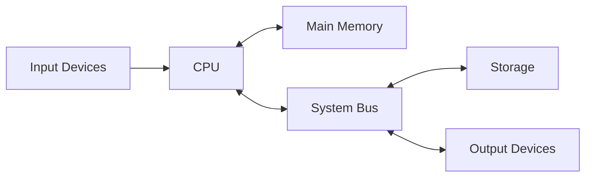

# Introduction

## Learning Goals

- Explain the purpose of computer architecture.
- Connect architecture to program performance.
- Identify CPU, memory, I/O, and bus subsystems.

## 1. What Is Computer Architecture?

Computer architecture describes the design and organization of a computer system from the programmer-visible level down to hardware organization.

It explains:

- How instructions are executed.
- How memory is accessed.
- How devices communicate.
- How performance is affected by hardware design.

## 2. High-Level Architecture

## 3. Why It Matters

- Helps programmers write efficient code.
- Explains why memory access can be slow.
- Helps diagnose system bottlenecks.
- Supports understanding of operating systems and compilers.

## 4. Architecture vs Organization

| Term | Focus |
| --- | --- |
| Architecture | What the system does from the programmer's view |
| Organization | How hardware units are connected internally |

## 5. Intensive Architecture Layers

Computer architecture sits between software and electronics. A program written in C or Python eventually becomes instructions and data handled by hardware.

| Layer | Example Concern |
| --- | --- |
| Application | what the user wants to do |
| Programming language | how the programmer expresses logic |
| Compiler/interpreter | how code becomes executable behavior |
| Instruction set architecture | instructions the CPU understands |
| Microarchitecture | internal CPU design such as pipelines and caches |
| Digital logic | gates, circuits, registers |
| Physical hardware | transistors, wires, memory chips |

This course focuses on the bridge between programming concepts and hardware organization.

## 6. Performance Thinking

System performance is not one number. Consider:

- CPU execution time.
- Memory access time.
- Disk or SSD read/write speed.
- Network delay.
- I/O waiting time.
- Operating system scheduling.
- Algorithm efficiency.

Example: A data analysis script may be slow because it repeatedly reads from disk, not because the CPU is weak.

## 7. Intensive Practice

1. Explain the path from a high-level program statement to hardware execution.
2. Identify the likely bottleneck in five scenarios: slow boot, slow video export, slow web page, slow database query, slow matrix calculation.
3. Compare architecture and organization using one laptop example.
4. Draw the layered model from application to physical hardware.
5. Write a short note on why architecture knowledge helps programmers.

## Practice

1. Explain why faster CPU alone does not always mean faster programs.
2. Name the major subsystems of a computer.
3. Give one example where memory speed affects performance.
