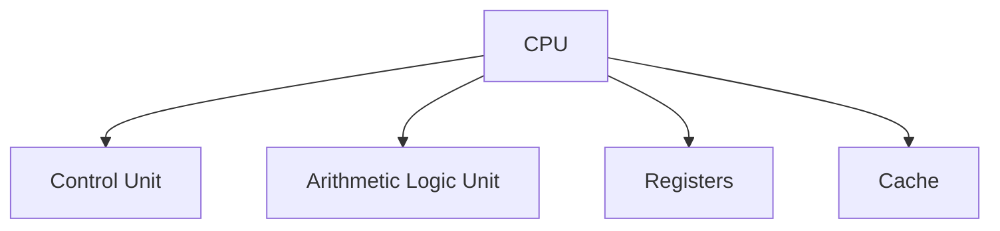
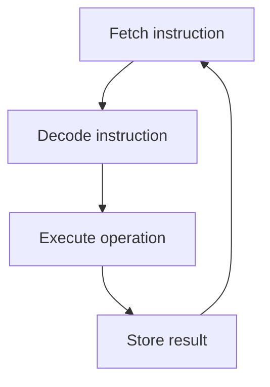

# CPU

## Learning Goals

- Identify CPU components.
- Explain fetch, decode, and execute.
- Understand registers, ALU, and control unit.

## 1. CPU Components



| Component | Role |
| --- | --- |
| Control Unit | Directs instruction execution |
| ALU | Performs arithmetic and logical operations |
| Registers | Store small fast values |
| Cache | Stores frequently used data near CPU |

## 2. Instruction Cycle



## 3. Registers

Registers are the fastest storage locations in a computer.

Common examples:

- Program Counter.
- Instruction Register.
- Accumulator.
- General-purpose registers.

## 4. Clock Speed and Cores

- Clock speed measures cycles per second.
- Multiple cores allow parallel execution of tasks.
- Real performance also depends on memory, cache, architecture, and software.

## 5. Intensive CPU Execution

The CPU executes instructions using a coordinated set of internal units.

| CPU Part | Intensive Role |
| --- | --- |
| Control Unit | interprets instruction flow and coordinates signals |
| ALU | performs integer arithmetic and logic |
| Registers | hold operands, addresses, and intermediate results |
| Cache | reduces slow memory access |
| Clock | synchronizes operations |
| Flags/status register | stores condition results such as zero or carry |

The CPU is fast because it works on very small pieces of data in highly optimized circuits. However, it depends on memory and I/O systems to provide data.

## 6. Pipeline Concept

Modern CPUs often overlap instruction stages using pipelining.

```text
Instruction 1: Fetch -> Decode -> Execute -> Store
Instruction 2:          Fetch -> Decode -> Execute -> Store
Instruction 3:                   Fetch -> Decode -> Execute -> Store
```

Pipelining increases throughput, but branches and data dependencies can interrupt the smooth flow.

## 7. Cores, Threads, and Parallelism

Multiple cores allow different instruction streams to run at the same time. This helps when work can be split into independent tasks. It does not automatically make every program faster.

Examples that can benefit:

- Compiling many files.
- Rendering video.
- Running multiple applications.
- Parallel data processing.

Examples that may not benefit much:

- A mostly sequential algorithm.
- A program waiting on disk or network.
- Code limited by one slow dependency.

## 8. Intensive Practice

1. Trace how an addition instruction uses registers and the ALU.
2. Explain why clock speed alone cannot compare two CPUs accurately.
3. Draw a simple pipeline diagram for three instructions.
4. Identify which tasks benefit from multiple cores and justify each.
5. Research your computer's CPU model and record cores, threads, base speed, and cache if available.

## Practice

1. What is the ALU responsible for?
2. Why are registers faster than RAM?
3. Draw the instruction cycle.
