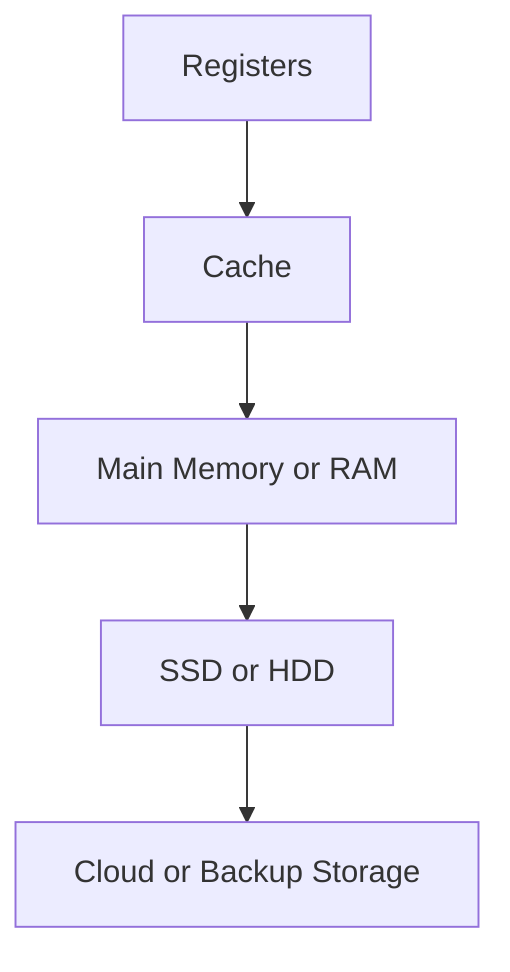

# Memory

## Learning Goals

- Explain memory hierarchy.
- Compare cache, RAM, ROM, and secondary storage.
- Understand locality at a basic level.

## 1. Memory Hierarchy



As we move down the hierarchy:

- Capacity increases.
- Cost per bit decreases.
- Speed decreases.

## 2. Memory Types

| Memory | Volatile | Use |
| --- | --- | --- |
| Registers | Yes | Immediate CPU values |
| Cache | Yes | Frequently used data |
| RAM | Yes | Running programs |
| ROM | No | Firmware |
| SSD/HDD | No | Permanent files |

## 3. Locality

Programs often reuse nearby data or instructions.

| Locality Type | Meaning |
| --- | --- |
| Temporal locality | Recently used data may be used again |
| Spatial locality | Nearby data may be used soon |

Cache works well because of locality.

## 4. Example

When a loop processes an array, nearby elements are accessed repeatedly. This makes caching effective.

```c
for (int i = 0; i < n; i++) {
    sum += arr[i];
}
```

## 5. Intensive Memory Hierarchy

Memory hierarchy exists because no single storage technology is simultaneously fastest, largest, cheapest, and permanent.

| Level | Approximate Role | Programmer Impact |
| --- | --- | --- |
| Registers | immediate CPU operands | compiler-managed in most high-level code |
| L1/L2/L3 cache | recently used data and instructions | improves loops and locality |
| RAM | active programs and data | limits multitasking and dataset size |
| SSD/HDD | persistent files | affects loading, saving, and swapping |
| Cloud/backup | remote persistence | affected by network speed and availability |

The closer the memory is to the CPU, the faster and smaller it usually is.

## 6. Cache-Friendly Thinking

Sequential array access is usually cache-friendly:

```c
for (int i = 0; i < n; i++) {
    sum += arr[i];
}
```

Random access can be less cache-friendly:

```c
sum += arr[random_index];
```

Cache behavior becomes important in large arrays, matrices, databases, games, and high-performance computing.

## 7. Virtual Memory Concept

Operating systems use virtual memory to give each process the illusion of its own large address space. Virtual memory helps with:

- Process isolation.
- Memory protection.
- Running programs larger than physical RAM using paging.
- Simplifying program loading.

When RAM is insufficient and the system relies heavily on disk paging, performance drops sharply.

## 8. Intensive Practice

1. Arrange memory levels by speed, cost per bit, and capacity.
2. Explain temporal and spatial locality using real code examples.
3. Compare RAM, ROM, cache, SSD, and registers.
4. Describe what happens when a system runs out of RAM.
5. Write two versions of a matrix traversal and discuss which is more cache-friendly.

## Practice

1. Arrange register, RAM, SSD, and cache from fastest to slowest.
2. What is volatile memory?
3. Explain spatial locality using an array.
