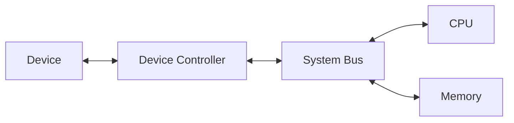
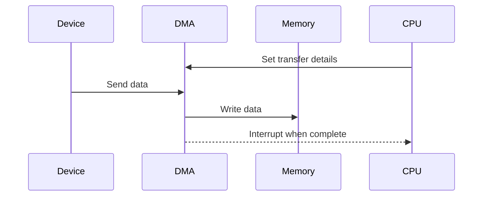

# I/O Subsystems

## Learning Goals

- Explain the role of input/output subsystems.
- Describe device controllers and interrupts.
- Understand polling vs interrupt-driven I/O.

## 1. What Is I/O?

I/O means input and output. It allows the computer to communicate with external devices such as keyboards, screens, disks, printers, cameras, and networks.

## 2. I/O Path



## 3. Device Controller

A device controller is hardware that manages a device and communicates with the CPU.

Examples:

- Disk controller.
- Network adapter.
- Graphics controller.
- USB controller.

## 4. Polling vs Interrupts

| Method | Meaning | Limitation or Benefit |
| --- | --- | --- |
| Polling | CPU repeatedly checks device status | Can waste CPU time |
| Interrupt | Device signals CPU when attention is needed | More efficient |

## 5. Direct Memory Access

DMA allows a device to transfer data directly to memory without constant CPU involvement.



## 6. Intensive I/O Performance

I/O devices are often much slower than the CPU. A processor may execute billions of operations per second, but disk, keyboard, network, and printer operations involve mechanical, electrical, or communication delays.

| Device Type | Typical Concern |
| --- | --- |
| Keyboard/mouse | low data rate, event handling |
| Disk/SSD | latency, throughput, queueing |
| Network card | bandwidth, packet loss, latency |
| Display/GPU | refresh rate, rendering throughput |
| Printer/scanner | slow physical movement |

Operating systems use buffering, caching, interrupts, drivers, and DMA to manage these differences.

## 7. Device Drivers

A device driver is software that allows the operating system to communicate with a hardware device. Applications usually do not talk to hardware directly; they use operating system services, which rely on drivers.

Example path for printing:

```text
Application -> Operating System -> Printer Driver -> Printer Controller -> Printer
```

Driver problems can cause devices to stop working even when the physical hardware is fine.

## 8. Polling, Interrupts, and DMA Compared

| Method | Best For | Weakness |
| --- | --- | --- |
| Polling | simple devices or predictable checks | wastes CPU if overused |
| Interrupts | event-driven device communication | too many interrupts can add overhead |
| DMA | large data transfers | requires setup and controller support |

A high-performance system uses the right method for the device and workload.

## 9. Intensive Practice

1. Trace what happens when a key is pressed and a character appears on screen.
2. Compare polling and interrupts using a keyboard example.
3. Explain why DMA is useful for disk or network transfers.
4. Identify the role of a driver in a webcam or printer.
5. Design an I/O path diagram for reading a file from an SSD into a program.

## Practice

1. Give three examples of I/O devices.
2. Why are interrupts useful?
3. What is the advantage of DMA?
