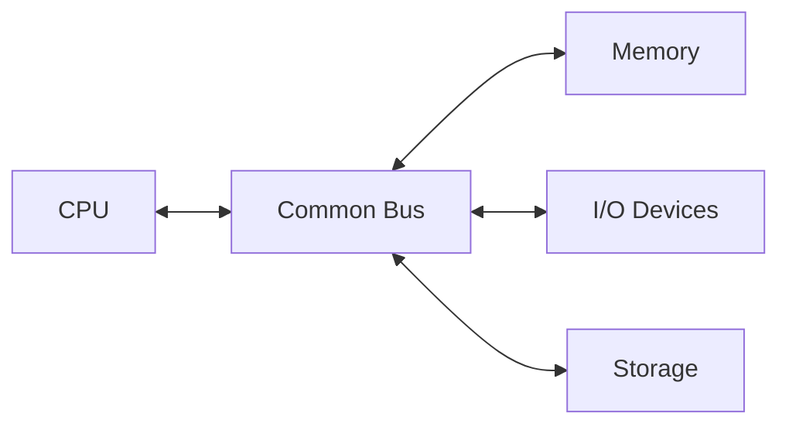
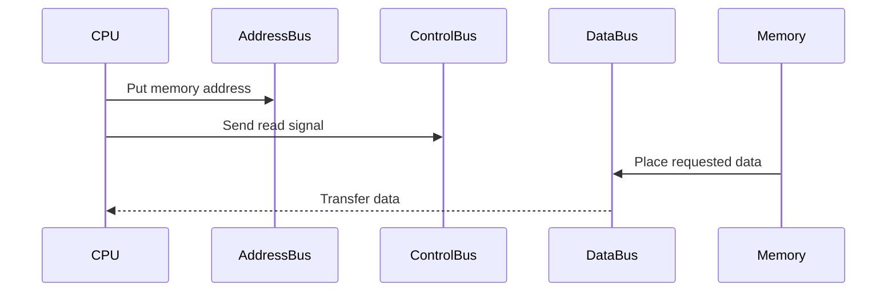

# Common Bus System

## Learning Goals

- Define a bus in computer architecture.
- Explain address, data, and control buses.
- Understand why bus width affects performance.

## 1. What Is a Bus?

A bus is a shared communication path used to transfer data, addresses, and control signals between components.



## 2. Types of Buses

| Bus | Carries | Example Use |
| --- | --- | --- |
| Address bus | Address of memory or device | Which location to access |
| Data bus | Actual data | Value being read or written |
| Control bus | Control signals | Read, write, interrupt |

## 3. Read Operation Flow



## 4. Bus Width

Bus width is the number of bits transferred at once. A wider data bus can transfer more data per operation.

Example:

- 8-bit bus transfers 1 byte at a time.
- 32-bit bus transfers 4 bytes at a time.
- 64-bit bus transfers 8 bytes at a time.

## 5. Intensive Bus Operation

During a memory read, the CPU and memory coordinate through buses:

1. CPU places the target address on the address bus.
2. CPU activates a read signal on the control bus.
3. Memory decodes the address.
4. Memory places the requested data on the data bus.
5. CPU copies the data into a register.

During a memory write, the CPU places both the address and data, then activates a write signal.

## 6. Address Bus Width

Address bus width affects how many unique memory locations can be addressed.

```text
Number of addresses = 2^(address bus width)
```

Examples:

| Address Bus Width | Number of Addresses |
| --- | --- |
| 8-bit | 256 |
| 16-bit | 65,536 |
| 32-bit | 4,294,967,296 |

This is why address width is connected to maximum addressable memory.

## 7. Bus Contention and Arbitration

If multiple components want to use the bus at the same time, the system needs rules to decide who gets access. This is called bus arbitration.

Without arbitration, signals could conflict. With arbitration, devices take turns according to priority or scheduling rules.

Modern systems may use point-to-point interconnects and specialized buses, but the address-data-control model remains a useful foundation.

## 8. Intensive Practice

1. Trace a memory read and memory write using address, data, and control bus roles.
2. Calculate addressable locations for 10-bit, 20-bit, and 32-bit address buses.
3. Explain why a wider data bus can improve throughput.
4. Draw a bus arbitration scenario with CPU, memory, and I/O device.
5. Compare a shared bus with a point-to-point connection at a conceptual level.

## Practice

1. What does the address bus carry?
2. Why does bus width matter?
3. Draw a simple CPU-memory bus connection.
