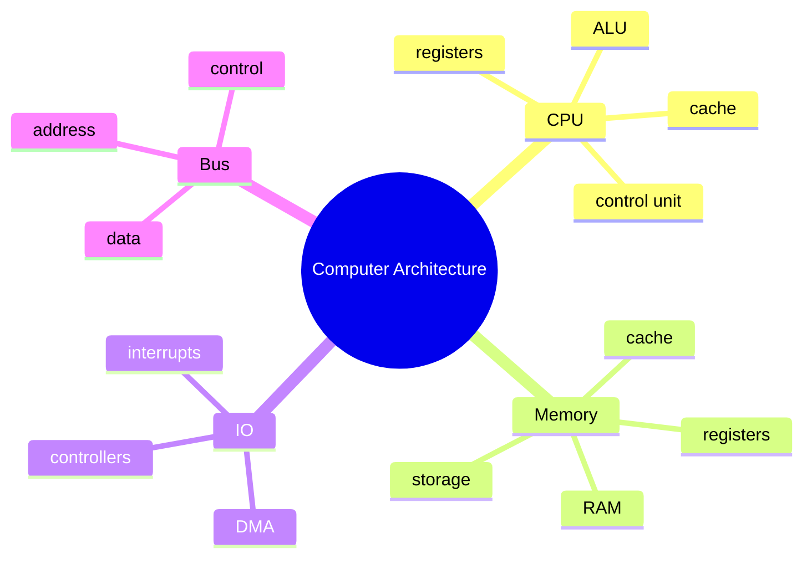

# Unit 6 Summary: Computer Architecture

## Lessons

- [01 Introduction](01_Introduction.md)
- [02 CPU](02_CPU.md)
- [03 Memory](03_Memory.md)
- [04 I/O Subsystems](04_IO_Subsystems.md)
- [05 Common Bus System](05_Common_Bus_System.md)

## Concept Map

## Intensive Review Checklist

By the end of this unit, a student should be able to:

- Explain architecture layers from application code to hardware.
- Identify CPU parts and trace an instruction through fetch, decode, execute, and store.
- Explain registers, cache, RAM, ROM, SSD, and virtual memory.
- Describe locality and why it improves cache performance.
- Compare polling, interrupts, DMA, and device drivers.
- Trace I/O paths for keyboard, disk, printer, and network examples.
- Explain address, data, and control bus roles.
- Calculate addressable locations from address bus width.
- Identify likely performance bottlenecks in realistic scenarios.

## Unit Assessment Tasks

1. Trace the execution of a simple assignment statement through CPU, memory, and bus activity.
2. Compare two computer systems and explain which is better for programming, data analysis, and multitasking.
3. Draw the path of a disk read operation using controller, bus, memory, DMA, and CPU.
4. Calculate addressable memory for several bus widths.
5. Explain why cache-friendly code can run faster than code with random memory access.

## Mini Project

Prepare a computer architecture case study for a real laptop or lab PC.

Required features:

- CPU model, cores, threads, and clock information if available.
- RAM capacity and storage type.
- Basic memory hierarchy explanation.
- At least three I/O devices and their controllers or interfaces.
- A bus or data movement diagram.
- Bottleneck analysis for programming, browsing, and data visualization workloads.

## Review Questions

1. What is the role of the CPU?
2. Explain the instruction cycle.
3. Why is cache useful?
4. Compare polling and interrupts.
5. What are the three main bus types?
