# Networking and the Internet

> **Unit 1 — Computer Fundamentals**  
> A beginner-friendly but practical chapter on computer networks, Internet communication, IP addressing, protocols, command-line tools, file sharing, and troubleshooting.

---

## How to Use This Chapter

This chapter combines theory with hands-on investigation. The first half explains how networks work. The second half turns the computer into a small networking laboratory using **Windows Command Prompt**, **PowerShell**, **Linux Terminal**, or **macOS Terminal**.

Do not try to memorise every command at once. The more useful skill is learning a repeatable diagnostic process:

1. identify the network interface,
2. read the IP configuration,
3. test local communication,
4. test the gateway,
5. test the Internet,
6. test DNS,
7. inspect the route and active connections, and
8. isolate the layer where the problem begins.

All practical exercises should be performed only on computers and networks that you own or are authorised to use.

---

## Learning Outcomes

After completing this chapter, you should be able to:

1. explain what a computer network is and why networks are created;
2. distinguish PAN, LAN, MAN, WAN, the Internet, an intranet, and an extranet;
3. compare client–server and peer-to-peer communication;
4. identify the functions of a network interface card, switch, access point, router, modem, firewall, and server;
5. explain the purpose of the OSI and TCP/IP models;
6. describe frames, packets, segments, encapsulation, and decapsulation;
7. distinguish MAC addresses, IP addresses, subnet masks, gateways, DNS servers, and ports;
8. explain DHCP, DNS, NAT, TCP, UDP, HTTP, HTTPS, and common application protocols;
9. interpret the output of common networking commands;
10. connect two computers on the same trusted Wi-Fi network and test communication;
11. share a temporary folder or service across a local network;
12. troubleshoot basic network and Internet problems systematically; and
13. apply safe practices when using local networks and public Wi-Fi.

---

# Part I — Foundations of Computer Networking

## 1. What Is a Computer Network?

A **computer network** is a collection of two or more devices connected so that they can exchange data and share resources. The devices may be physically connected by copper or fibre-optic cable, or they may communicate wirelessly using radio signals such as Wi-Fi or Bluetooth.

A network is not created merely because two computers are close to each other. The devices must have a communication path and must follow compatible rules called **protocols**. For example, two laptops connected to the same Wi-Fi router normally receive network addresses and can potentially exchange data. However, a guest Wi-Fi network may deliberately isolate devices so that they can reach the Internet but cannot communicate with one another.

<p align="center">
  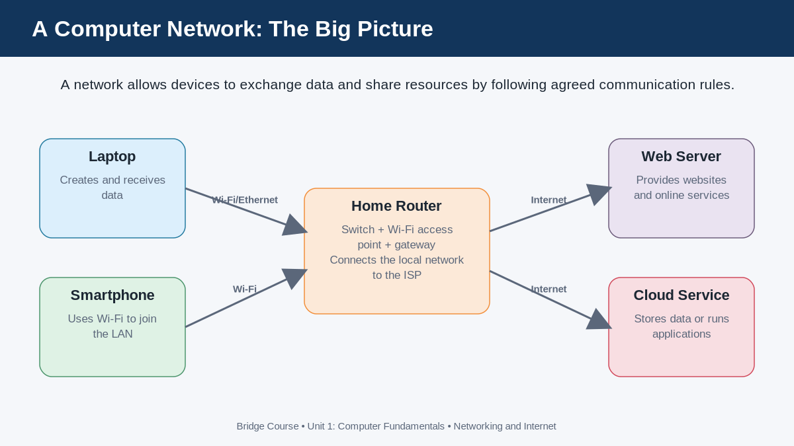
</p>

<p align="center"><em>Figure 1: A local network connects user devices to each other and, through a router and ISP, to remote Internet services.</em></p>

### A Simple Example

Consider a home with two laptops, three smartphones, a smart television, and a printer. The devices connect to a Wi-Fi router. Inside the home, the router and its built-in switch or access point form a local network. The router also connects that local network to an Internet Service Provider, commonly abbreviated as **ISP**.

When a laptop prints a document on the Wi-Fi printer, the communication may remain entirely inside the home network. When the same laptop opens a website, the request leaves the local network through the router, travels through the ISP and other networks, reaches a server, and returns with the requested content.

---

## 2. Why Are Networks Useful?

Networks are built because isolated computers are limited. A computer can process and store information independently, but a network allows information and services to move between devices.

<p align="center">
  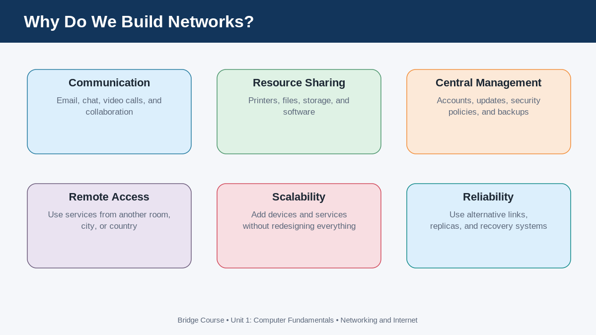
</p>

### Communication

Networks support email, instant messaging, voice calls, video meetings, collaborative documents, multiplayer games, and many other forms of communication. The participants may be in the same room or on different continents.

### Resource Sharing

A network allows several users to share resources such as printers, storage, databases, software services, and an Internet connection. A university laboratory does not need a separate printer for every computer; many computers can send print jobs to one network printer.

### Central Management

Organisations often manage accounts, passwords, updates, backups, and security policies centrally. Instead of configuring every computer independently, administrators can use servers and management systems to apply consistent rules.

### Remote Access

A user may access a service running on another computer. A student can open a university learning portal, an employee can connect to an approved company system, and a developer can administer a server using SSH.

### Reliability and Scalability

Well-designed networks can include alternative paths, redundant devices, replicated services, and backup links. They can also grow by adding more switches, access points, servers, and address space.

---

## 3. Network, Internet, Web, Intranet, and Extranet

These terms are related but should not be treated as synonyms.

| Term | Explanation |
|---|---|
| **Network** | Any connected group of devices that can communicate. A network may be small and private. |
| **Internet** | The global network of interconnected networks that communicate mainly using the TCP/IP protocol suite. |
| **World Wide Web** | A collection of interlinked web resources accessed through browsers using HTTP or HTTPS. The Web is one service that uses the Internet. |
| **Intranet** | A private network or set of web services used inside an organisation. |
| **Extranet** | A controlled part of an organisation’s network made accessible to selected external users such as suppliers or partners. |

A computer can participate in a local network even when the Internet connection is unavailable. Two computers on the same Wi-Fi can still exchange local data if the router and security settings allow it.

---

## 4. Types of Networks by Geographic Coverage

Network categories are often explained according to the area they cover. The boundaries are approximate rather than absolute.

<p align="center">
  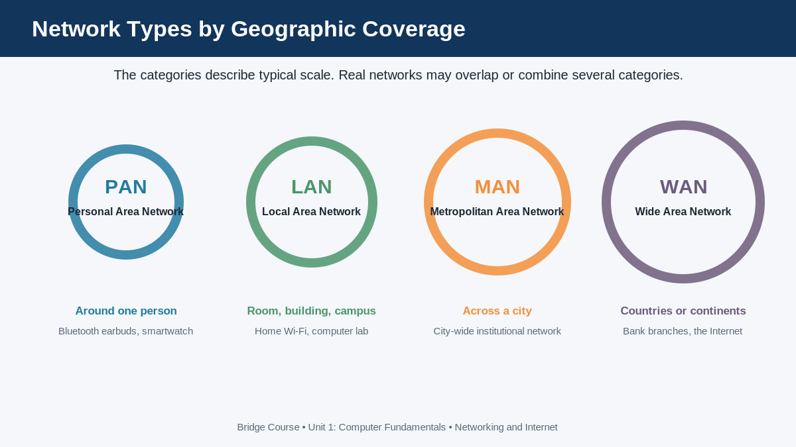
</p>

### Personal Area Network

A **Personal Area Network**, or **PAN**, covers the devices around one person. Bluetooth communication between a phone, smartwatch, keyboard, and wireless earbuds is a common example.

### Local Area Network

A **Local Area Network**, or **LAN**, normally covers a room, home, office, building, laboratory, or campus. Ethernet and Wi-Fi are common LAN technologies. A home Wi-Fi network is still a LAN even though it also provides Internet access.

### Metropolitan Area Network

A **Metropolitan Area Network**, or **MAN**, connects locations across a town or city. A municipal network or a university network linking several city campuses may fit this category.

### Wide Area Network

A **Wide Area Network**, or **WAN**, connects networks across large geographic distances. A company may use a WAN to connect offices in several countries. The Internet is the largest and best-known network of networks.

---

## 5. Client–Server and Peer-to-Peer Communication

A network can be organised in different ways depending on where services and responsibilities are located.

<p align="center">
  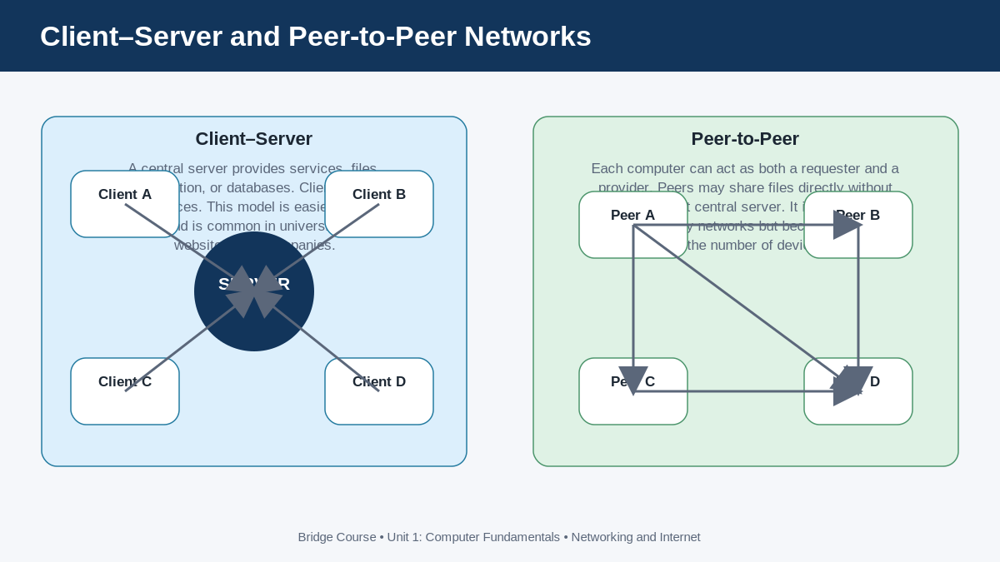
</p>

### Client–Server Model

In the **client–server model**, a server provides a service and a client requests it. When a browser requests a web page, the browser acts as the client and the web server responds. A database server accepts queries from authorised applications. A file server stores folders that users access over the network.

The server does not have to be a physically enormous computer. The term describes a role. A laptop running a temporary web server can act as a server, while another laptop opening the page acts as a client.

Client–server systems are common because they support central control, consistent backups, access permissions, and easier maintenance. Their weakness is that an unavailable server can make the service unavailable unless redundancy has been designed.

### Peer-to-Peer Model

In a **peer-to-peer**, or **P2P**, arrangement, computers can provide resources directly to one another. A computer may act as a client in one interaction and a server in another.

A small home workgroup that shares folders directly is an example. Peer-to-peer systems are simple for a few devices, but permissions, backups, and consistency become harder to manage as the number of devices grows.

---

## 6. Network Topologies

A **topology** describes how network devices and links are arranged. A topology may describe the physical cabling or the logical flow of communication.

<p align="center">
  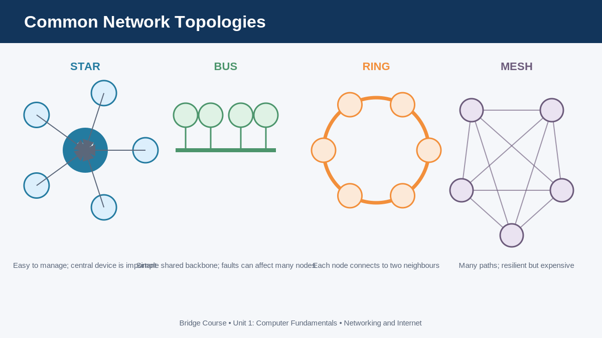
</p>

### Star Topology

In a star topology, devices connect to a central switch or access point. This is the most familiar layout in modern Ethernet and Wi-Fi LANs. A failed end-device cable normally affects only one device, but failure of the central device can affect the entire group.

### Bus Topology

In a bus topology, devices share a common backbone. Older Ethernet technologies used bus-like arrangements. A fault in the shared medium can affect many devices, and simultaneous transmissions may compete for the same channel.

### Ring Topology

In a ring topology, each node connects to neighbouring nodes to form a loop. Data travels around the ring according to the technology’s rules. Ring networks are less common in ordinary home networking but remain useful for understanding topology design.

### Mesh Topology

In a mesh topology, nodes have several possible paths between them. A full mesh connects every node to every other node, while a partial mesh provides selected redundant paths. Mesh designs can improve resilience but require more links and more complex management.

---

## 7. Wired and Wireless Transmission Media

A network must carry signals through some form of medium.

<p align="center">
  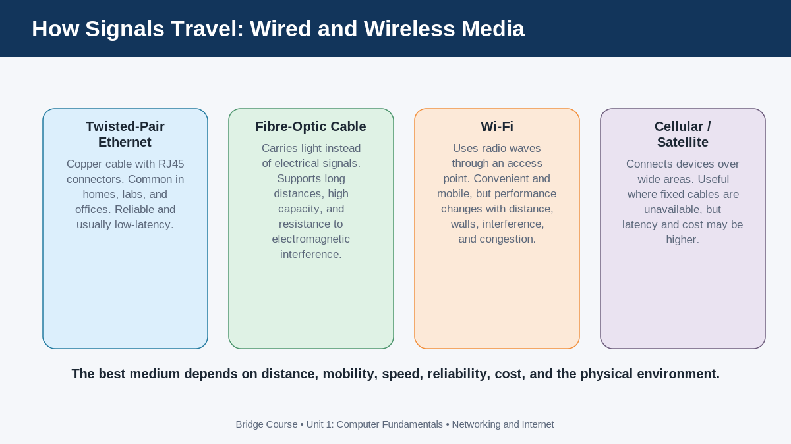
</p>

### Twisted-Pair Ethernet Cable

Most ordinary wired LAN connections use twisted-pair copper cable with RJ45-style connectors. The twisting reduces interference. Ethernet cable generally provides stable performance and low latency, which makes it suitable for desktop computers, servers, access points, and network equipment.

Cable category and equipment capability influence the supported speed. The practical speed also depends on cable quality, length, network adapters, switch ports, and configuration.

### Fibre-Optic Cable

Fibre carries light rather than electrical signals. It supports high capacity and long distances and is resistant to electromagnetic interference. Fibre is common in ISP infrastructure, data centres, campus backbones, and modern fibre-to-the-home connections.

### Wi-Fi

Wi-Fi uses radio waves. It provides mobility and convenience, but its performance depends on distance, obstacles, channel congestion, interference, access-point capacity, and the capabilities of both the access point and client device.

A device showing a strong Wi-Fi symbol is not proof that the Internet is working. The device may have a good radio connection to the router while the router’s connection to the ISP is unavailable.

### Cellular and Satellite Links

Cellular networks provide wide-area mobile connectivity. Satellite systems can provide service in places where terrestrial infrastructure is limited, although delay, weather, equipment, and cost may affect performance.

---

## 8. Network Devices and Their Responsibilities

Network devices are frequently confused because a home router may combine several functions in one box.

<p align="center">
  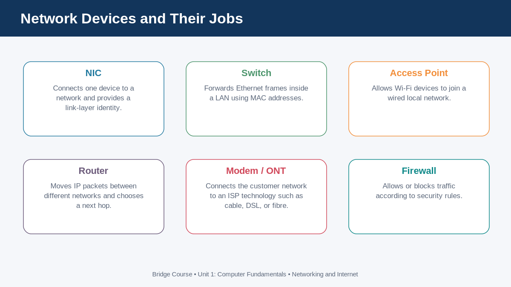
</p>

### Network Interface Card

A **Network Interface Card**, or **NIC**, connects a computer to a network. Modern computers usually have an Ethernet interface, a Wi-Fi interface, or both. Each active interface has its own configuration and may have its own MAC and IP addresses.

### Switch

A switch connects devices inside a LAN. It examines destination MAC addresses in Ethernet frames and forwards frames toward the appropriate port. A switch learns which MAC addresses have been observed on each port.

A switch is not normally responsible for moving traffic between different IP networks. That is the router’s role.

### Wireless Access Point

A wireless access point allows Wi-Fi clients to join a local network. In a home device, the access point, Ethernet switch, router, firewall, and DHCP server may all be integrated into one unit.

### Router

A router connects different IP networks. It examines the destination IP address and chooses where a packet should go next. A home router commonly connects the private home LAN to the ISP network.

### Modem or Optical Network Terminal

The device that connects to the ISP depends on the access technology. Cable and DSL connections may use a modem. Fibre connections may use an **Optical Network Terminal**, or **ONT**. Sometimes this ISP device is separate from the Wi-Fi router; sometimes the functions are combined.

### Firewall

A firewall applies rules to network traffic. It may allow, reject, or silently drop communication based on addresses, ports, protocols, applications, network profiles, and connection state.

A firewall is not a magical guarantee of safety. It is one layer of defence that must be combined with updates, secure configuration, authentication, encryption, and responsible user behaviour.

---

# Part II — How Network Communication Is Organised

## 9. Protocols: Rules for Communication

A **protocol** is an agreed set of rules that defines how data is formatted, transmitted, received, interpreted, acknowledged, or corrected.

Human communication also depends on protocols. A telephone conversation has expectations about dialling, answering, identifying the speaker, taking turns, and ending the call. Computer protocols formalise such expectations precisely.

Different protocols perform different jobs. Ethernet and Wi-Fi handle local-link communication. IP handles addressing and routing across networks. TCP and UDP support application-to-application transport. DNS translates names. HTTP carries web requests and responses.

No single protocol performs every task. Network communication works because several protocols cooperate in layers.

---

## 10. Why Network Models Use Layers

A layered model divides a complex communication task into manageable responsibilities. Each layer serves the layer above and uses the layer below.

This separation allows a web browser to use the same HTTP concepts whether the computer is connected through Ethernet, Wi-Fi, fibre, or cellular service. The application does not need to control every electrical signal or radio transmission directly.

Two common teaching models are the **OSI model** and the **TCP/IP model**.

<p align="center">
  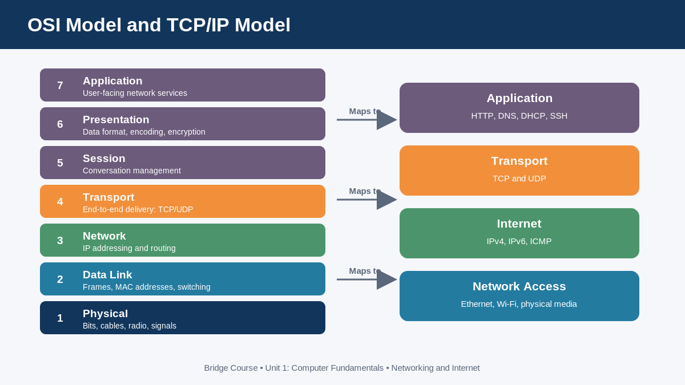
</p>

---

## 11. The Seven-Layer OSI Model

The **Open Systems Interconnection**, or **OSI**, model contains seven conceptual layers.

### Layer 7 — Application

The application layer provides network services used by software. HTTP, DNS, SMTP, and SSH are commonly discussed here. The word “application” does not mean the entire program interface; it means the networking functions closest to the user application.

### Layer 6 — Presentation

The presentation layer concerns the representation of data. Encoding, serialisation, compression, and encryption are often explained at this layer. In real TCP/IP implementations, these responsibilities may be handled by application libraries rather than a distinct layer.

### Layer 5 — Session

The session layer describes the management of conversations between systems, including starting, maintaining, and ending sessions. Modern protocols may integrate these functions elsewhere.

### Layer 4 — Transport

The transport layer provides process-to-process delivery. TCP and UDP use port numbers so that data reaches the correct application endpoint. TCP offers connection-oriented reliable delivery, while UDP offers simpler datagram delivery without the same reliability mechanisms.

### Layer 3 — Network

The network layer provides logical addressing and routing between networks. IPv4 and IPv6 are central examples. Routers operate primarily with network-layer information.

### Layer 2 — Data Link

The data-link layer handles communication over the current local link. Ethernet frames, Wi-Fi frames, MAC addresses, switching, and local error detection are associated with this layer.

### Layer 1 — Physical

The physical layer represents bits as electrical, optical, or radio signals. It includes cables, connectors, radio channels, signalling, timing, and physical transmission characteristics.

### Why the OSI Model Is Still Useful

Real protocols do not always fit perfectly into one OSI layer. The model remains valuable because it gives students a vocabulary for troubleshooting. A damaged cable is a physical-layer problem. An incorrect IP route is a network-layer problem. A web server returning an HTTP error is an application-layer issue.

---

## 12. The TCP/IP Model

The TCP/IP model is more directly connected to the protocol suite used by the Internet. It is commonly shown with four layers:

| TCP/IP Layer | Main Responsibility | Examples |
|---|---|---|
| Application | Services and application protocols | HTTP, HTTPS, DNS, DHCP, SSH, SMTP |
| Transport | Communication between application endpoints | TCP, UDP |
| Internet | Logical addressing and routing | IPv4, IPv6, ICMP |
| Network Access | Local frames, media, and physical transmission | Ethernet, Wi-Fi, fibre, copper |

The OSI and TCP/IP models should not be treated as competing truths. They are conceptual tools with different levels of detail.

---

## 13. Encapsulation and Decapsulation

When an application sends data, each layer adds information needed for its responsibility. This process is called **encapsulation**.

<p align="center">
  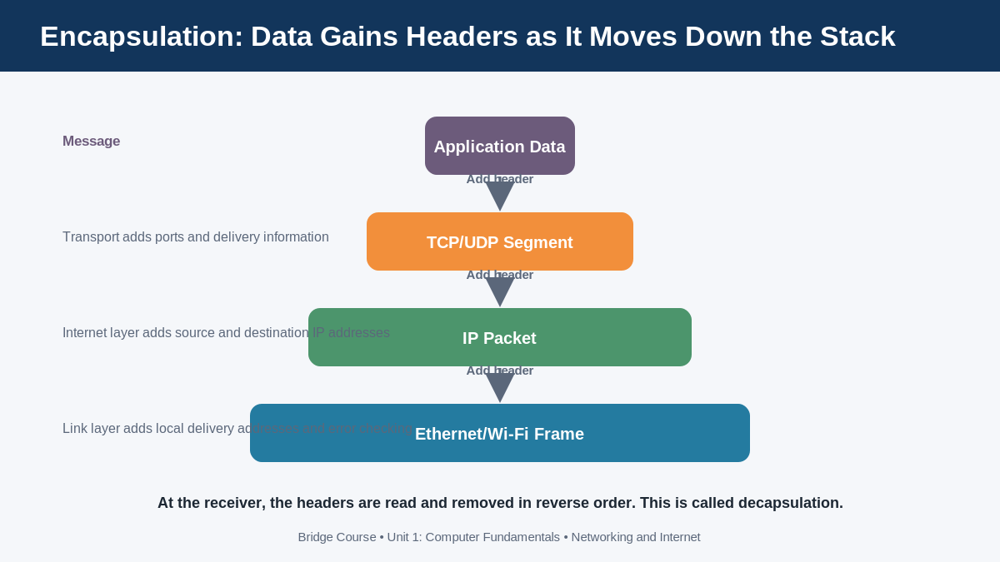
</p>

Suppose a browser sends a small HTTP request:

1. The application creates the request data.
2. The transport layer adds TCP information such as source and destination ports.
3. The Internet layer adds source and destination IP addresses.
4. The link layer adds local delivery information, including link-layer addresses.
5. The physical layer transmits the resulting bits as signals.

At the receiver, the layers interpret and remove the headers in reverse order. This is called **decapsulation**.

The terminology often used is:

| Layer | Common Data Unit Name |
|---|---|
| Application | Data or message |
| Transport using TCP | Segment |
| Transport using UDP | Datagram |
| Internet | Packet |
| Data Link | Frame |
| Physical | Bits |

In everyday conversation, people may use “packet” more generally. In formal study, it is useful to distinguish the layer-specific units.

---

## 14. What Is Inside a Packet?

A real packet format depends on the protocol, but a simplified representation helps explain the idea.

<p align="center">
  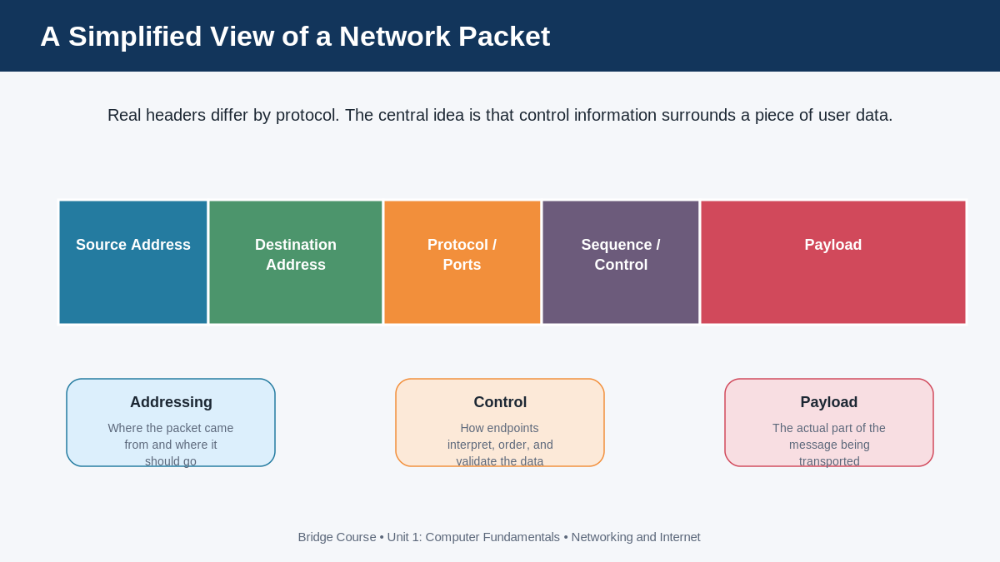
</p>

A packet or frame may carry:

- source information indicating where it came from;
- destination information indicating where it should go;
- protocol information explaining how to interpret the payload;
- sequencing or control information;
- error-detection information; and
- the payload containing part of the user’s actual data.

A large file is usually divided into many smaller units. Different parts of the path may have different size limits, and transport protocols may divide and reassemble data as required.

---

# Part III — Addresses, Names, and Ports

## 15. Three Different Identities: MAC, IP, and Port

Students commonly confuse these because all three help deliver data, but they work at different layers and scopes.

<p align="center">
  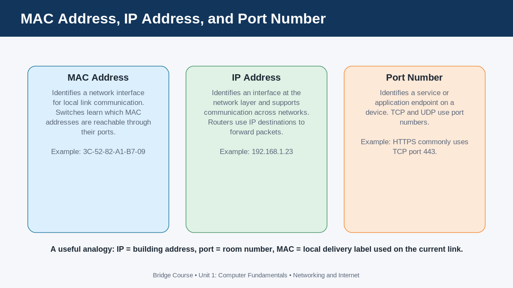
</p>

### MAC Address

A **Media Access Control address**, or **MAC address**, identifies a network interface for local-link communication. Ethernet switches use MAC information to forward frames within a LAN.

A MAC address is often displayed as six hexadecimal groups, for example:

```text
3C-52-82-A1-B7-09
```

or

```text
3c:52:82:a1:b7:09
```

Modern operating systems may use randomised MAC addresses on Wi-Fi networks to improve privacy, so a Wi-Fi interface may not always present the same address on every network.

### IP Address

An IP address is a logical network-layer address. Routers use the destination IP address to move packets between networks.

Examples:

```text
IPv4: 192.168.1.23
IPv6: 2001:db8:4a2:10::25
```

An IP address normally belongs to an interface, not permanently to the human user or physical computer. A laptop with Ethernet, Wi-Fi, a VPN, and virtual-machine adapters may have several IP addresses simultaneously.

### Port Number

A port number identifies an application endpoint using TCP or UDP. If an IP address is compared to a building address, a port can be compared to a room or service desk inside the building.

For example, a server may provide HTTPS on TCP port 443 and SSH on TCP port 22. The same IP address can support many services because each service listens on a different port.

---

## 16. IPv4 Addresses

IPv4 uses 32-bit addresses. For human readability, the 32 bits are displayed as four decimal numbers separated by dots. Each decimal part represents one byte and ranges from 0 to 255.

```text
192.168.10.25
```

The address alone is incomplete for local routing decisions. A device also needs a **subnet mask** or prefix length to determine which part identifies the network and which part identifies the host.

<p align="center">
  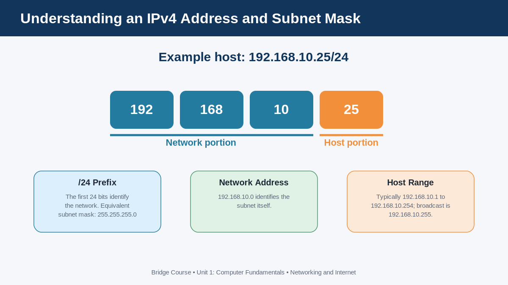
</p>

### Prefix Length and Subnet Mask

The notation `/24` means that the first 24 bits form the network prefix.

```text
192.168.10.25/24
```

The equivalent subnet mask is:

```text
255.255.255.0
```

For this ordinary `/24` example:

| Item | Value |
|---|---|
| Network address | `192.168.10.0` |
| Typical usable host range | `192.168.10.1` to `192.168.10.254` |
| Broadcast address | `192.168.10.255` |
| Subnet mask | `255.255.255.0` |

The network address identifies the subnet, while the broadcast address represents all IPv4 hosts on that subnet. Those addresses are not assigned to ordinary hosts in this common example.

### Are Two Devices on the Same Subnet?

Consider:

```text
Computer A: 192.168.1.23/24
Computer B: 192.168.1.54/24
```

Both share the network prefix `192.168.1.0/24`, so they are on the same IP subnet.

Now consider:

```text
Computer A: 192.168.1.23/24
Computer B: 192.168.2.54/24
```

These addresses belong to different `/24` networks. Communication would normally require a router with routes between the two networks.

### Common Prefix Examples

| Prefix | Subnet Mask | Total IPv4 Addresses | Typical Usable Hosts* |
|---|---|---:|---:|
| `/24` | `255.255.255.0` | 256 | 254 |
| `/25` | `255.255.255.128` | 128 | 126 |
| `/26` | `255.255.255.192` | 64 | 62 |
| `/27` | `255.255.255.224` | 32 | 30 |
| `/28` | `255.255.255.240` | 16 | 14 |

\*The “minus two” beginner rule applies to conventional broadcast subnets. Some specialised designs, such as `/31` point-to-point links, follow different rules.

---

## 17. Private, Public, Loopback, and Link-Local IPv4 Addresses

### Private IPv4 Addresses

Private addresses are used inside local networks and are not globally routed as ordinary public Internet addresses.

<p align="center">
  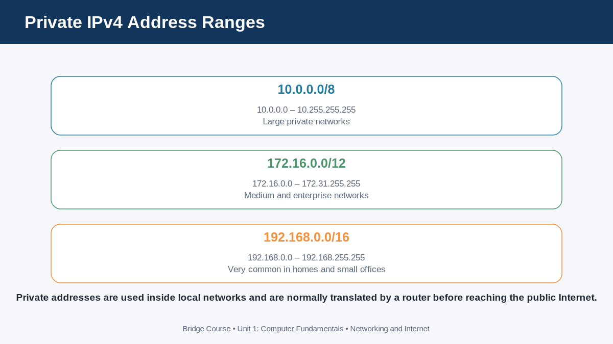
</p>

The three private ranges are:

```text
10.0.0.0/8
172.16.0.0/12
192.168.0.0/16
```

Home routers commonly assign addresses such as `192.168.0.15`, `192.168.1.23`, or `10.0.0.8`.

### Public IP Address

A public IP address is globally routable on the Internet, subject to routing and filtering policies. A home router may have one public-facing address while many private devices share it through Network Address Translation.

### Loopback Address

The IPv4 loopback range is `127.0.0.0/8`. The address most commonly used is:

```text
127.0.0.1
```

The hostname `localhost` normally resolves to a loopback address. Communication to loopback remains inside the computer and is useful for testing locally running software.

### Link-Local Address

If a Windows computer configured for automatic addressing cannot obtain an IPv4 lease, it may assign itself an address in `169.254.0.0/16`. This is often called an **Automatic Private IP Addressing**, or **APIPA**, address.

An address such as `169.254.52.18` often indicates that the device did not receive normal configuration from DHCP. It may communicate with another link-local device on the same link, but it normally cannot reach the router or Internet without additional configuration.

---

## 18. IPv6

IPv6 uses 128-bit addresses, providing a vastly larger address space than IPv4. It also changes several aspects of addressing, neighbour discovery, and packet handling.

An IPv6 address is written in hexadecimal groups:

```text
2001:0db8:0000:0000:04a2:0000:0000:0025
```

Leading zeroes within a group may be omitted, and one continuous sequence of zero groups may be replaced by `::`:

```text
2001:db8::4a2:0:0:25
```

Useful IPv6 categories include:

| Type | Example or Prefix | Purpose |
|---|---|---|
| Loopback | `::1` | Local computer |
| Link-local | `fe80::/10` | Communication on the current local link |
| Global unicast | Often within `2000::/3` | Globally routable addressing |
| Unique local | `fc00::/7` | Local/private-style use |

IPv6 does not use broadcast in the same way as IPv4. It uses multicast and neighbour-discovery mechanisms instead.

Beginners should not disable IPv6 simply because they are more familiar with IPv4. Modern operating systems and networks are designed to use both where appropriate.

---

## 19. Default Gateway

A device sends traffic directly to another device when the destination is on the same local subnet. When the destination belongs to another network, the device sends the packet to a router known as the **default gateway**.

Example configuration:

```text
Computer IP:     192.168.1.23
Subnet mask:     255.255.255.0
Default gateway: 192.168.1.1
```

A destination such as `192.168.1.54` is local in this `/24` network. A destination such as `8.8.8.8` is remote, so the computer sends the frame to the gateway’s local MAC address while preserving the remote IP destination inside the packet.

If the default gateway is missing or incorrect, the computer may communicate with local devices but fail to reach other networks.

---

## 20. DHCP: Automatic Network Configuration

The **Dynamic Host Configuration Protocol**, or **DHCP**, gives devices network configuration automatically. Without DHCP, users would have to enter addresses manually and carefully avoid duplicates.

<p align="center">
  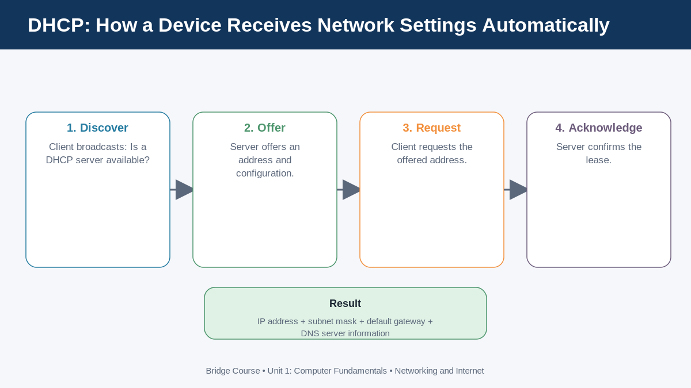
</p>

A simplified DHCP exchange is often remembered as **DORA**:

1. **Discover:** the client searches for a DHCP server.
2. **Offer:** the server offers an address and configuration.
3. **Request:** the client requests the offered address.
4. **Acknowledge:** the server confirms the lease.

The client may receive:

- an IP address;
- a subnet mask or prefix length;
- a default gateway;
- DNS server addresses;
- a lease duration; and
- additional network-specific options.

A DHCP lease is temporary. The client renews it while connected. The same device may receive a different address later unless the server has a reservation.

### DHCP Troubleshooting on Windows

View current configuration:

```cmd
ipconfig /all
```

Release the current IPv4 DHCP configuration:

```cmd
ipconfig /release
```

Request new configuration:

```cmd
ipconfig /renew
```

Do not use release and renew casually on a remote computer because releasing the address can disconnect the remote session.

---

## 21. DNS: Names Instead of Numbers

The **Domain Name System**, or **DNS**, translates names into records such as IP addresses. Humans prefer names such as `www.example.com`, while network routing uses IP addresses.

<p align="center">
  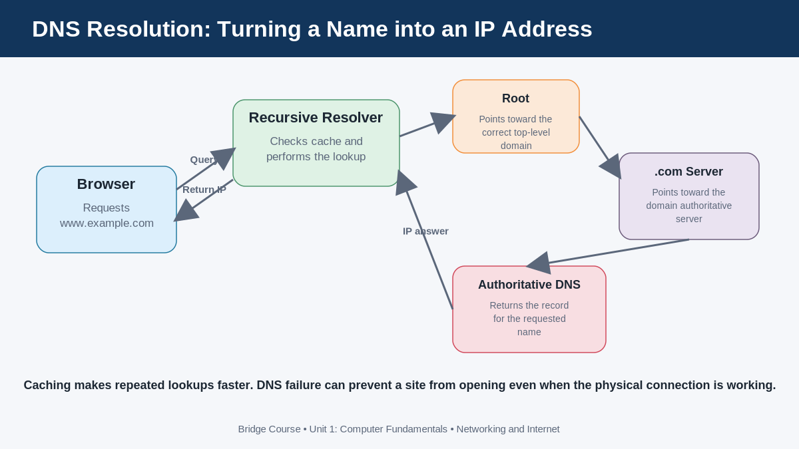
</p>

A simplified lookup works as follows:

1. The application checks whether the answer is already cached locally.
2. The computer asks a configured recursive DNS resolver.
3. If necessary, the resolver follows the DNS hierarchy.
4. An authoritative DNS server provides the required record.
5. The result is returned and may be cached for a limited time.

### Common DNS Records

| Record | Purpose |
|---|---|
| `A` | Maps a name to an IPv4 address |
| `AAAA` | Maps a name to an IPv6 address |
| `CNAME` | Creates an alias pointing to another name |
| `MX` | Identifies mail servers for a domain |
| `NS` | Identifies authoritative name servers |
| `TXT` | Stores text used for verification, policy, and other purposes |
| `PTR` | Supports reverse lookup from an address to a name |

### Why DNS Failure Looks Like Internet Failure

Suppose this command succeeds:

```cmd
ping 1.1.1.1
```

but this fails:

```cmd
nslookup example.com
```

The computer may have working IP connectivity but a DNS problem. Applications that depend on names will appear unable to access the Internet even though packets can reach public IP addresses.

---

## 22. Network Address Translation

Home and small-office networks commonly use **Network Address Translation**, or **NAT**, at the router. Private devices use internal addresses, while the router translates their connections to a public-facing address.

<p align="center">
  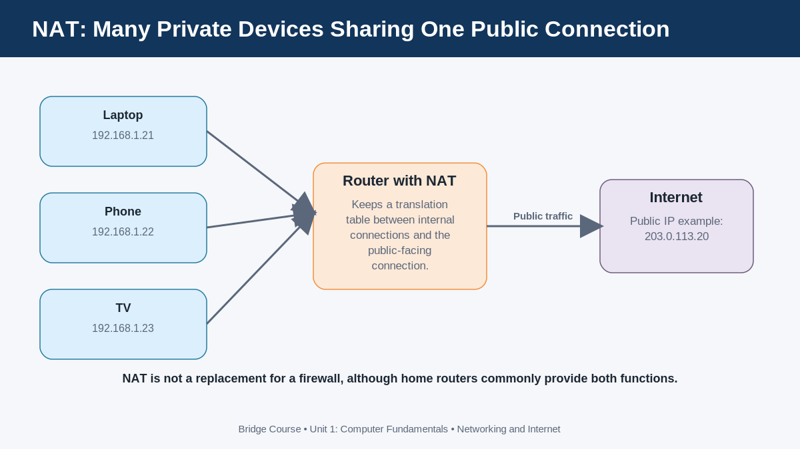
</p>

The router maintains a translation table so that returning traffic is delivered to the correct internal device and application. Port information often helps distinguish simultaneous connections from many devices.

NAT conserves public IPv4 addresses and hides the internal addressing structure, but it should not be confused with a complete security system. A firewall applies traffic policy; NAT performs translation. Home routers frequently provide both.

---

## 23. TCP and UDP

TCP and UDP are transport-layer protocols. Both use port numbers, but they provide different services.

### Transmission Control Protocol

**TCP** is connection-oriented. Before application data is exchanged, endpoints establish a connection. TCP provides mechanisms for ordered delivery, acknowledgement, retransmission, flow control, and congestion control.

TCP is suitable when correct and ordered delivery is important. Web traffic, SSH, and many file-transfer applications use TCP.

A simplified connection establishment is called the three-way handshake:

```text
Client  → Server: SYN
Server  → Client: SYN-ACK
Client  → Server: ACK
```

### User Datagram Protocol

**UDP** sends independent datagrams without establishing a TCP-style connection. It does not itself guarantee delivery, order, or retransmission.

UDP has less protocol overhead and is useful when applications value timeliness, simplicity, multicast capability, or custom reliability mechanisms. DNS queries, real-time media, online games, and modern transport technologies may use UDP.

### Comparison

| Feature | TCP | UDP |
|---|---|---|
| Connection setup | Yes | No TCP-style setup |
| Delivery acknowledgement | Built into TCP | Not built into UDP |
| Ordering | Preserved by TCP | Not guaranteed by UDP |
| Retransmission | Built into TCP | Application must handle if required |
| Header overhead | Higher | Lower |
| Typical uses | Web, SSH, email, file transfer | DNS, streaming, voice, games, discovery |

“UDP is faster” is an oversimplification. Application design, network conditions, congestion control, loss, and implementation matter. The correct statement is that UDP provides a simpler transport service with fewer built-in guarantees.

---

## 24. Common Protocols and Ports

<p align="center">
  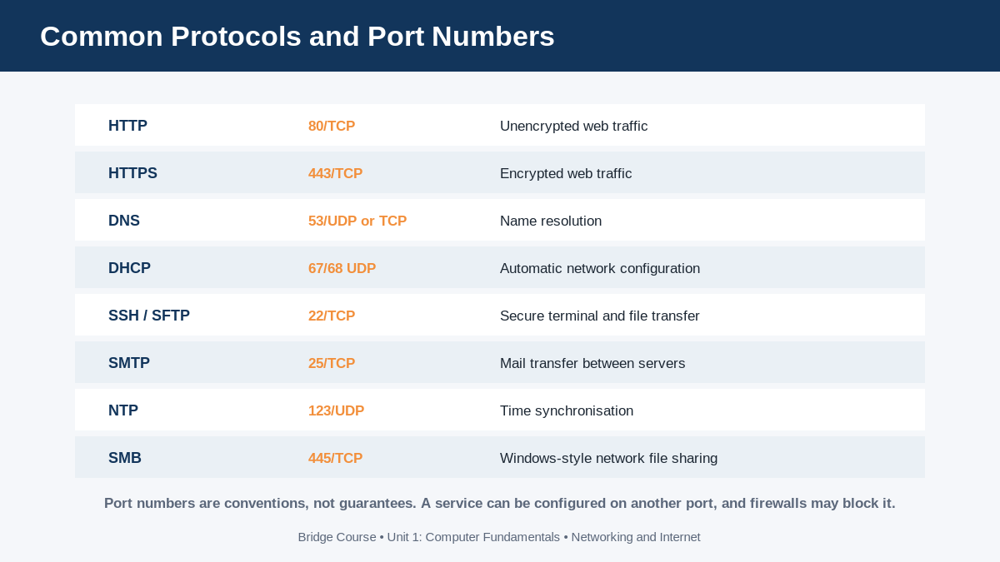
</p>

| Protocol | Common Port | Purpose |
|---|---:|---|
| HTTP | TCP 80 | Unencrypted web communication |
| HTTPS | TCP 443 | HTTP protected by TLS |
| DNS | UDP/TCP 53 | Domain-name resolution |
| DHCP server/client | UDP 67/68 | Automatic address configuration |
| SSH and SFTP | TCP 22 | Secure remote terminal and file transfer |
| SMTP | TCP 25 and other deployment-specific ports | Mail transfer |
| IMAP | TCP 143 or 993 with TLS | Mailbox access |
| POP3 | TCP 110 or 995 with TLS | Mail retrieval |
| NTP | UDP 123 | Time synchronisation |
| SMB | TCP 445 | Windows-style file and printer sharing |
| RDP | TCP/UDP 3389 | Microsoft Remote Desktop |

These are conventional ports. A service can be configured on another port, and a firewall can allow or block traffic regardless of convention.

---

# Part IV — The Internet and the Web

## 25. Understanding a URL

Consider this URL:

```text
https://learn.example.org:443/networking/index.html?unit=1#commands
```

| Component | Value | Meaning |
|---|---|---|
| Scheme | `https` | Communication method expected by the application |
| Hostname | `learn.example.org` | Name of the target service |
| Port | `443` | Explicit application port; normally omitted when using the standard HTTPS port |
| Path | `/networking/index.html` | Resource path on the server |
| Query | `unit=1` | Parameters supplied to the application |
| Fragment | `commands` | Location within the returned document; normally handled by the browser |

A URL identifies a resource and the method used to access it. DNS resolves the hostname, but DNS does not process the path, query, or fragment.

---

## 26. How a Web Page Opens

<p align="center">
  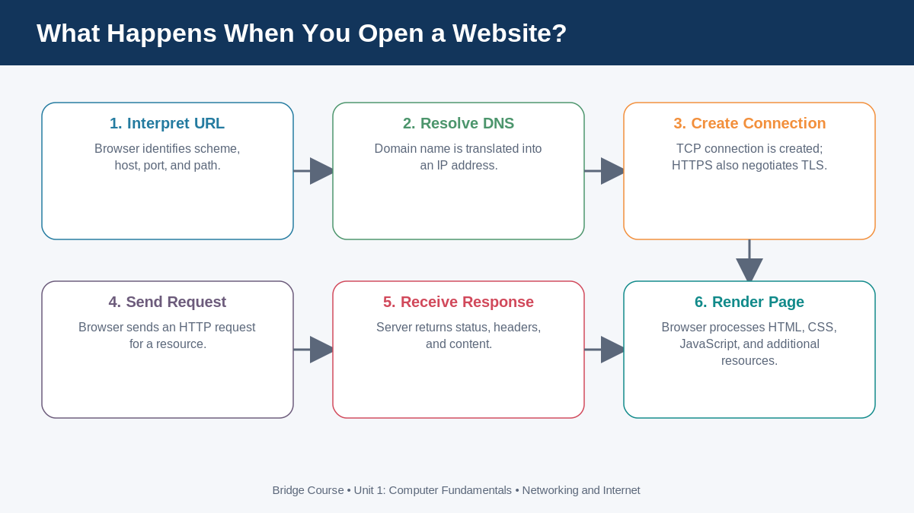
</p>

When a user enters a URL, the following activities may occur:

### Step 1: The Browser Interprets the URL

The browser identifies the scheme, hostname, optional port, resource path, query parameters, and fragment.

### Step 2: The Hostname Is Resolved

The browser or operating system checks caches and uses DNS to obtain an IPv4 or IPv6 address.

### Step 3: A Transport Connection Is Created

For traditional HTTPS over TCP, the browser establishes a TCP connection. Other modern HTTP versions may use different transport arrangements, but the basic teaching idea remains that a communication path is created to the server.

### Step 4: Encryption Is Negotiated

HTTPS uses TLS to protect the communication. The browser validates the server’s certificate and negotiates cryptographic parameters.

### Step 5: The HTTP Request Is Sent

A simplified request may look like:

```http
GET /index.html HTTP/1.1
Host: www.example.com
User-Agent: ExampleBrowser
Accept: text/html
```

### Step 6: The Server Responds

A simplified response begins with a status line and headers:

```http
HTTP/1.1 200 OK
Content-Type: text/html
Content-Length: 1250
```

The body contains the requested content.

### Step 7: The Browser Renders the Page

The browser parses HTML, applies CSS, executes permitted JavaScript, loads images and fonts, and may make many additional requests. A visually simple page can involve dozens or hundreds of network transactions.

---

## 27. HTTP Status Codes

HTTP status codes summarise the result of a request.

| Range | Category | Examples |
|---|---|---|
| `1xx` | Informational | Processing or protocol information |
| `2xx` | Success | `200 OK`, `201 Created` |
| `3xx` | Redirection | `301 Moved Permanently`, `304 Not Modified` |
| `4xx` | Client-side request issue | `400 Bad Request`, `403 Forbidden`, `404 Not Found` |
| `5xx` | Server-side failure | `500 Internal Server Error`, `503 Service Unavailable` |

A `404` response proves that network communication and the web server may be working; the requested resource was not found. Therefore, “the page did not open” does not always mean “the network is down.”

---

## 28. Bandwidth, Throughput, Latency, Jitter, and Loss

<p align="center">
  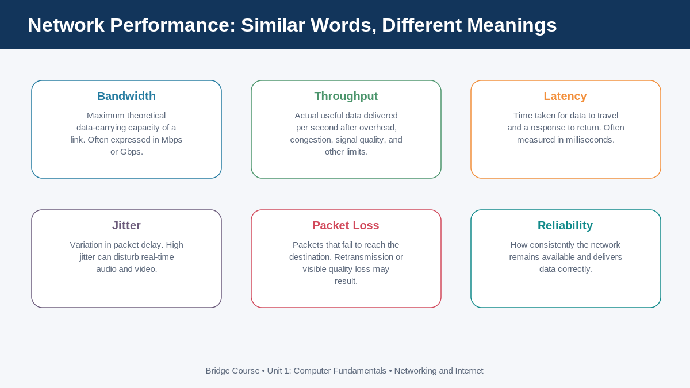
</p>

### Bandwidth

Bandwidth describes the maximum theoretical capacity of a link, commonly measured in bits per second. A `1 Gbps` Ethernet link does not guarantee that every file transfer will achieve one gigabit per second.

### Throughput

Throughput is the useful data actually delivered per second. Protocol overhead, server limits, storage speed, congestion, radio conditions, competing users, and packet loss can reduce throughput.

### Latency

Latency is delay. `ping` reports round-trip time, which includes travel to the destination and back. Interactive applications such as video calls and games are sensitive to latency.

### Jitter

Jitter is variation in delay. Audio packets arriving with inconsistent timing may produce gaps or require buffering even if average bandwidth is sufficient.

### Packet Loss

Packet loss occurs when packets do not reach the destination. TCP may retransmit lost data, reducing performance. Real-time applications may prefer to continue rather than wait, producing visible or audible quality loss.

### Reliability

Reliability describes how consistently the network remains available and delivers usable service over time.

### A Useful Example

A network can have high bandwidth and poor latency. A large download may complete quickly because the link carries a lot of data, while an online game still feels unresponsive because each interaction takes too long to travel and return.

---

# Part V — Terminal and Command-Line Networking

## 29. Command Prompt, PowerShell, and Terminal

### Windows Command Prompt

Command Prompt runs traditional Windows commands. Open it by searching for **Command Prompt** or pressing `Win + R`, typing `cmd`, and pressing Enter.

The prompt may look like:

```text
C:\Users\Student>
```

### Windows PowerShell

PowerShell is a modern shell and scripting environment that works with structured objects. Open it by searching for **PowerShell** or by opening **Windows Terminal** and selecting a PowerShell tab.

The prompt may look like:

```text
PS C:\Users\Student>
```

Traditional commands such as `ping` and `ipconfig` can also be run from PowerShell. PowerShell additionally provides cmdlets such as `Get-NetIPConfiguration` and `Test-NetConnection`.

### Linux and macOS Terminal

Linux and macOS use shells such as Bash or Zsh. The prompt often includes the user and computer name:

```text
student@lab-pc:~$
```

or

```text
student@MacBook ~ %
```

### Normal and Administrative Shells

Most diagnostic commands do not require administrator privileges. Commands that change firewall rules, install services, or modify system configuration may require elevation.

Do not run a shell as administrator merely as a habit. Use elevated privileges only when the task requires them, and understand the command before executing it.

---

## 30. Command Syntax Conventions

Documentation often uses conventions such as:

```text
command [optional_argument] <required_argument>
```

Do not type the angle brackets or square brackets unless they are literal characters in the command.

For example:

```text
ping <destination>
```

means:

```cmd
ping example.com
```

A command option modifies behaviour:

```cmd
ping -n 4 example.com
```

On Windows, `-n 4` requests four echo attempts. On Linux and macOS, the equivalent count option is usually `-c 4`:

```bash
ping -c 4 example.com
```

Press `Ctrl + C` to stop a continuously running command.

---

## 31. Begin with Identity and Interface Information

Before diagnosing the network, identify the computer and its interfaces.

### Computer Name

Windows Command Prompt or PowerShell:

```cmd
hostname
```

Linux or macOS:

```bash
hostname
```

The hostname is useful when connecting to a shared computer by name. However, name resolution must work; an IP address is often easier for a first laboratory test.

### Current User

Windows:

```cmd
whoami
```

Linux or macOS:

```bash
whoami
```

The output is important when file permissions or login credentials are involved.

---

## 32. Windows Command: `ipconfig`

The most important beginner command on Windows is:

```cmd
ipconfig
```

It displays basic IPv4 and IPv6 configuration for network adapters. A shortened example is:

```text
Wireless LAN adapter Wi-Fi:

   IPv4 Address. . . . . . . . . . . : 192.168.1.23
   Subnet Mask . . . . . . . . . . . : 255.255.255.0
   Default Gateway . . . . . . . . . : 192.168.1.1
```

Interpretation:

- `192.168.1.23` identifies the Wi-Fi interface inside the local network.
- `255.255.255.0` indicates a `/24` subnet.
- `192.168.1.1` is the router used to reach other networks.

For detailed information, run:

```cmd
ipconfig /all
```

This normally includes:

- physical or MAC address;
- whether DHCP is enabled;
- DHCP server;
- DNS servers;
- lease times;
- adapter description; and
- IPv6 information.

### Useful `ipconfig` Operations

Display the DNS resolver cache:

```cmd
ipconfig /displaydns
```

Clear the local DNS resolver cache:

```cmd
ipconfig /flushdns
```

Release a DHCP lease:

```cmd
ipconfig /release
```

Request new DHCP configuration:

```cmd
ipconfig /renew
```

The release and renew operations temporarily disrupt connectivity. Do not use them during an important download or remote session.

---

## 33. PowerShell: `Get-NetIPConfiguration`

PowerShell can present network information as structured objects:

```powershell
Get-NetIPConfiguration
```

A concise view of useful fields can be produced with:

```powershell
Get-NetIPConfiguration |
    Select-Object InterfaceAlias, IPv4Address, IPv4DefaultGateway, DNSServer
```

List IPv4 addresses:

```powershell
Get-NetIPAddress -AddressFamily IPv4
```

List network adapters and their state:

```powershell
Get-NetAdapter
```

Show network profiles:

```powershell
Get-NetConnectionProfile
```

A profile marked **Public** applies stricter discovery and sharing rules. On a trusted home or lab LAN, a **Private** profile is commonly used when local sharing is required. Do not change an airport, hotel, or café network to Private merely to make a lab work.

---

## 34. Linux Commands: `ip addr`, `ip route`, and `ip link`

On modern Linux systems, the `ip` command is the standard tool for interface and route information.

Show addresses:

```bash
ip addr
```

Short form:

```bash
ip a
```

Show routes:

```bash
ip route
```

A typical default route may look like:

```text
default via 192.168.1.1 dev wlan0 proto dhcp metric 600
```

This means that remote traffic is sent through gateway `192.168.1.1` using interface `wlan0`.

Show interfaces and their state:

```bash
ip link
```

Display only assigned host addresses on many Linux systems:

```bash
hostname -I
```

The interface name may be `wlan0`, `wlp2s0`, `eth0`, `enp3s0`, or another predictable name.

---

## 35. macOS Network Commands

Show all interfaces:

```bash
ifconfig
```

Display the IPv4 address of a specific interface, commonly Wi-Fi on many Macs:

```bash
ipconfig getifaddr en0
```

The Wi-Fi interface name is not guaranteed to be `en0`. Use this command to list hardware ports and interfaces:

```bash
networksetup -listallhardwareports
```

Show Wi-Fi configuration:

```bash
networksetup -getinfo Wi-Fi
```

Show the default route:

```bash
route -n get default
```

Show DNS configuration:

```bash
scutil --dns
```

---

## 36. `ping`: Testing Reachability and Delay

`ping` sends ICMP Echo Request messages and reports Echo Replies when permitted.

Windows:

```cmd
ping example.com
```

Send exactly four requests to an IP address:

```cmd
ping -n 4 192.168.1.1
```

Linux or macOS:

```bash
ping -c 4 192.168.1.1
```

Example output:

```text
Reply from 192.168.1.1: bytes=32 time=3ms TTL=64
```

Interpretation:

- `Reply from` confirms that a response was received.
- `time=3ms` is the approximate round-trip time.
- `TTL` is the remaining Time To Live value in the returned IP packet.

### What a Failed Ping Means

A failed ping does **not** automatically prove that the destination is offline. Possible reasons include:

- the destination is unavailable;
- the route is missing;
- Wi-Fi client isolation is enabled;
- a firewall blocks ICMP;
- the address is incorrect;
- the device is asleep;
- the network profile or sharing configuration is restrictive; or
- name resolution failed when a hostname was used.

Test both the hostname and the IP address to separate DNS from basic reachability:

```cmd
ping example.com
ping 93.184.216.34
```

The example IP may change over time, so obtain the current address using `nslookup` rather than relying on a memorised value.

---

## 37. A Layered Ping Test

A systematic order is more informative than randomly pinging websites.

<p align="center">
  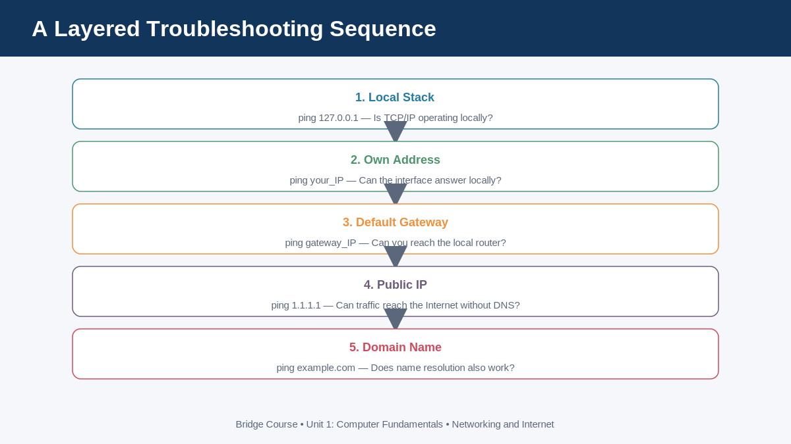
</p>

### Test 1: Local TCP/IP Stack

```cmd
ping 127.0.0.1
```

If this fails, the problem is inside the local TCP/IP configuration or operating system rather than the cable or router.

### Test 2: Your Own Address

```cmd
ping 192.168.1.23
```

Replace the example with your interface address. This checks whether the local interface can respond through the protocol stack.

### Test 3: Default Gateway

```cmd
ping 192.168.1.1
```

A failed gateway test suggests a local Wi-Fi, Ethernet, addressing, VLAN, or router problem.

### Test 4: A Public IP Address

```cmd
ping 1.1.1.1
```

A successful result suggests that routing beyond the local gateway is available. Some public systems may block ping, so one target alone is not conclusive.

### Test 5: A Domain Name

```cmd
ping example.com
```

If public IP tests work but name tests fail, investigate DNS.

---

## 38. `tracert`, `traceroute`, and `pathping`

A route-tracing tool attempts to reveal intermediate routers between the source and destination.

Windows:

```cmd
tracert example.com
```

Linux or macOS:

```bash
traceroute example.com
```

Some Linux systems provide `tracepath` by default:

```bash
tracepath example.com
```

A route may show:

```text
1    2 ms    3 ms    2 ms    192.168.1.1
2   10 ms   11 ms   10 ms    ISP-router.example
3    *       *       *       Request timed out.
4   24 ms   23 ms   25 ms    destination.example
```

An asterisk does not necessarily mean that forwarding stopped. A router may forward ordinary traffic while refusing or deprioritising trace responses.

Windows also provides:

```cmd
pathping example.com
```

`pathping` combines path discovery with extended measurement. It takes longer because it sends multiple probes.

---

## 39. DNS Commands: `nslookup`, `Resolve-DnsName`, and `dig`

### Windows `nslookup`

```cmd
nslookup example.com
```

The result normally shows the DNS server used and one or more records returned.

Query a specific record type:

```cmd
nslookup -type=mx example.com
```

Use a particular resolver for the query:

```cmd
nslookup example.com 1.1.1.1
```

This can help determine whether the configured DNS server is the problem.

### PowerShell `Resolve-DnsName`

```powershell
Resolve-DnsName example.com
```

Request MX records:

```powershell
Resolve-DnsName example.com -Type MX
```

### Linux or macOS `dig`

If installed:

```bash
dig example.com
```

Show a short answer:

```bash
dig +short example.com
```

Query an MX record:

```bash
dig MX example.com
```

On systems without `dig`, `nslookup`, `host`, or operating-system-specific resolver tools may be available.

---

## 40. ARP and the Neighbour Cache

On an IPv4 LAN, the **Address Resolution Protocol**, or **ARP**, maps local IPv4 addresses to MAC addresses. The operating system keeps recently learned mappings in a cache.

Windows:

```cmd
arp -a
```

PowerShell:

```powershell
Get-NetNeighbor
```

Linux:

```bash
ip neigh
```

macOS:

```bash
arp -a
```

Example:

```text
192.168.1.1    2c-f0-5d-a1-b2-c3    dynamic
```

This indicates that the computer learned a MAC address for the local gateway.

The neighbour cache is not a complete list of every device connected to the Wi-Fi. It normally contains devices with which the computer has recently communicated, plus multicast or broadcast-related entries.

Do not use address-scanning tools on networks without permission. The exercises in this chapter rely on known lab devices rather than indiscriminate scanning.

---

## 41. Routing Table Commands

A routing table tells the operating system where packets should be sent.

Windows Command Prompt:

```cmd
route print
```

PowerShell:

```powershell
Get-NetRoute
```

Linux:

```bash
ip route
```

macOS:

```bash
netstat -rn
```

A common default route resembles:

```text
0.0.0.0          0.0.0.0          192.168.1.1
```

or:

```text
default via 192.168.1.1 dev wlan0
```

The default route is used when no more specific route matches the destination.

The routing table may contain additional routes created by VPNs, virtual machines, Docker, WSL, or security software. Therefore, seeing many routes does not automatically indicate a problem.

---

## 42. Active Connections and Listening Ports

### Windows `netstat`

Show active connections and listening ports numerically:

```cmd
netstat -ano
```

Important flags:

- `-a` shows active connections and listening ports;
- `-n` keeps addresses and ports numeric;
- `-o` includes the process identifier, or PID.

Example:

```text
TCP    0.0.0.0:8000     0.0.0.0:0     LISTENING     14520
```

This means that process `14520` is listening on TCP port `8000` on all IPv4 interfaces.

Identify the process:

```cmd
tasklist /FI "PID eq 14520"
```

PowerShell alternatives:

```powershell
Get-NetTCPConnection
```

Filter listening sockets:

```powershell
Get-NetTCPConnection -State Listen
```

Find a particular local port:

```powershell
Get-NetTCPConnection -LocalPort 8000
```

### Linux `ss`

```bash
ss -tulpen
```

The options request TCP, UDP, listening, process, extended, and numeric information. Some process details require elevated permission.

### macOS `lsof`

```bash
lsof -i
```

Find a particular TCP port:

```bash
lsof -iTCP:8000 -sTCP:LISTEN
```

### Listening Does Not Mean Publicly Reachable

A program may listen on a port but remain unreachable because:

- it is bound only to `127.0.0.1`;
- the firewall blocks incoming traffic;
- the computers are on different subnets;
- the router uses client isolation;
- the service is listening on another IP version; or
- the application stopped after the command was checked.

---

## 43. PowerShell `Test-NetConnection`

`Test-NetConnection` can test both general reachability and a specific TCP port.

Detailed test:

```powershell
Test-NetConnection example.com -InformationLevel Detailed
```

Test HTTPS:

```powershell
Test-NetConnection example.com -Port 443
```

Test a local lab server:

```powershell
Test-NetConnection 192.168.1.23 -Port 8000
```

A useful result is:

```text
TcpTestSucceeded : True
```

A port test is often more relevant than ping. A server may block ICMP echo but still accept HTTPS on port 443.

---

## 44. `curl`: Testing an HTTP Service

Modern Windows, Linux, and macOS systems commonly include `curl`.

Retrieve a web page:

```bash
curl https://example.com
```

Request only headers:

```bash
curl -I https://example.com
```

Show detailed connection information:

```bash
curl -v https://example.com
```

Test the temporary local server used later in this chapter:

```bash
curl http://192.168.1.23:8000
```

`curl` is helpful because it separates an HTTP test from browser extensions, caches, and rendering behaviour.

Do not use `-k` or `--insecure` as a routine solution to certificate errors. It disables certificate verification for that request and can hide a genuine security problem.

---

## 45. Windows Wi-Fi Information with `netsh`

Show the current Wi-Fi connection:

```cmd
netsh wlan show interfaces
```

The output may include:

- network name or SSID;
- radio type;
- channel;
- receive and transmit rates;
- signal percentage; and
- authentication method.

Show saved Wi-Fi profile names:

```cmd
netsh wlan show profiles
```

Saved profiles may contain sensitive configuration. Avoid displaying profile details or passwords during a projected classroom demonstration.

---

## 46. Command Reference Map

<p align="center">
  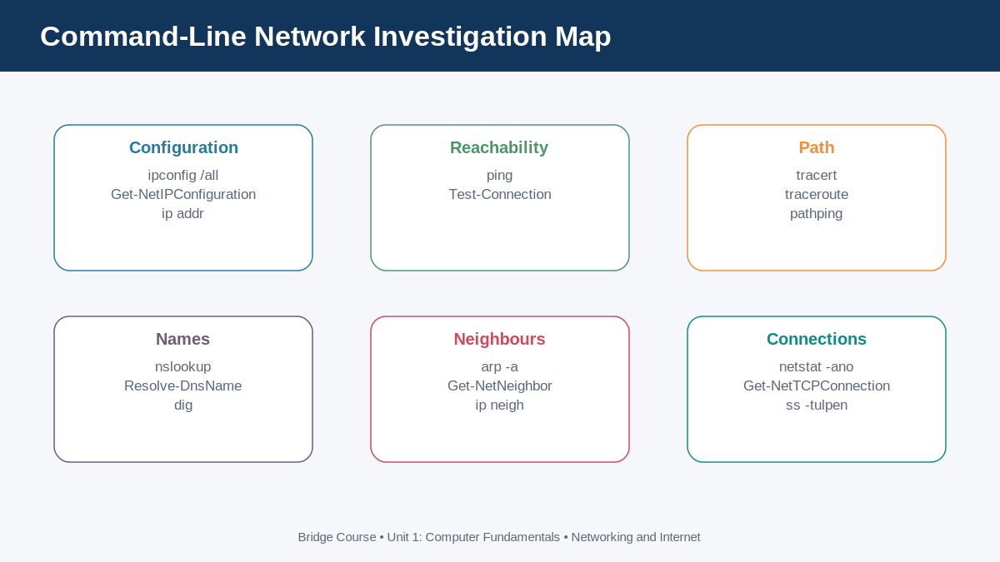
</p>

| Question | Windows Command Prompt | PowerShell | Linux | macOS |
|---|---|---|---|---|
| What is my network configuration? | `ipconfig /all` | `Get-NetIPConfiguration` | `ip addr` | `ifconfig` or `networksetup -getinfo Wi-Fi` |
| What is my default route? | `route print` | `Get-NetRoute` | `ip route` | `route -n get default` |
| Can I reach a device? | `ping` | `Test-Connection` | `ping -c 4` | `ping -c 4` |
| Is a TCP port open? | PowerShell recommended | `Test-NetConnection -Port` | `nc -vz` if installed or `curl` | `nc -vz` or `curl` |
| What path is used? | `tracert` | `Test-NetConnection -TraceRoute` | `traceroute` or `tracepath` | `traceroute` |
| Does DNS work? | `nslookup` | `Resolve-DnsName` | `dig` or `resolvectl` | `dig`, `nslookup`, or `scutil --dns` |
| What neighbours are known? | `arp -a` | `Get-NetNeighbor` | `ip neigh` | `arp -a` |
| What connections exist? | `netstat -ano` | `Get-NetTCPConnection` | `ss -tulpen` | `lsof -i` |

---

# Part VI — Practical Laboratory: Two Computers on the Same Wi-Fi

## 47. Lab Safety and Preparation

This laboratory demonstrates communication between two computers on the same trusted Wi-Fi network.

Use a home network, classroom lab network, or personal hotspot for which you have permission. Do not enable file sharing on public Wi-Fi. Do not disable the firewall globally. Do not expose personal folders such as Documents, Desktop, Pictures, or the entire system drive.

For the examples, the computers are named:

```text
Computer A — will temporarily provide a service
Computer B — will connect to that service
```

The example addresses are:

```text
Computer A: 192.168.1.23/24
Computer B: 192.168.1.54/24
Router:     192.168.1.1
```

Your addresses will probably be different. Replace every example address with the one shown by your own computer.

<p align="center">
  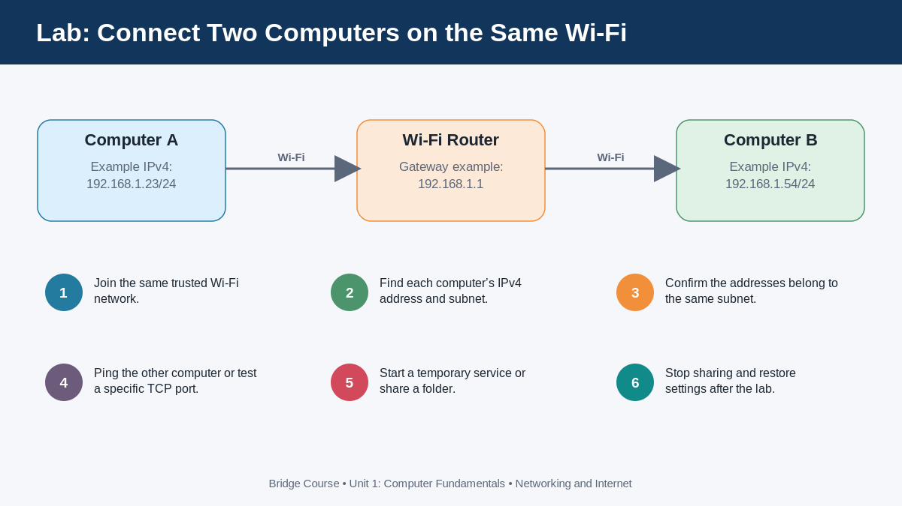
</p>

---

## 48. Step 1 — Join the Same Trusted Wi-Fi

Connect both computers to the same Wi-Fi network name, or **SSID**.

Being connected to an identically named SSID does not always guarantee peer communication. Enterprise Wi-Fi may place users into separate VLANs, and guest networks often enable **client isolation**. Client isolation allows Internet access while preventing one wireless client from contacting another.

For a first experiment, a personal home router or phone hotspot is often simpler than a university guest network. Some phone hotspots also isolate clients, so test rather than assume.

---

## 49. Step 2 — Record Each Computer’s Configuration

### On Computer A — Windows

```cmd
hostname
ipconfig
```

Record:

```text
Computer name:
IPv4 address:
Subnet mask:
Default gateway:
```

### On Computer B — Windows

Run the same commands and record the values.

### PowerShell Alternative

```powershell
hostname
Get-NetIPConfiguration
```

### Linux

```bash
hostname
ip addr
ip route
```

### macOS

```bash
hostname
networksetup -listallhardwareports
networksetup -getinfo Wi-Fi
route -n get default
```

---

## 50. Step 3 — Confirm That the Addresses Belong to the Same Subnet

Suppose the results are:

```text
Computer A: 192.168.1.23
Mask:       255.255.255.0

Computer B: 192.168.1.54
Mask:       255.255.255.0
```

The mask `255.255.255.0` is `/24`. The first three octets identify the network, so both belong to:

```text
192.168.1.0/24
```

If one computer has `192.168.1.23/24` and the other has `192.168.2.54/24`, they are not on the same IPv4 subnet even if they are in the same physical room.

If one computer shows an address beginning with `169.254`, DHCP probably failed. Reconnect to Wi-Fi and investigate the DHCP service before continuing.

---

## 51. Step 4 — Test the Router from Both Computers

From Computer A:

```cmd
ping 192.168.1.1
```

From Computer B:

```cmd
ping 192.168.1.1
```

Replace the address with the actual default gateway.

If one computer cannot reach the gateway, solve its local connection problem first. Possible causes include an incorrect password, weak signal, disabled adapter, expired DHCP configuration, restrictive VLAN, or router issue.

---

## 52. Step 5 — Ping Computer A from Computer B

On Computer B:

```cmd
ping 192.168.1.23
```

Then reverse the test. On Computer A:

```cmd
ping 192.168.1.54
```

### If Ping Succeeds

The devices have basic IP reachability in both directions. Continue to the service test.

### If Ping Fails but Both Can Reach the Router

Do not immediately switch off the firewall. Investigate these possibilities:

1. The operating-system network profile is Public rather than Private.
2. The firewall blocks inbound ICMP echo.
3. The Wi-Fi router has client isolation enabled.
4. One computer’s address changed after it was recorded.
5. One computer entered sleep mode.
6. The two devices are in different VLANs despite similar Wi-Fi names.

A failed ping does not prevent every other test. Start the temporary server and use a TCP port test. This determines whether only ICMP is blocked.

---

## 53. Step 6 — Check the Windows Network Profile

On Windows 11, open:

```text
Settings → Network & internet → Wi-Fi → current network
```

For a trusted home or laboratory network where sharing is required, select **Private network**.

A Private profile permits device discovery and sharing rules when those features are enabled. A Public profile is more restrictive and is appropriate for untrusted networks.

PowerShell view:

```powershell
Get-NetConnectionProfile
```

Do not convert public airport, hotel, train, or café Wi-Fi into a Private profile for convenience.

---

# Part VII — Sharing a Temporary Service Across the LAN

## 54. Lab A — Share a Folder Read-Only Using Python’s HTTP Server

This is one of the simplest cross-platform networking demonstrations. Computer A runs a small HTTP server, and Computer B opens it through a browser.

Python’s `http.server` is designed for basic testing and classroom use, not production deployment. It exposes a directory listing and lacks the security controls expected from a production web server.

<p align="center">
  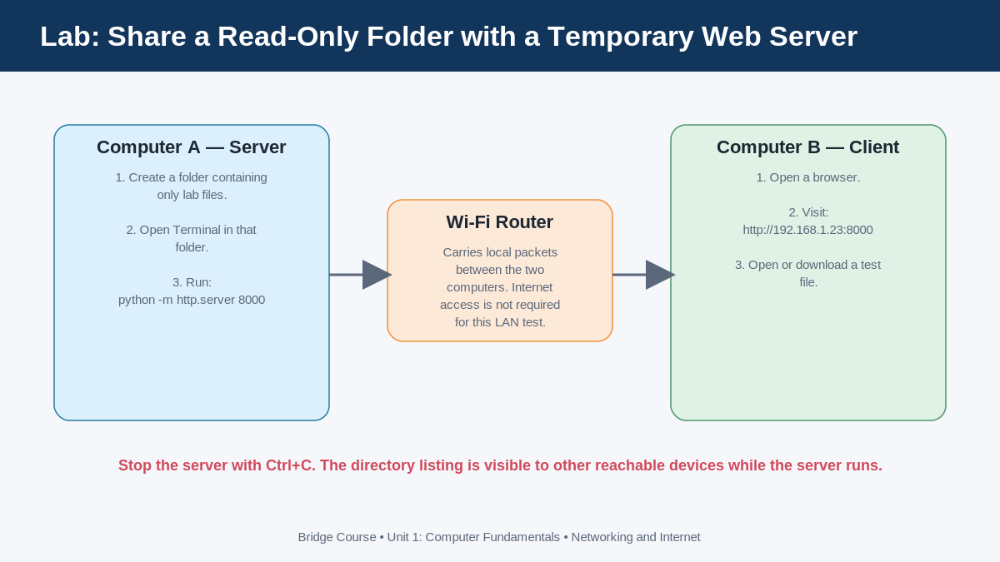
</p>

### Step A1 — Verify Python on Computer A

Windows:

```cmd
py --version
```

or:

```cmd
python --version
```

Linux or macOS:

```bash
python3 --version
```

If Python is not installed, use the Windows shared-folder method later in the chapter rather than downloading software from an unverified source during class.

### Step A2 — Create a Safe Lab Folder

Windows Command Prompt:

```cmd
mkdir NetworkLabShare
cd NetworkLabShare
```

Create a test file:

```cmd
echo Hello from Computer A > hello.txt
```

PowerShell:

```powershell
New-Item -ItemType Directory -Name NetworkLabShare
Set-Location NetworkLabShare
"Hello from Computer A" | Set-Content hello.txt
```

Linux or macOS:

```bash
mkdir NetworkLabShare
cd NetworkLabShare
printf 'Hello from Computer A\n' > hello.txt
```

The folder should contain only files intended for the exercise. Do not start the server inside your user profile root or a folder containing private information.

### Step A3 — Start the Server on Computer A

Assume Computer A is `192.168.1.23`.

Windows with the Python launcher:

```cmd
py -m http.server 8000 --bind 192.168.1.23
```

Windows with `python`:

```cmd
python -m http.server 8000 --bind 192.168.1.23
```

Linux or macOS:

```bash
python3 -m http.server 8000 --bind 192.168.1.23
```

Binding to the exact LAN address is preferable to binding to every interface for this focused lab.

A message similar to this appears:

```text
Serving HTTP on 192.168.1.23 port 8000 ...
```

Windows Firewall may ask whether Python should communicate through the firewall. Permit it only for the trusted **Private network** used for the lab. Do not allow it on public networks.

### Step A4 — Confirm That the Port Is Listening

On Computer A:

```cmd
netstat -ano | findstr :8000
```

PowerShell:

```powershell
Get-NetTCPConnection -LocalPort 8000
```

Linux:

```bash
ss -ltn | grep 8000
```

macOS:

```bash
lsof -iTCP:8000 -sTCP:LISTEN
```

### Step A5 — Test Locally on Computer A

Open:

```text
http://127.0.0.1:8000
```

or use:

```bash
curl http://127.0.0.1:8000
```

If local access fails, the server did not start correctly. Resolve that before testing from Computer B.

### Step A6 — Test the Port from Computer B

PowerShell on Computer B:

```powershell
Test-NetConnection 192.168.1.23 -Port 8000
```

Expected result:

```text
TcpTestSucceeded : True
```

Then open this address in a browser:

```text
http://192.168.1.23:8000
```

The browser should display the directory listing and `hello.txt`.

Linux or macOS test:

```bash
curl http://192.168.1.23:8000
```

### Step A7 — Observe the Server Log

The terminal on Computer A records each request, for example:

```text
192.168.1.54 - - [date] "GET / HTTP/1.1" 200 -
192.168.1.54 - - [date] "GET /hello.txt HTTP/1.1" 200 -
```

This demonstrates a client–server interaction:

- Computer B is the client.
- Computer A is the server.
- `192.168.1.23` identifies the server interface.
- TCP port `8000` identifies the temporary HTTP service.
- HTTP carries the request and response.

### Step A8 — Stop the Server

On Computer A, press:

```text
Ctrl + C
```

Verify that the service is no longer listening:

```cmd
netstat -ano | findstr :8000
```

Remove any temporary firewall exception if one was manually created. Delete the temporary folder when no longer required.

---

## 55. Why `localhost` Does Not Work from the Other Computer

On Computer A:

```text
http://localhost:8000
```

refers to Computer A itself.

On Computer B, the same address:

```text
http://localhost:8000
```

refers to Computer B, not Computer A.

To reach Computer A from Computer B, use Computer A’s LAN address:

```text
http://192.168.1.23:8000
```

This is one of the most important ideas in beginner networking: **loopback is local to each machine**.

---

## 56. Why Binding Matters

A server can listen on different addresses.

### Loopback Only

```bash
python -m http.server 8000 --bind 127.0.0.1
```

Only applications on the same computer can connect.

### One LAN Interface

```bash
python -m http.server 8000 --bind 192.168.1.23
```

The service listens on that LAN address.

### All IPv4 Interfaces

```bash
python -m http.server 8000 --bind 0.0.0.0
```

The service accepts connections through every suitable IPv4 interface, subject to firewall and routing rules. This may include Ethernet, Wi-Fi, VPN, or virtual interfaces, so the more specific address is preferable for a controlled beginner lab.

---

# Part VIII — Windows Folder Sharing on the Same Wi-Fi

## 57. Lab B — Create a Windows Shared Folder

Windows file sharing uses SMB. This lab should be performed only on a trusted Private network.

### Step B1 — Create a Dedicated Folder

Create:

```text
C:\NetworkLabShare
```

Add a harmless text file such as `hello.txt`.

### Step B2 — Enable Appropriate Private-Network Sharing

Open:

```text
Settings → Network & internet → Advanced network settings → Advanced sharing settings
```

Under **Private networks**, enable:

- Network discovery; and
- File and printer sharing.

Do not enable broad sharing for Public networks.

### Step B3 — Share the Folder

In File Explorer:

1. Right-click the folder.
2. Choose **Show more options** if required.
3. Select **Give access to** or open **Properties → Sharing**.
4. Select specific users where possible.
5. Grant only the permission required for the exercise.

Read-only permission is safer for a demonstration. Avoid granting Everyone full control unless the environment is disposable and the instructor explicitly requires it.

### Step B4 — Note the Share Name

Assume the share name is:

```text
NetworkLabShare
```

Computer A’s address is:

```text
192.168.1.23
```

The network path is:

```text
\\192.168.1.23\NetworkLabShare
```

### Step B5 — Open the Share from Computer B

Press `Win + R` on Computer B and enter:

```text
\\192.168.1.23\NetworkLabShare
```

or type the path into File Explorer’s address bar.

Windows may request credentials belonging to an authorised account on Computer A.

### Step B6 — View Available Shares from the Command Line

```cmd
net view \\192.168.1.23
```

### Step B7 — Map the Share to a Drive Letter

```cmd
net use Z: \\192.168.1.23\NetworkLabShare
```

If credentials are required:

```cmd
net use Z: \\192.168.1.23\NetworkLabShare /user:COMPUTER-A\student
```

Windows prompts for the password. Avoid placing passwords directly in a command because they may remain visible in history or logs.

### Step B8 — Remove the Mapping

```cmd
net use Z: /delete
```

### Step B9 — Stop Sharing After the Lab

Remove the share or access permission after testing. Turn off Network discovery and File and printer sharing if they are not normally needed.

---

## 58. Connect to a Windows Share from macOS

On the Mac, choose:

```text
Finder → Go → Connect to Server
```

Enter:

```text
smb://192.168.1.23/NetworkLabShare
```

Use an authorised Windows account when prompted.

The same SMB address can often be entered in a Linux graphical file manager:

```text
smb://192.168.1.23/NetworkLabShare
```

Terminal-based SMB clients may require additional packages, so graphical access is usually simpler for a beginner laboratory.

---

# Part IX — Optional Secure Shell and File Transfer

## 59. SSH and SCP Concepts

**Secure Shell**, or **SSH**, provides encrypted remote terminal access. **SCP** copies files through an SSH connection. These are useful across Windows, Linux, and macOS when an SSH server is installed and enabled on the destination.

Basic login syntax:

```bash
ssh username@192.168.1.23
```

Copy a local file to a remote computer:

```bash
scp report.txt username@192.168.1.23:/destination/path/
```

Copy a remote file to the current folder:

```bash
scp username@192.168.1.23:/source/path/report.txt .
```

### Important Distinction

The SSH **client** initiates the connection. The SSH **server** listens on the remote computer, commonly on TCP port 22.

Having the `ssh` command installed does not prove that the computer is accepting incoming SSH connections. The server component must be installed, configured, running, and permitted through the firewall.

### Windows Check

PowerShell can show OpenSSH capabilities:

```powershell
Get-WindowsCapability -Online | Where-Object Name -like 'OpenSSH*'
```

Service status, when the server is installed:

```powershell
Get-Service sshd
```

Do not install or enable remote-access services on organisational computers without administrator permission.

### Test the SSH Port

From another Windows computer:

```powershell
Test-NetConnection 192.168.1.23 -Port 22
```

A successful TCP test confirms only that something accepted the port connection. Authentication and authorisation are separate stages.

---

# Part X — Optional TCP Programming Laboratory

## 60. Simple TCP Server and Client

The package accompanying this chapter includes:

```text
labs/simple_tcp_server.py
labs/simple_tcp_client.py
```

These small scripts demonstrate sockets directly. Use them only on a trusted lab network.

### Server Computer

Edit the script if a different port is required, then run:

```bash
python simple_tcp_server.py
```

The server listens on TCP port `5000`.

### Client Computer

Edit this line in `simple_tcp_client.py`:

```python
SERVER_IP = "192.168.1.23"
```

Replace the example with the server’s LAN address, then run:

```bash
python simple_tcp_client.py
```

The client sends a message and displays the server’s response.

### Concepts Demonstrated

This exercise shows:

- IP addressing;
- TCP port numbers;
- listening and connecting sockets;
- client and server roles;
- application data carried inside TCP; and
- firewall effects on inbound connections.

Stop the server after the exercise. The script is educational and does not implement authentication, encryption, or production security controls.

---

# Part XI — Troubleshooting Network Problems

## 61. Troubleshoot by Layers, Not by Guessing

A structured sequence saves time.

<p align="center">
  
</p>

### Stage 1 — Physical and Radio Connection

Check whether:

- the Ethernet cable is connected;
- link lights are present where applicable;
- Wi-Fi is enabled;
- airplane mode is off;
- the correct SSID is selected;
- signal strength is reasonable; and
- the router or access point is powered.

### Stage 2 — Interface State

Windows:

```powershell
Get-NetAdapter
```

Linux:

```bash
ip link
```

macOS:

```bash
ifconfig
```

Confirm that the expected interface is up rather than disabled or disconnected.

### Stage 3 — Address Configuration

Windows:

```cmd
ipconfig /all
```

Look for:

- a valid IPv4 or IPv6 address;
- the expected subnet;
- a default gateway;
- DNS servers; and
- evidence that DHCP succeeded.

### Stage 4 — Local Gateway

```cmd
ping <gateway-address>
```

Failure here points toward the local connection, VLAN, firewall, address, or router.

### Stage 5 — External IP Connectivity

Test a known public address or a specific remote service. Remember that some systems block ICMP, so a TCP test may be more useful:

```powershell
Test-NetConnection example.com -Port 443
```

### Stage 6 — DNS

```cmd
nslookup example.com
```

Compare the result with a direct IP or TCP test.

### Stage 7 — Application

Use `curl`, a browser’s developer tools, application logs, or service-specific commands. A network may be healthy while one application is misconfigured.

---

## 62. Troubleshooting Scenarios

### Scenario A — Wi-Fi Connected but No Internet

Observed:

```text
Wi-Fi icon is connected.
ping 192.168.1.1 succeeds.
ping a public IP fails.
```

Likely interpretation: the local Wi-Fi connection is working, but the router or ISP path is failing. Check the router’s WAN status, ISP connection, or upstream outage.

### Scenario B — Public IP Works but Websites Do Not

Observed:

```text
ping 1.1.1.1 succeeds.
nslookup example.com fails.
```

Likely interpretation: basic routing works, but DNS is failing. Inspect configured DNS servers and resolver behaviour.

### Scenario C — Website Opens by Name but One Application Fails

Observed:

```text
Browser opens websites.
One application cannot connect to its service.
```

Likely interpretation: the entire network is not down. Investigate the application’s server name, port, proxy, certificate, login, firewall, or service availability.

### Scenario D — Two Computers Reach the Router but Not Each Other

Observed:

```text
Both computers can ping the gateway.
Neither can ping the other computer.
```

Possible causes:

- Wi-Fi client isolation;
- Public network profile;
- host firewall;
- different VLANs;
- incorrect recorded address; or
- inbound ICMP blocked while other services remain possible.

Test a known listening TCP port rather than disabling the firewall.

### Scenario E — Address Begins with `169.254`

Likely interpretation: normal IPv4 DHCP configuration was not obtained. Check whether the DHCP server is reachable, reconnect the adapter, and inspect the router.

### Scenario F — Local Server Works on `localhost` but Not from Another PC

Check:

1. whether the server is bound only to `127.0.0.1`;
2. whether the correct LAN IP is used;
3. whether the port is listening;
4. whether the firewall permits the application on the Private profile;
5. whether both computers share the subnet; and
6. whether the Wi-Fi blocks client-to-client communication.

---

## 63. Do Not “Fix” Networking by Disabling Security

A common but poor troubleshooting method is to disable the firewall completely. This may hide the true issue while exposing the computer unnecessarily.

A safer sequence is:

1. identify the exact application and port;
2. confirm that the service is listening;
3. confirm the network profile;
4. create a narrow Private-network rule only if required;
5. test the connection; and
6. remove the temporary rule after the lab.

<p align="center">
  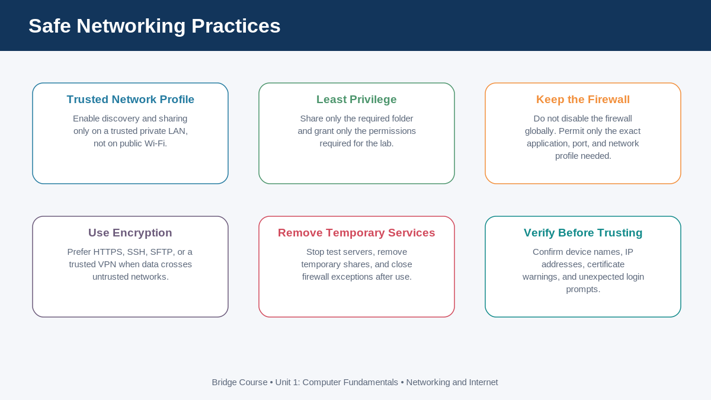
</p>

---

# Part XII — Internet and Network Security Fundamentals

## 64. Public Wi-Fi Risks

Public Wi-Fi should be treated as an untrusted network. Risks include malicious users on the same local network, fake access points, insecure services, credential theft, tracking, and accidental file sharing.

Safer practice includes:

- use HTTPS services;
- keep the network profile Public;
- turn off unnecessary discovery and sharing;
- verify the correct network name;
- avoid bypassing certificate warnings;
- use a trusted VPN when organisational policy requires it;
- install operating-system and browser updates;
- use multifactor authentication; and
- forget the public network when it is no longer required.

HTTPS protects the connection between the client and the authenticated web service. It does not prove that the website itself is honest, and it does not protect a user who voluntarily enters credentials into a convincing phishing site.

---

## 65. Passwords and Authentication

Use unique passwords for important accounts. A password manager can generate and store strong passwords. Multifactor authentication adds another verification step.

Network access and application access are separate. Knowing the Wi-Fi password does not automatically authorise a person to access every computer, shared folder, printer, or server on that network.

---

## 66. Encryption

Encryption protects information against unauthorised reading during transmission when implemented and validated correctly.

Examples include:

- WPA2 or WPA3 for Wi-Fi protection;
- TLS for HTTPS;
- SSH for remote terminal access;
- SFTP or SCP for secure file transfer; and
- VPN tunnels for protected communication across an untrusted network.

Encryption does not replace access control, patching, backups, endpoint security, or user awareness.

---

## 67. Firewall Profiles

Windows commonly distinguishes Domain, Private, and Public network profiles. Different firewall rules may apply to each profile.

A local service may work at home but not on public Wi-Fi because an inbound rule is restricted to Private networks. This is often desirable rather than an error.

When creating a classroom rule, document:

```text
Application:
Protocol:
Port:
Allowed remote network:
Profile:
Date created:
Date removed:
```

This turns firewall changes into controlled configuration rather than guesswork.

---

# Part XIII — Guided Command Exercises

## 68. Exercise 1 — Build a Network Configuration Report

Run the appropriate commands and complete this table:

| Field | Value |
|---|---|
| Computer name | |
| Operating system | |
| Active interface name | |
| Interface type | Ethernet / Wi-Fi / other |
| MAC address | |
| IPv4 address | |
| Prefix or subnet mask | |
| IPv6 address | |
| Default gateway | |
| DHCP enabled | |
| DHCP server | |
| DNS server addresses | |
| Network profile | |

Then explain in complete sentences how the computer reaches a device on the same subnet and how it reaches a remote Internet server.

---

## 69. Exercise 2 — Compare Name and Address Tests

Run:

```cmd
nslookup example.com
ping example.com
```

Record the address returned by DNS. Then test one returned address directly.

Explain:

- which command tested DNS;
- which command tested ICMP reachability;
- why different addresses may appear;
- why ping may fail even when the website opens; and
- why DNS results can change over time.

---

## 70. Exercise 3 — Investigate the Default Gateway

1. Find the gateway using `ipconfig`, `Get-NetIPConfiguration`, `ip route`, or `route -n get default`.
2. Ping the gateway.
3. Run `arp -a`, `Get-NetNeighbor`, or `ip neigh`.
4. Find the neighbour-cache entry corresponding to the gateway.
5. Explain why the gateway has both an IP address and a MAC address in the local network.

---

## 71. Exercise 4 — Observe a Listening Port

1. Start the Python HTTP server on port 8000.
2. Run `netstat`, `Get-NetTCPConnection`, `ss`, or `lsof` to find the listening socket.
3. Connect from another computer.
4. Run the connection command again.
5. Identify the local address, local port, remote address, remote port, and connection state.
6. Stop the server and confirm that the listening socket disappears.

---

## 72. Exercise 5 — Trace a Web Request

Use:

```bash
curl -I https://example.com
```

Record:

- the HTTP status;
- content type;
- server or proxy headers if present;
- caching information; and
- any redirect location.

Then run:

```bash
curl -v https://example.com
```

Identify DNS resolution, connection establishment, TLS information, request headers, and response headers. Do not include personal cookies or authentication tokens in a submitted screenshot.

---

## 73. Exercise 6 — Compare Wi-Fi and Ethernet

Where both are available:

1. record the active adapter and IP configuration on Wi-Fi;
2. test latency to the gateway;
3. connect through Ethernet;
4. record the new adapter and address;
5. repeat the gateway test; and
6. discuss differences in latency, stability, interface identity, and routing.

Do not claim that one medium is universally better based on one short test. Environmental and equipment conditions affect the result.

---

# Part XIV — Common Misconceptions

## 74. “The Internet and Wi-Fi Are the Same”

Wi-Fi is a local wireless networking technology. The Internet is a global network of networks. A computer can be connected to Wi-Fi while the router has no Internet service. A computer can also access the Internet through Ethernet or cellular data without using Wi-Fi.

## 75. “An IP Address Identifies a Person”

An IP address identifies an interface or connection context, not necessarily an individual. Addresses may be shared through NAT, reassigned by DHCP, used by multiple users, changed by VPNs, or associated with organisational gateways.

## 76. “A Successful Ping Proves Every Service Works”

Ping tests ICMP echo reachability. It does not verify that a web server, database, SSH service, login system, or application is functioning.

## 77. “A Failed Ping Proves the Device Is Offline”

Firewalls and network policies may block ICMP while allowing other traffic. Test the actual service port when possible.

## 78. “A Switch and Router Are the Same”

A switch normally forwards frames within a LAN using MAC addresses. A router forwards IP packets between networks. Consumer equipment may combine both functions in one box.

## 79. “More Bandwidth Always Means Lower Delay”

Bandwidth and latency measure different properties. A link can carry large amounts of data but still have noticeable delay.

## 80. “The Firewall Should Be Disabled When a Lab Fails”

The firewall should remain enabled. Diagnose the service, binding, port, profile, and exact rule. Create the smallest temporary exception required.

## 81. “`localhost` Refers to the Server Computer”

`localhost` always refers to the computer on which the command or browser is running. From another computer, use the server’s LAN address or a resolvable hostname.

---

# Part XV — Assessment

## 82. Short-Answer Questions

1. Define a computer network and give two examples.
2. Explain the difference between a LAN and a WAN.
3. Distinguish the Internet from the World Wide Web.
4. Compare client–server and peer-to-peer networks.
5. Explain the role of a switch.
6. Explain the role of a router.
7. Why may a home router perform several network-device roles?
8. Explain encapsulation using an HTTP request as an example.
9. Distinguish a frame, packet, and TCP segment.
10. Explain the difference between a MAC address and an IP address.
11. What is a subnet mask?
12. What does `/24` mean?
13. Explain the role of a default gateway.
14. What information does DHCP normally provide?
15. Explain how DNS helps a browser.
16. What is NAT and why is it common in IPv4 home networks?
17. Compare TCP and UDP.
18. Why can a website open even when ping fails?
19. Explain the difference between bandwidth and latency.
20. Why should file sharing not be enabled on public Wi-Fi?

---

## 83. Long-Answer Questions

1. Explain the journey of a web request from a browser to a web server and back.
2. Describe all seven OSI layers with suitable examples.
3. Analyse a home network containing a router, two laptops, smartphones, a printer, and a smart television.
4. Explain IPv4 addressing, subnet masks, private addresses, gateways, DHCP, DNS, and NAT as one connected system.
5. Design a systematic troubleshooting procedure for a computer that shows Wi-Fi connected but cannot open websites.
6. Explain how two computers on the same Wi-Fi can communicate and why the communication might be blocked.
7. Compare Windows Command Prompt, PowerShell, Linux, and macOS networking tools.
8. Write a security plan for a classroom LAN file-sharing exercise.

---

## 84. Multiple-Choice Questions

### Question 1

Which device primarily forwards Ethernet frames inside a LAN using MAC addresses?

A. Router  
B. Switch  
C. Modem  
D. DNS server

### Question 2

Which value identifies a service endpoint on a computer?

A. Port number  
B. Subnet mask  
C. SSID  
D. Cable category

### Question 3

Which protocol normally provides automatic IP configuration?

A. HTTP  
B. DHCP  
C. SSH  
D. SMTP

### Question 4

Which command displays detailed Windows IP configuration?

A. `format /all`  
B. `ipconfig /all`  
C. `net use /all`  
D. `hostname /all`

### Question 5

Which address normally refers to the local computer in IPv4?

A. `0.0.0.0`  
B. `127.0.0.1`  
C. `255.255.255.255`  
D. `192.168.255.255`

### Question 6

What does DNS primarily do?

A. Converts domain names into records such as IP addresses  
B. Encrypts every network packet  
C. Assigns MAC addresses  
D. Measures bandwidth

### Question 7

Which command tests a specific TCP port in Windows PowerShell?

A. `Test-NetConnection host -Port 443`  
B. `ipconfig host 443`  
C. `arp host 443`  
D. `hostname host 443`

### Question 8

Two computers have addresses `192.168.1.20/24` and `192.168.1.70/24`. They are:

A. necessarily on different continents  
B. in the same IPv4 subnet  
C. using public IPv4 addresses  
D. unable to communicate through Wi-Fi

### Question 9

Which transport protocol provides built-in ordered reliable delivery?

A. UDP  
B. ARP  
C. TCP  
D. ICMP

### Question 10

A computer has address `169.254.20.8`. What is a likely explanation?

A. It successfully received normal DHCP configuration  
B. It assigned itself a link-local address after DHCP failure  
C. It is using a public web-server address  
D. It is connected through IPv6 only

### Question 11

Which statement is correct?

A. Wi-Fi and the Internet are identical  
B. A failed ping always proves the server is offline  
C. A switch and router always perform exactly the same role  
D. A device may be connected to Wi-Fi even when Internet access is unavailable

### Question 12

Which URL component identifies the application communication scheme?

A. Fragment  
B. Query  
C. `https`  
D. Path

### Question 13

What is the usual purpose of a default gateway?

A. Store files permanently  
B. Forward traffic toward other networks  
C. Convert hostnames into passwords  
D. Assign MAC addresses

### Question 14

Which tool is most directly used to inspect the path through intermediate routers on Windows?

A. `tracert`  
B. `mkdir`  
C. `tasklist`  
D. `echo`

### Question 15

Why is Python’s `http.server` suitable only for a controlled lab?

A. It cannot use a port  
B. It is a basic test server without production security controls  
C. It works only without a network  
D. It automatically deletes shared files

---

## 85. MCQ Answers

| Question | Answer | Question | Answer | Question | Answer |
|---:|:---:|---:|:---:|---:|:---:|
| 1 | B | 6 | A | 11 | D |
| 2 | A | 7 | A | 12 | C |
| 3 | B | 8 | B | 13 | B |
| 4 | B | 9 | C | 14 | A |
| 5 | B | 10 | B | 15 | B |

---

# Part XVI — Command Cheat Sheet

## 86. Windows Command Prompt

```cmd
hostname                         :: Show computer name
whoami                           :: Show current user
ipconfig                         :: Basic IP configuration
ipconfig /all                    :: Detailed adapter, DHCP, DNS, MAC data
ipconfig /displaydns             :: Show DNS resolver cache
ipconfig /flushdns               :: Clear DNS resolver cache
ipconfig /release                :: Release DHCP IPv4 address
ipconfig /renew                  :: Renew DHCP configuration
ping -n 4 192.168.1.1            :: Send four ping requests
tracert example.com              :: Trace route
pathping example.com             :: Trace and measure path
nslookup example.com             :: Query DNS
arp -a                           :: Show ARP cache
route print                      :: Show routing table
netstat -ano                     :: Connections, listeners, numeric data, PID
netsh wlan show interfaces       :: Current Wi-Fi information
netsh wlan show profiles         :: Saved Wi-Fi profile names
net view \\192.168.1.23           :: List shares offered by a computer
net use Z: \\192.168.1.23\Share  :: Map a network share
net use Z: /delete               :: Remove mapped drive
```

---

## 87. Windows PowerShell

```powershell
Get-NetAdapter
Get-NetIPConfiguration
Get-NetIPAddress -AddressFamily IPv4
Get-NetConnectionProfile
Test-Connection 192.168.1.1 -Count 4
Test-NetConnection example.com -Port 443
Resolve-DnsName example.com
Get-NetNeighbor
Get-NetRoute
Get-NetTCPConnection
Get-NetTCPConnection -State Listen
Get-NetUDPEndpoint
```

---

## 88. Linux

```bash
hostname
whoami
hostname -I
ip addr
ip link
ip route
ping -c 4 192.168.1.1
traceroute example.com
tracepath example.com
ip neigh
ss -tulpen
dig example.com
dig +short example.com
resolvectl status
nmcli device show
curl -I https://example.com
```

Availability differs among distributions. Install missing diagnostic tools only through the distribution’s trusted package manager and according to lab policy.

---

## 89. macOS

```bash
hostname
whoami
ifconfig
networksetup -listallhardwareports
networksetup -getinfo Wi-Fi
ipconfig getifaddr en0
route -n get default
ping -c 4 192.168.1.1
traceroute example.com
arp -a
netstat -rn
scutil --dns
lsof -i
curl -I https://example.com
```

The Wi-Fi interface may not always be `en0`; confirm it using `networksetup -listallhardwareports`.

---

# Part XVII — Glossary

| Term | Meaning |
|---|---|
| Access point | Device that allows Wi-Fi clients to join a network |
| ARP | Protocol that maps local IPv4 addresses to MAC addresses |
| Bandwidth | Theoretical data-carrying capacity of a link |
| Client | Program or device requesting a service |
| DHCP | Protocol providing automatic network configuration |
| DNS | Distributed naming system used to retrieve records for domain names |
| Ethernet | Common wired LAN technology |
| Firewall | System that permits or blocks traffic according to rules |
| Frame | Data-link-layer unit of communication |
| Gateway | Router used to reach another network |
| Host | Device or system participating in a network |
| HTTP | Application protocol used for web communication |
| HTTPS | HTTP protected by TLS |
| IP address | Logical network-layer address |
| ISP | Organisation providing Internet connectivity |
| Jitter | Variation in packet delay |
| LAN | Local Area Network |
| Latency | Delay experienced by communication |
| MAC address | Link-layer interface identifier used in local communication |
| NAT | Translation between address or port contexts, common in IPv4 routers |
| NIC | Network Interface Card or network interface controller |
| Packet | Network-layer data unit |
| Port | Transport-layer application endpoint number |
| Protocol | Agreed rules for communication |
| Router | Device forwarding packets between IP networks |
| Server | Program or system providing a service |
| Socket | Combination of protocol, address, and port used by an endpoint |
| SSID | Wi-Fi network name |
| Subnet | Logical subdivision of an IP network |
| Switch | Device forwarding LAN frames using MAC information |
| TCP | Reliable connection-oriented transport protocol |
| Throughput | Useful data delivered per unit of time |
| TLS | Protocol providing cryptographic protection for application traffic |
| UDP | Datagram-oriented transport protocol with minimal built-in guarantees |
| URL | Address and access method for a resource |
| VLAN | Logical LAN separation implemented by network equipment |
| WAN | Wide Area Network |
| Wi-Fi | Wireless LAN family of technologies |

---

# Part XVIII — Instructor-Led Assignment

## 90. Complete Local-Network Investigation

Work in pairs using two authorised computers on the same trusted Wi-Fi.

Prepare a report containing:

1. a diagram of the network;
2. the hostname and interface information for both devices;
3. IPv4 address, subnet mask, gateway, DNS, and MAC information;
4. a calculation proving whether the devices share the same subnet;
5. gateway ping results;
6. computer-to-computer ping results;
7. a temporary TCP service on port 8000;
8. a port test from the client;
9. a browser or `curl` request to the server;
10. listening and established connection evidence from `netstat`, PowerShell, `ss`, or `lsof`;
11. a DNS lookup and route trace to a public domain;
12. a description of any firewall or network-profile setting used;
13. a security cleanup checklist; and
14. a conclusion explaining how addressing, ports, routing, and applications worked together.

Screenshots must not expose passwords, Wi-Fi keys, authentication tokens, personal filenames, or unrelated private information.

---

# Key Takeaways

A computer network is a system of connected devices, communication media, protocols, addresses, and services. Local communication and Internet communication use several cooperating layers.

A MAC address supports local-link delivery, an IP address supports routing, and a port identifies an application endpoint. DHCP supplies configuration, DNS translates names, a gateway forwards remote traffic, and NAT commonly allows private IPv4 devices to share a public connection.

Command-line tools are most valuable when used as part of a structured diagnostic process. Begin with the physical connection and interface state, read the address configuration, test the gateway, test remote IP connectivity, test DNS, inspect the route, and finally examine the application service.

Two computers on the same trusted Wi-Fi can communicate when addressing, subnet, firewall, service binding, and access-point policy all allow it. A small Python HTTP server or a controlled SMB share provides a clear client–server laboratory, but temporary services and sharing must be removed after the exercise.

---

# Image Credits

All infographics in this chapter were created specifically for the Bridge Course package. Both editable SVG versions and PNG versions are provided in:

```text
images/infographics/
images/infographics/png/
```

They may be edited to match the course theme. No external stock photographs are required for the chapter.

---

# Official References and Further Reading

The command syntax and networking concepts in this tutorial should be checked against current operating-system documentation when used in a production environment.

1. [Microsoft Learn — Windows Commands](https://learn.microsoft.com/en-us/windows-server/administration/windows-commands/windows-commands)
2. [Microsoft Learn — ipconfig](https://learn.microsoft.com/en-us/windows-server/administration/windows-commands/ipconfig)
3. [Microsoft Learn — ping](https://learn.microsoft.com/en-us/windows-server/administration/windows-commands/ping)
4. [Microsoft Learn — nslookup](https://learn.microsoft.com/en-us/windows-server/administration/windows-commands/nslookup)
5. [Microsoft Learn — netstat](https://learn.microsoft.com/en-us/windows-server/administration/windows-commands/netstat)
6. [Microsoft Learn — NetTCPIP PowerShell Module](https://learn.microsoft.com/en-us/powershell/module/nettcpip/)
7. [Microsoft Support — File Sharing over a Network in Windows](https://support.microsoft.com/en-us/windows/experience/connectivity-networking/file-sharing-over-a-network-in-windows)
8. [Microsoft Learn — OpenSSH for Windows](https://learn.microsoft.com/en-us/windows-server/administration/openssh/openssh-overview)
9. [Python Documentation — http.server](https://docs.python.org/3/library/http.server.html)
10. [Python Documentation — Security Considerations](https://docs.python.org/3/library/security_warnings.html)
11. [Apple Support — Set Up File Sharing on Mac](https://support.apple.com/guide/mac-help/mh17131/mac)
12. [RFC 1918 — Address Allocation for Private Internets](https://www.rfc-editor.org/rfc/rfc1918.html)
13. [RFC 8200 — Internet Protocol, Version 6 Specification](https://www.rfc-editor.org/rfc/rfc8200.html)

---

**End of Chapter**
